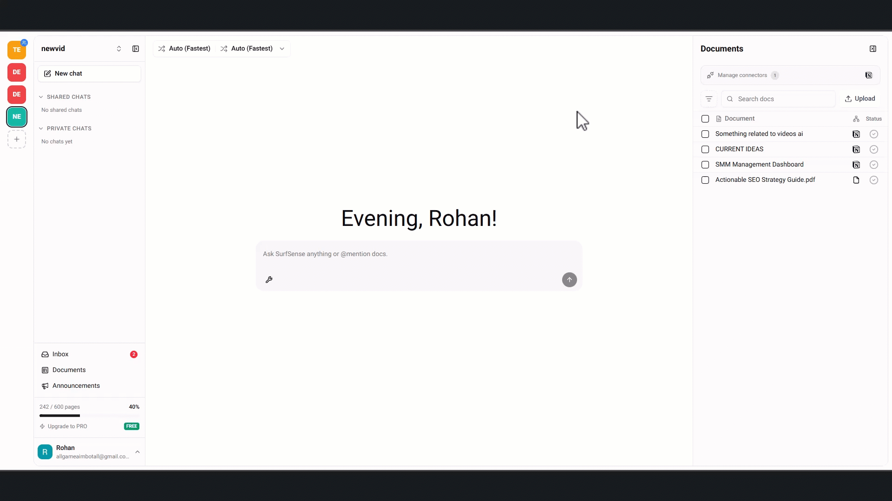
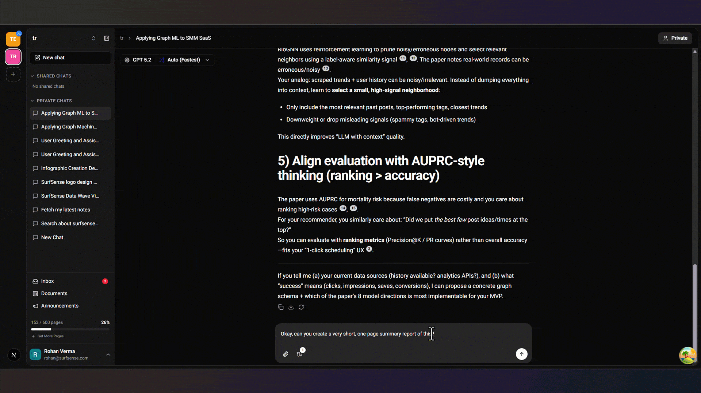
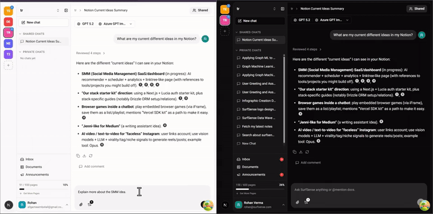
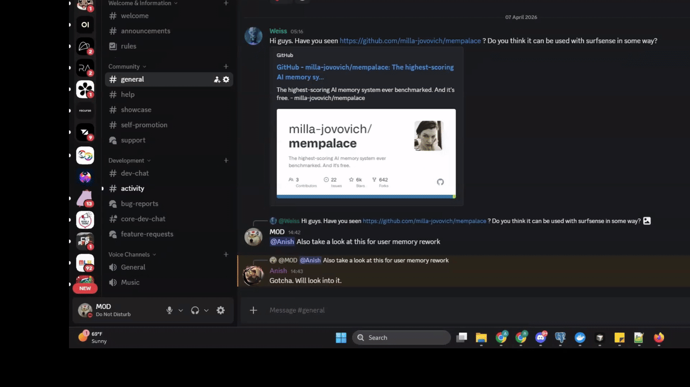
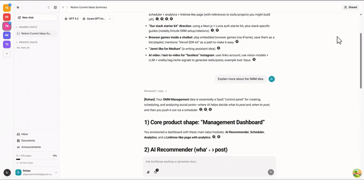

<a href="https://www.nowing.com/"></a>


<div align="center">
<a href="https://discord.gg/ejRNvftDp9">

</a>
<a href="https://www.reddit.com/r/Nowing/">

</a>
</div>

<div align="center">

[English](README.md) | [Español](README.es.md) | [Português](README.pt-BR.md) | [हिन्दी](README.hi.md) | [简体中文](README.zh-CN.md)

</div>
<div align="center">
<a href="https://trendshift.io/repositories/13606" target="_blank"></a>
</div>

# Nowing: AI एजेंट्स के लिए ओपन-सोर्स रिसर्च मेमोरी

> **Nowing AI एजेंट्स के लिए ओपन-सोर्स रिसर्च मेमोरी है — यह याद रखता है कि उसने क्या खोजा और पाया, न कि सिर्फ़ वो जो आपने उसे बताया।**

Nowing **AI एजेंट्स और टीमों के लिए लॉन्ग-टर्म मेमोरी वाला एक सेल्फ़-होस्टेड रिसर्च वर्कस्पेस** है, जिसे **ओपन-सोर्स कोर** और एक **होस्टेड डीप-रिसर्च इंजन** से पावर मिलती है। आपके एजेंट **Reddit, YouTube, Instagram, TikTok, Amazon, Google Maps, Google Search और ओपन वेब के किसी भी पेज** से स्ट्रक्चर्ड डेटा के साथ लाइव वेब पर रिसर्च करते हैं, वह भी एक ही **REST API** या **MCP सर्वर** के ज़रिए। शेड्यूल्ड और इवेंट-ट्रिगर्ड एजेंट अपनी खोजों को ब्रीफ़ और अलर्ट में बदलते हैं, और एक बिल्ट-इन नॉलेज बेस हर खोज को साइटेशन के साथ खोजने योग्य बनाए रखता है।

> [!NOTE]
> **📢 हमारे लॉन्ग-टर्म रिसर्च मेमोरी उपयोगकर्ताओं के लिए एक सूचना**
>
> पिछलें कुछ महीनों में हमनें Nowing को एक ऐसे रिसर्च वर्कस्पेस के रूप में बनाया जो रिसर्च को टिकाऊ, दोबारा पा सकने वाली मेमोरी में बदलता है, और उस अध्याय ने हमें एक ऐसा समुदाय दिया जिस पर हमें सचमुच गर्व है। Claude, OpenCode, Hermes और OpenClaw जैसे एजेंटिक टूल्स ने अब साबित कर दिया है कि एजेंट ही भविष्य हैं, और स्टैटिक इंडेक्स पर रीज़निंग अब कुछ ऐसी चीज़ बनती जा रही है जो हर सक्षम एजेंट पहले से ही कर लेता है। एजेंट्स के पास अब भी जिस चीज़ की कमी है वह है **उन जगहों का लाइव डेटा जहां जवाब वास्तव में मौजूद हैं, और उसके इर्द-गिर्द के वर्कफ़्लो**। हम अपनी पूरी ऊर्जा वहीं लगा रहे हैं: एजेंट्स को ओपन वेब पर रिसर्च करने के प्रिमिटिव देना।
>
> **आप जिस भी चीज़ पर निर्भर हैं, वह कहीं नहीं जा रही।** आपका नॉलेज बेस, citations वाली चैट, रिपोर्ट, पॉडकास्ट, प्रेज़ेंटेशन, automation और सहयोगी चैट, सब पहले की तरह काम करते रहेंगे, और open-source core का self-hosting मुफ़्त रहेगा। hosted deep-research engine एक optional cloud API key का उपयोग करता है। पूरी घोषणा [हमारे changelog](https://www.nowing.com/changelog) पर पढ़ें।

## विषय-सूची

- [एजेंट्स को Nowing की ज़रूरत क्यों है](#एजेंट्स-को-nowing-की-ज़रूरत-क्यों-है)
- [लाइव डेटा कनेक्टर](#लाइव-डेटा-कनेक्टर)
- [क्विक स्टार्ट](#क्विक-स्टार्ट)
- [बॉक्स में बाकी सब कुछ](#बॉक्स-में-बाकी-सब-कुछ)
- [Nowing की तुलना कैसी है](#nowing-की-तुलना-कैसी-है)
- [रोडमैप](#रोडमैप)
- [योगदान करें](#योगदान-करें)

## एजेंट्स को Nowing की ज़रूरत क्यों है

किसी भी सक्षम एजेंट से पूछिए "लॉन्च के बाद से Reddit पर इस प्रोडक्ट के बारे में क्या कहा जा रहा है?" या "इन दस जगहों की रिव्यू में असल में किस बात की शिकायत है?" और उसके पास देखने के लिए कोई भरोसेमंद जगह नहीं होती। आधिकारिक प्लेटफ़ॉर्म API या तो रेट-लिमिटेड हैं, एंटरप्राइज़ के हिसाब से महंगे हैं, या हैं ही नहीं; स्क्रैपिंग का ढांचा नाज़ुक होता है; और LLM से ब्राउज़र चलाना हर पेज पर मिनट और टोकन खर्च करा देता है। इसके बजाय Nowing एजेंट्स को प्रिमिटिव देता है:

- **डेटा जहां भी हो, उसके लिए एक ही टाइप्ड सरफ़ेस।** हर कनेक्टर एक REST एंडपॉइंट है जो स्ट्रक्चर्ड JSON लौटाता है — पोस्ट, कमेंट, ट्रांसक्रिप्ट, रिव्यू, SERP, पेज। न रेट-लिमिट का जुआ, न HTML पार्सिंग, न ब्राउज़र लूप।
- **एक MCP सर्वर** जो हर कनेक्टर को नेटिव टूल के रूप में (`nowing_reddit_scrape`, `nowing_google_search` और अन्य) Claude, Cursor या किसी भी एजेंट फ़्रेमवर्क को उपलब्ध कराता है।
- **एक एजेंट हार्नेस**, सिर्फ़ कच्चा डेटा नहीं: रीट्राई, स्ट्रक्चर्ड आउटपुट और क्रेडिट मीटरिंग बिल्ट-इन हैं, ताकि एजेंट सवाल से सीधे साइटेशन वाले ब्रीफ़ तक पहुंच सकें और आपको ढांचा खुद न बनाना पड़े।
- **ओपन सोर्स और सेल्फ-होस्ट करने योग्य**, ताकि आपकी रिसर्च आपके अपने इन्फ्रास्ट्रक्चर पर ही रहे।

## लाइव डेटा कनेक्टर

| कनेक्टर | आपके एजेंट्स को क्या मिलता है | और जानें |
|---|---|---|
| **Reddit** | आधिकारिक API की रेट लिमिट के बिना पोस्ट, कमेंट और सबरेडिट स्ट्रीम | [Reddit Scraper API](https://www.nowing.com/reddit) |
| **YouTube** | बड़े पैमाने पर वीडियो, ट्रांसक्रिप्ट और कमेंट थ्रेड | [YouTube Scraper API](https://www.nowing.com/youtube) |
| **Instagram** | Graph API के बिना सार्वजनिक प्रोफ़ाइल, पोस्ट और रील्स | [Instagram Scraper API](https://www.nowing.com/instagram) |
| **TikTok** | Research API अप्रूवल के बिना वीडियो, कमेंट, हैशटैग और प्रोफ़ाइल | [TikTok Scraper API](https://www.nowing.com/tiktok) |
| **Google Maps** | स्थानीय बिज़नेस रिसर्च के लिए स्थान, रेटिंग और रिव्यू | [Google Maps Scraper API](https://www.nowing.com/google-maps) |
| **Google Search** | सर्च रिसर्च और मॉनिटरिंग के लिए लाइव SERP | [Google Search API](https://www.nowing.com/google-search) |
| **Amazon** | सार्वजनिक प्रोडक्ट डेटा: कीमतें, रेटिंग, ऑफ़र, विक्रेता और बेस्ट-सेलर रैंक | [Amazon Product API](https://www.nowing.com/amazon) |
| **Web Crawl** | ओपन वेब का कोई भी पेज साफ़-सुथरे, स्ट्रक्चर्ड कंटेंट के रूप में | [Web Crawling API](https://www.nowing.com/web-crawl) |
| **External MCP Connectors** | कोई भी MCP सर्वर अपने एजेंट्स से जोड़ें, Notion, Slack, Jira और अन्य के लिए वन-क्लिक OAuth के साथ | [External MCP Connectors](https://www.nowing.com/external-mcp-connectors) |

कनेक्टर कैटलॉग सोशल प्लेटफ़ॉर्म और सर्च से आगे बढ़ रहा है; हर नया स्रोत उसी API और MCP सर्वर पर एक टाइप्ड एंडपॉइंट के रूप में आता है।

बिलिंग पे-एज़-यू-गो है: कनेक्टर सिर्फ़ वास्तव में लौटाए गए हर आइटम पर बिल करते हैं, क्रॉल सफलतापूर्वक फ़ेच किए गए हर पेज पर, और असफल कॉल कभी बिल नहीं होतीं। सेल्फ-होस्टेड इंस्टॉल बिलिंग बंद रखकर चलते हैं। देखें [pricing](https://www.nowing.com/pricing)।

## क्विक स्टार्ट

### कोड से कनेक्टर कॉल करें

हर कनेक्टर एक REST एंडपॉइंट है जिसे आप अपनी Nowing API कुंजी के साथ किसी भी भाषा से कॉल कर सकते हैं:

```bash
curl -X POST "$NOWING_API_URL/workspaces/$WORKSPACE_ID/scrapers/reddit/scrape" \
  -H "Authorization: Bearer $NOWING_API_KEY" \
  -H "Content-Type: application/json" \
  -d '{
    "search_queries": ["your brand"],
    "community": "SaaS",
    "sort": "top",
    "time_filter": "week"
  }'
```

हर [कनेक्टर पेज](https://www.nowing.com/connectors) पर Python, JavaScript, Go, PHP, Ruby, Java और C# में कॉपी-पेस्ट उदाहरण मौजूद हैं।

### MCP के ज़रिए ये टूल्स अपने एजेंट्स को दें

Nowing MCP सर्वर को Claude, Cursor या अपने एजेंट फ़्रेमवर्क में जोड़ें:

```json
{
  "mcpServers": {
    "nowing": {
      "url": "https://mcp.nowing.com/mcp",
      "headers": { "Authorization": "Bearer ${NOWING_API_KEY}" }
    }
  }
}
```

अब आपका एजेंट हर कनेक्टर को नेटिव टूल के रूप में कॉल कर सकता है। टूल्स की पूरी सूची के लिए [Nowing MCP सर्वर](https://www.nowing.com/mcp-server) पेज देखें, या [`nowing_mcp`](./nowing_mcp) से सर्वर को लोकली चलाएँ।

### क्लाउड इस्तेमाल करें

[nowing.com](https://www.nowing.com) पर जाएं, लॉग इन करें, और एजेंट से सीधी-सादी भाषा में लाइव वेब डेटा मांगें। नए अकाउंट $5 के मुफ़्त क्रेडिट के साथ शुरू होते हैं, बिना किसी सब्सक्रिप्शन के।

### मुफ़्त में सेल्फ-होस्ट करें

पूरा प्लेटफ़ॉर्म, कनेक्टर, एजेंट, ऑटोमेशन और MCP सर्वर अपने इन्फ्रास्ट्रक्चर पर चलाएं। सेल्फ-होस्टेड इंस्टॉल बिलिंग बंद के साथ आते हैं, इसलिए स्क्रैपिंग, क्रॉलिंग और एजेंट रन की सीमा सिर्फ़ आपके हार्डवेयर और आपके द्वारा लाई गई मॉडल कुंजियों पर निर्भर करती है।

**आवश्यकताएं:** [Docker Desktop](https://www.docker.com/products/docker-desktop/) इंस्टॉल होना और चल रहा होना चाहिए।

Linux/macOS के लिए:

```bash
curl -fsSL https://raw.githubusercontent.com/nowing/Nowing/main/docker/scripts/install.sh | bash
```

Windows के लिए:

```bash
irm https://raw.githubusercontent.com/nowing/Nowing/main/docker/scripts/install.ps1 | iex
```

इंस्टॉल स्क्रिप्ट दैनिक ऑटो-अपडेट के लिए [Watchtower](https://github.com/nicholas-fedor/watchtower) अपने आप सेट कर देती है। इसे छोड़ने के लिए `--no-watchtower` फ़्लैग जोड़ें। Docker Compose, मैनुअल इंस्टॉलेशन और अन्य डिप्लॉयमेंट विकल्पों के लिए [docs](https://www.nowing.com/docs/) देखें।

## बॉक्स में बाकी सब कुछ

लॉन्ग-टर्म रिसर्च मेमोरी वाला रिसर्च वर्कस्पेस, जिसने Nowing को एजेंट रिसर्च के लिए एक अनोखा घर बनाया, अब भी यहीं है, और आपके एजेंट जो कुछ भी इकट्ठा करते हैं वह सब इसी में पहुँचता है।

**नॉलेज बेस**

- PDF, Office दस्तावेज़, इमेज और ऑडियो अपलोड करें, या **Google Drive, OneDrive और Dropbox** सिंक करें। 50+ फ़ाइल फ़ॉर्मैट समर्थित हैं।
- हाइब्रिड सिमेंटिक और फ़ुल-टेक्स्ट सर्च, Perplexity-शैली के साइटेड जवाबों के साथ।

<p align="center"></p>

**डिलीवरेबल स्टूडियो**

- AI रिपोर्ट जनरेटर, PDF, DOCX, HTML, LaTeX, EPUB, ODT या सादे टेक्स्ट में एक्सपोर्ट के साथ।
- किसी भी दस्तावेज़ या फ़ोल्डर से 20 सेकंड से कम में दो-होस्ट वाले AI पॉडकास्ट।
- संपादन योग्य स्लाइड डेक, नैरेटेड वीडियो ओवरव्यू और AI इमेज जनरेशन।

<p align="center"></p>

**ऑटोमेशन**

- शेड्यूल पर या इवेंट के जवाब में पूरे एजेंट टर्न चलाएं, सीधी-सादी भाषा में बताकर, और नतीजे Notion, Slack, Linear और Jira में वापस लिखे जाते हैं।

**टीम सहयोग**

- कमेंट और मेंशन के साथ रीयल-टाइम सहयोगी AI चैट।
- Owner, Editor और Viewer भूमिकाओं के साथ RBAC।

<p align="center"></p>

**डेस्कटॉप ऐप**

आपके कंप्यूटर के हर एप्लिकेशन में नेटिव AI सहायता। [latest release](https://github.com/nowing/Nowing/releases/latest) से डाउनलोड करें।

- **General Assist**: ग्लोबल शॉर्टकट से किसी भी ऐप से Nowing लॉन्च करें।
- **Quick Assist**: कहीं भी टेक्स्ट चुनें, फिर AI से उसे समझाने, फिर से लिखने या उस पर कार्रवाई करने को कहें।
- **Screenshot Assist**: अपनी स्क्रीन का कोई भी हिस्सा कैप्चर करें और AI से उसके बारे में पूछें।
- **Watch Local Folder**: किसी लोकल फ़ोल्डर को अपने नॉलेज बेस से ऑटो-सिंक करें। इसे अपने Obsidian वॉल्ट पर पॉइंट करें ताकि आपके नोट्स खोजने योग्य बने रहें।

<p align="center"></p>

**कोई वेंडर लॉक-इन नहीं**

- OpenAI स्पेक और LiteLLM के ज़रिए 100+ LLM, जिनमें GPT-5.5, Claude Sonnet 5 और Gemini 3.1 Pro शामिल हैं।
- 6,000+ एम्बेडिंग मॉडल और सभी प्रमुख रीरैंकर।
- पूर्ण लोकल और प्राइवेट LLM समर्थन (vLLM, Ollama), ताकि आपका डेटा आपका ही रहे।

## वीडियो एजेंट नमूना

https://github.com/user-attachments/assets/012a7ffa-6f76-4f06-9dda-7632b470057a

## पॉडकास्ट एजेंट नमूना

https://github.com/user-attachments/assets/a0a16566-6967-4374-ac51-9b3e07fbecd7

## रीयल टाइम में सहयोग कैसे करें (बीटा)

1. Manage Members पेज पर जाएं और एक इनवाइट बनाएं।

   <p align="center"></p>

2. कोई साथी जुड़ता है और वह वर्कस्पेस साझा हो जाता है।

   <p align="center"></p>

3. किसी चैट को साझा करें और उसमें रीयल टाइम में साथ काम करें, साथियों को टैग करने के लिए कमेंट के साथ।

   <p align="center"></p>

## Nowing की तुलना कैसी है

Nowing एकमात्र ओपन-सोर्स प्रोडक्ट है जो AI एजेंट्स और टीमों के लिए लॉन्ग-टर्म रिसर्च मेमोरी को लाइव-डेटा प्रिमिटिव के साथ जोड़ता है। हर श्रेणी के टूल के मुकाबले यह तुलना कुछ ऐसी दिखती है।

**बनाम ब्राउज़र एजेंट (Browserbase, Browser Use)।** ब्राउज़र एजेंट LLM को लूप में रखकर असली ब्राउज़र चलाते हैं — जब किसी काम में क्लिक करना, लॉग इन करना या फ़ॉर्म भरना ज़रूरी हो, तब यही सही टूल है। लेकिन ज़्यादातर रिसर्च रीड-ओनली रिट्रीवल होती है, और रिट्रीवल के लिए ब्राउज़र-में-LLM वाला लूप हर पेज पर मिनट और हज़ारों टोकन खर्च करा देता है। Nowing कनेक्टर कॉल एक ही HTTP रिक्वेस्ट है: सेकंडों में, डिटर्मिनिस्टिक, और कहां क्लिक करना है यह तय करने पर शून्य टोकन खर्च।

**बनाम स्क्रैपिंग API (Firecrawl)।** स्क्रैपिंग API किसी सामान्य पेज को markdown में बदलने में बेहतरीन हैं, लेकिन markdown का ब्लॉब मिलने पर भी आपके एजेंट को गद्य में से स्ट्रक्चर खुद निकालना पड़ता है, और Reddit, TikTok और Instagram जैसे बॉट-प्रोटेक्टेड प्लेटफ़ॉर्म पर उनका प्रदर्शन गिर जाता है। Nowing कनेक्टर प्लेटफ़ॉर्म-नेटिव स्ट्रक्चर्ड आइटम लौटाते हैं — पोस्ट, कमेंट, ट्रांसक्रिप्ट, रिव्यू — और सिर्फ़ वास्तव में लौटाए गए आइटम पर ही बिल करते हैं; असफल कॉल कभी बिल नहीं होतीं।

**बनाम सर्च API (Exa, Tavily, Parallel)।** सर्च API वेब इंडेक्स से जवाब देते हैं, जो "X के बारे में पेज ढूंढो" जैसे कामों के लिए सही टूल है। वे किसी Reddit थ्रेड के कमेंट, TikTok की प्रतिक्रियाएं, YouTube ट्रांसक्रिप्ट या Google Maps की रिव्यू नहीं खींच सकते — यानी वे जगहें जहां जवाब अक्सर वास्तव में मौजूद होता है।

**बनाम स्क्रैपर मार्केटप्लेस (Apify)।** मार्केटप्लेस आपको हज़ारों कम्युनिटी ऐक्टर देते हैं, हर एक की अपनी स्कीमा, गुणवत्ता और कीमत। Nowing एक ही टाइप्ड API और एक ही MCP सर्वर है, जिसके पीछे एजेंट हार्नेस और रिसर्च वर्कस्पेस मौजूद है, और यह ओपन सोर्स है।

### उपभोक्ता रिसर्च टूल्स के मुकाबले Nowing

ज़्यादातर मेमोरी लेयर्स सिर्फ़ वो याद रखती हैं जो आपने उन्हें बताया। **Nowing यह भी याद रखती है कि उसने खोज-खोजकर क्या पाया।**

Nowing कोई बेहतर नोट-ऐप नहीं है; यह एक ओपन-कोर रिसर्च वर्कस्पेस है जो लाइव-वेब रिसर्च को AI एजेंट्स और टीमों के लिए टिकाऊ, साइटेड मेमोरी में बदल देती है।

|  | सेल्फ-होस्ट (मुफ़्त) | क्लाउड (पे-एज़-यू-गो) |
|---|---|---|
| **मेमोरी लेयर + 4 MCP टूल्स** | ✅ | ✅ |
| **नॉलेज बेस + हाइब्रिड सर्च + साइटेशन** | ✅ | ✅ |
| **8 प्लेटफ़ॉर्म / 14 स्क्रैपिंग वर्ब्स** (Reddit/YouTube/TikTok/Instagram/Google Search+Maps/Amazon/वेब क्रॉल) | ✅ (BSL 1.1 क्रॉलर इंजन) | ✅ |
| **चैट, डिलिवरेबल्स, ऑटोमेशन** | ✅ | ✅ |
| **5 क्लाइंट सरफेस** (वेब/डेस्कटॉप/एक्सटेंशन/Obsidian/MCP) | ✅ | ✅ |
| **डीप मल्टी-स्टेप ओपन-वेब रिसर्च** | फेज़ 1: ❌ · फेज़ 2: 💳 मीटर्ड | ✅ |

**लाइसेंस एक नज़र में:**
- Core (`nowing_backend/app/proprietary/` के बाहर सब कुछ): **Apache-2.0** — सचमुच ओपन-सोर्स।
- क्रॉलर इंजन (`nowing_backend/app/proprietary/**`): **BSL 1.1** — फ्री रन, इनक्लूडिंग प्रोडक्शन, लेकिन होस्टेड/मैनेज्ड सर्विस के तौर पर रीसेल नहीं किया जा सकता।
- डीप-रिसर्च इंजन: **क्लोज़्ड-सोर्स, होस्टेड** — फेज़ 1 में सिर्फ़ क्लाउड।

## फ़ीचर अनुरोध और भविष्य

**Nowing सक्रिय रूप से विकसित किया जा रहा है।** हालांकि यह अभी प्रोडक्शन-रेडी नहीं है, आप इस प्रक्रिया को तेज़ करने में हमारी मदद कर सकते हैं।

[Nowing Discord](https://discord.gg/ejRNvftDp9) से जुड़ें और Nowing का भविष्य गढ़ने में मदद करें!

## रोडमैप

हमारी विकास प्रगति और आने वाले फ़ीचर्स से अपडेट रहें। हमारा सार्वजनिक रोडमैप देखें और अपने विचार या फ़ीडबैक साझा करें:

**रोडमैप चर्चा:** [Nowing 2026 Roadmap](https://github.com/nowing/Nowing/discussions/565)

**कानबान बोर्ड:** [Nowing Project Board](https://github.com/users/MODSetter/projects/3)

## योगदान करें

हर तरह का योगदान स्वागत योग्य है, स्टार और बग रिपोर्ट से लेकर बैकएंड सुधार तक। शुरू करने के लिए [CONTRIBUTING.md](CONTRIBUTING.md) देखें।

हमारे सभी Surfers का धन्यवाद:

<a href="https://github.com/nowing/Nowing/graphs/contributors">
  
</a>

## स्टार हिस्ट्री

<a href="https://www.star-history.com/#nowing/Nowing&Date">
 <picture>
   <source media="(prefers-color-scheme: dark)" srcset="https://api.star-history.com/svg?repos=nowing/Nowing&type=Date&theme=dark" />
   <source media="(prefers-color-scheme: light)" srcset="https://api.star-history.com/svg?repos=nowing/Nowing&type=Date" />
   
 </picture>
</a>

---
---
<p align="center">
    
</p>

---
---
