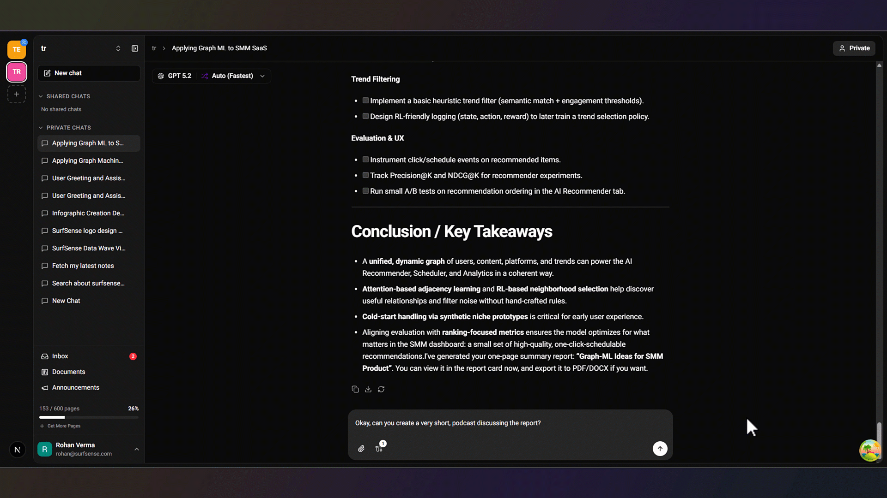
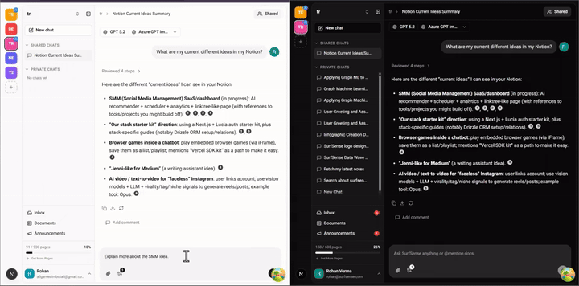

# Nowing

**Nowing is the AI knowledge platform for teams.** Turn your documents, connectors, and conversations into cited answers, reports, and podcasts — all in one collaborative workspace.

NotebookLM is one of the best AI research tools out there, but teams quickly run into its limits:

1. Caps on the number of sources you can add to a notebook.
2. Caps on the number of notebooks you can have.
3. Sources can't exceed 500,000 words or 200MB.
4. Locked to Google's models, with no team collaboration.
5. Limited external data sources and integrations.
6. Optimised for studying and research only.
7. No real-time multiplayer.

...and more.

**Nowing is built to solve these problems.** Nowing gives your team:

- **No Data Limits** - Add an unlimited number of sources and notebooks.
- **Best-in-Class Models, Managed** - Frontier models kept up to date for you. No API keys to configure.
- **27+ External Data Sources** - Connect Google Drive, OneDrive, Dropbox, Slack, Notion, and many more.
- **Real-Time Multiplayer** - Work together in a shared notebook with roles and live chat.
- **Cited Answers, Reports & Podcasts** - Perplexity-style citations, plus generated reports, podcasts, and videos.

...and more to come.

## How to Use Nowing

1. Go to [nowing.com](https://www.nowing.com) and sign up.

2. Connect your sources and sync. Enable periodic syncing to keep connectors up to date.

3. While connectors index, upload documents directly.

4. Once everything is indexed, ask away:

   - Search & Citation

   

   - Document Mention Q&A

   

   - Report Generation & Exports (PDF, DOCX, HTML, LaTeX, EPUB, ODT, Plain Text)

   

   - Podcast Generation

   

   - Image Generation

   

   - And more coming soon.

For full guides, see the [documentation](https://www.nowing.com/docs/).

### Real-Time Collaboration (Beta)

1. Go to the Manage Members page and create an invite.

   

2. A teammate joins and that search space becomes shared.

   

3. Make a chat shared.

   

4. Your team can now chat in real time.

   

5. Add comments to tag teammates.

   

## Nowing vs Google NotebookLM

| Feature | Google NotebookLM | Nowing |
|---------|-------------------|-----------|
| **Sources per Notebook** | 50 (Free) to 600 (Ultra, $249.99/mo) | Unlimited |
| **Number of Notebooks** | 100 (Free) to 500 (paid tiers) | Unlimited |
| **Source Size Limit** | 500,000 words / 200MB per source | No limit |
| **LLM Support** | Google Gemini only | Best-in-class models, managed for you |
| **External Connectors** | Google Drive, YouTube, websites | 27+ connectors - Search Engines, Google Drive, OneDrive, Dropbox, Slack, Teams, Jira, Notion, Discord & [more](#external-sources) |
| **File Format Support** | PDFs, Docs, Slides, Sheets, CSV, Word, EPUB, images, web URLs, YouTube | 50+ formats - documents, images, videos |
| **Search** | Semantic search | Hybrid Search - Semantic + Full Text with Hierarchical Indices & Reciprocal Rank Fusion |
| **Cited Answers** | Yes | Yes - Perplexity-style cited responses |
| **Agentic Architecture** | No | Yes - planning, subagents, and file system access |
| **Real-Time Multiplayer** | Shared notebooks with Viewer/Editor roles (no real-time chat) | RBAC with Owner / Admin / Editor / Viewer roles, real-time chat & comment threads |
| **Video Generation** | Cinematic Video Overviews via Veo 3 (Ultra only) | Available (NotebookLM is better here, actively improving) |
| **Presentation Generation** | Better looking slides but not editable | Create editable, slide-based presentations |
| **Podcast Generation** | Audio Overviews with customizable hosts and languages | Available (NotebookLM is better here, actively improving) |
| **Browser Extension** | No | Cross-browser extension to save any webpage, including auth-protected pages |

<b>Full list of External Sources</b>

Search Engines (Tavily, LinkUp) · SearxNG · Google Drive · OneDrive · Dropbox · Slack · Microsoft Teams · Linear · Jira · ClickUp · Confluence · BookStack · Notion · Gmail · YouTube Videos · Discord · Airtable · Google Calendar · Luma · Circleback · Elasticsearch, and more to come.

## Community

**Nowing is actively being developed.** Join the [Nowing Discord](https://discord.gg/ejRNvftDp9) to share feedback and help shape the future of Nowing.
