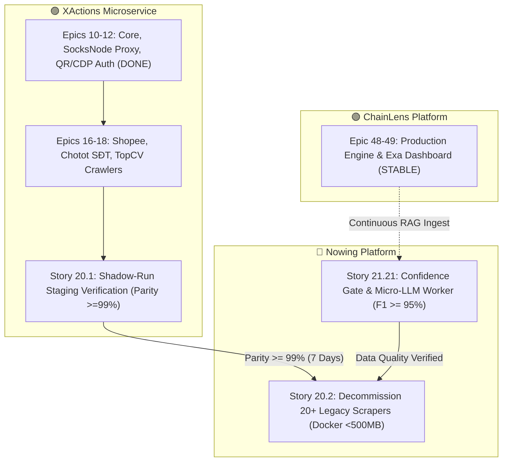

# 🌐 ECOSYSTEM CROSS-SPRINT STATUS & DEPENDENCY MATRIX
## The Strategic Trinity: Nowing Platform ✕ XActions Engine ✕ ChainLens-Research

**Bản cập nhật:** 2026-08-23  
**Điều phối viên:** Marcus (BMAD Master Cross-Project Program Coordinator)  
**Phạm vi hệ sinh thái (3 Repositories):**
1. 🔵 **Nowing Platform:** `/Users/luisphan/Documents/GitHub/nowing` *(AI Gen Leads Enterprise — Lead Intelligence, CRM Hub, PII Vault, Outbound)*
2. 🟣 **XActions Microservice:** `/Users/luisphan/Documents/GitHub/XActions` *(Universal Scraping Engine, Proxy Pool, Signer Bridge, MCP Daemon)*
3. 🟢 **ChainLens-Research Engine:** `/Users/luisphan/Documents/GitHub/chainlens-research` *(Stateless Vector Retrieval, Deep Research RAG, Exa Dashboard)*

---

## 🏛️ SƠ ĐỒ GIAO TIẾP & BẤT BIẾN LIÊN DỰ ÁN (CROSS-REPO ARCHITECTURE)

```
                            ┌─────────────────────────────────────────────────────────┐
                            │                NOWING PLATFORM (AI HUB)                 │
                            │  • Lead Scoring, Normalization & PII Dual-Vault (E21)   │
                            │  • Confidence Gate & Micro-LLM Worker (Story 21.21)     │
                            │  • Origami Split-Canvas, Team CRM & Multi-Table (E24)   │
                            └───────────▲─────────────────────────────────┬───────────┘
                                        │                                 │
                   (1) CRAWL INGESTION  │                                 │ (2) CHUNK INGESTION
                   • MCP HTTP/SSE:3001  │                                 │ • POST /v1/ingest/scraper
                   • Redis Stream       │                                 │ • UUIDv5 Deterministic
                                        │                                 ▼
┌───────────────────────────────────────┴───┐         ┌───────────────────────────────────────┐
│        XACTIONS SCRAPING ENGINE           │◄────────│      CHAINLENS-RESEARCH PLATFORM      │
│  • Hexagonal Core & PrismaStore (E10)     │  (3)    │  • Unified POST /api/v1/search (E48)  │
│  • SocksNode Sticky SOCKS5 Proxy (E11)    │  LIVE   │  • Multi-Tier Citation & Cost Ledger  │
│  • Playwright Tiered Signer Pool (E13)    │  DOMAIN │  • Exa-like Dev Dashboard (E49)       │
│  • 12+ Multi-Domain Scrapers (E13-18,21)  │  GROUND │  • Deep Research & Knowledge RAG      │
└───────────────────────────────────────────┘         └───────────────────────────────────────┘
```

---

## 📊 BẢNG TỔNG HỢP TIẾN ĐỘ 3 DỰ ÁN (3-REPO SPRINT PULSE)

| Dự án (Repository) | Epic Tổng & Quy mô | Trạng thái Hiện tại | Epics / Stories Nổi bật Đang Xử Lý |
|---|:---:|:---:|---|
| 🔵 **Nowing**<br>`/Users/luisphan/Documents/GitHub/nowing` | 28 Epics<br>(~160 Stories) | 🟡 **IN-PROGRESS (92% Done)** | • **Story 21.21:** `Deterministic Confidence Gate & Selective Micro-LLM Fallback` (`ready-for-dev`) 🔥<br>• **Story 25.4–25.6:** `Admin Telemetry & Dynamic Scraper Rules` (`ready-for-dev`)<br>• **Epic 24 & 26:** CRM Drip Outreach & LangGraph DSH Missions (`DONE`) |
| 🟣 **XActions**<br>`/Users/luisphan/Documents/GitHub/XActions` | 22 Epics<br>(~85 Stories) | 🟡 **IN-PROGRESS (Architecture Refactor Phase)** | • **Epics 10 & 11 (11.1–11.7):** Platform Core & Proxy Governor (`DONE`)<br>• **Story 11.8 & 12.2:** SocksNode Provider & CDP Remote Attach (`ready-for-dev`) 🔥<br>• **Epic 13 & 14:** Tiered Signer Pool (13.1), MCP Daemon Port 3001 (14.2) & Redis Stream (14.3) (`BACKLOG - HIGHEST PRIORITY`) 🔥<br>• **Epics 15–18:** Domain Crawlers (Shopee, Chợ Tốt, TopCV) (*chờ Epics 13–14 hoàn thành*) |
| 🟢 **ChainLens-Research**<br>`/Users/luisphan/Documents/GitHub/chainlens-research` | 49 Epics<br>(~140 Stories) | 🟢 **PRODUCTION READY (100% Done)** | • **Epic 48 & 49:** Unified Search API, Exa-like Dev Dashboard, Usage, Table/CSV/Share output (`DONE & STABLE`)<br>• Sẵn sàng 100% làm kho tri thức Vector Retrieval & Deep Research cho Nowing! |

---

## 🤝 MA TRẬN ĐIỂM GIAO THOA & PHỤ THUỘC (CROSS-REPO HANDSHAKES)

| Điểm Giao Thoa (Handshake) | Bên Cung Cấp (Provider) | Bên Tiêu Thụ (Consumer) | Giao Thức / Invariant | Trạng Thái Kết Nối |
|---|---|---|---|:---:|
| **H1: Social & Live Feed Ingestion** | `XActions` (Epics 13, 15) | `Nowing` (Story 21.8) | MCP Tool (`x_facebook_group_posts`, `x_search_tweets`) | 🟢 **CONNECTED (DONE)** |
| **H2: E-Com & Real Estate Scrapers** | `XActions` (Epics 16, 17) | `Nowing` (Stories 17.1, 17.5) | MCP Daemon HTTP/SSE (Port 3001) / Redis Stream | 🟡 **WIRING ADAPTERS** |
| **H3: B2B Registry & Procurement** | `XActions` (Epic 21.1) | `Nowing` (Story 16.2) | MCP Tool `x_dangkykinhdoanh` & `masothue` | 🟡 **SPEC READY** |
| **H4: Cutover & Scraper Cleanup** | `XActions` (Epic 20.1) | `Nowing` (Story 20.2) | Shadow-Run Parity $\ge 99\%$ trong 7 ngày | ⏳ **PENDING RUN** |
| **H5: Chunk Ingest & Knowledge RAG** | `Nowing` (Epic 20) | `ChainLens` (Epic 47) | `POST /v1/ingest/scraper` $\rightarrow$ Vector Store | 🟢 **CONNECTED (DONE)** |
| **H6: Deep Research Chat Subagent** | `ChainLens` (Epic 48) | `Nowing` (Epic 9, 26) | Unified `POST /api/v1/search` + Table Output | 🟢 **CONNECTED (DONE)** |
| **H7: Live Domain Grounding** | `XActions` (MCP Daemon 3001) | `ChainLens` (`XActionsLiveProvider`) | XActions MCP tools (`x_facebook_group_posts`, `x_shopee_search`) via HTTP | ⏳ **PLANNED (Chờ XActions Epic 14)** |

---

## 🚨 BẢN ĐỒ ĐIỂM NGHẼN & ĐƯỜNG GĂNG (CRITICAL PATH BLOCKER RADAR)



### 🎯 3 Nhiệm vụ Trọng tâm Cần Xử Lý Ngay (Next Action Items):

1. **Tại `Nowing` (Ưu tiên P0):**
   * Triển khai lập trình **`Story 21.21: Deterministic Confidence Gate & Selective Micro-LLM Fallback Worker`** (Tạo `confidence_gate.py`, `micro_extraction_worker.py`, kẹp 100-record Golden Dataset để nâng Phone F1 $\ge 95\%$).
2. **Tại `XActions` (Ưu tiên P0 - Kiến trúc & Hạ tầng Lõi):**
   * Triển khai **Story 11.8** (SocksNode Proxy Provider) và **Story 12.2** (CDP Remote Attach Port 9222).
   * Triển khai **Epic 13 (Story 13.1)** Tiered Signer Architecture (`a_bogus` / `msToken` Worker Pool).
   * Triển khai **Epic 14 (Story 14.2 & 14.3)** MCP Daemon HTTP/SSE (Port 3001) & Redis Stream `stream:social:raw_posts`.
3. **Liên repo `Nowing ↔ XActions` (Sau khi XActions hoàn thành Epics 13–14):**
   * Kết nối adapter Nowing qua MCP Daemon Port 3001 và kích hoạt chế độ **Shadow-Run (Story 20.1)** trong staging trước khi decommission scraper cũ (Story 20.2).

---

_Tài liệu được quản lý tự động bởi BMAD Coordinator Agent (Marcus). Chạy `/bmad-agent-coordinator sync` hoặc `/bmad-agent-coordinator standup` để cập nhật trạng thái mới nhất._
