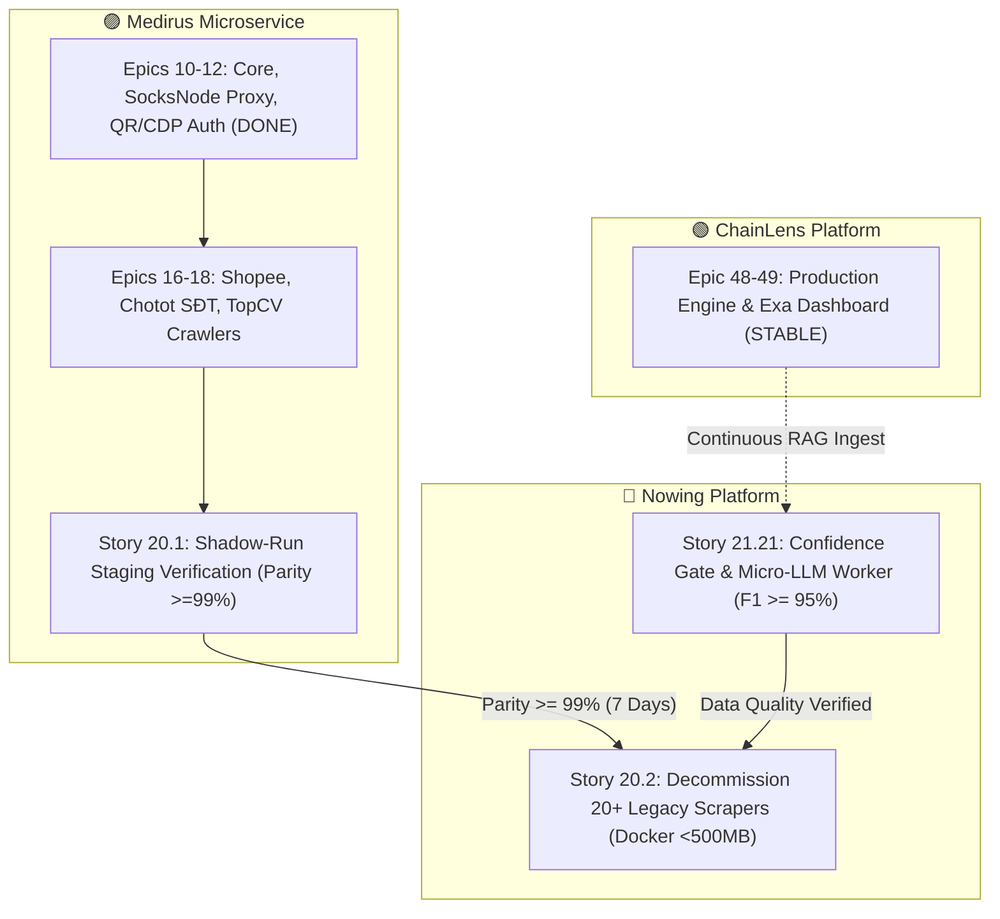

# 🌐 ECOSYSTEM CROSS-SPRINT STATUS & DEPENDENCY MATRIX
## The Strategic Trinity: Nowing Platform ✕ Medirus Engine ✕ ChainLens-Research

**Bản cập nhật:** 2026-10-08  
**Điều phối viên:** Marcus (BMAD Master Cross-Project Program Coordinator)  
**Phạm vi hệ sinh thái (3 Repositories):**
1. 🔵 **Nowing Platform:** `/Users/luisphan/Documents/GitHub/nowing` *(AI Gen Leads Enterprise — Lead Intelligence, CRM Hub, PII Vault, Outbound)*
2. 🟣 **Medirus Microservice:** `/Users/luisphan/Documents/GitHub/Medirus` *(Universal Scraping Engine, Proxy Pool, Signer Bridge, MCP Daemon)*
3. 🟢 **ChainLens-Research Engine:** `/Users/luisphan/Documents/GitHub/chainlens-research` *(Stateless Vector Retrieval, Deep Research RAG, Exa Dashboard)*

---

## 🏛️ SƠ ĐỒ GIAO TIẾP & BẤT BIẾN LIÊN DỰ ÁN (CROSS-REPO ARCHITECTURE)

```
                            ┌─────────────────────────────────────────────────────────┐
                            │                NOWING PLATFORM (AI HUB)                 │
                            │  • Lead Scoring, Normalization & PII Dual-Vault (E21)   │
                            │  • Confidence Gate & Micro-LLM Worker (Story 21.21)     │
                            │  • Origami Split-Canvas, Team CRM & Multi-Table (E24)   │
                            └───────────▲─────────────────────────────────┬───────────┘
                                        │                                 │
                   (1) CRAWL INGESTION  │                                 │ (2) CHUNK INGESTION
                   • MCP HTTP/SSE:3001  │                                 │ • POST /v1/ingest/scraper
                   • Redis Stream       │                                 │ • UUIDv5 Deterministic
                                        │                                 ▼
┌───────────────────────────────────────┴───┐         ┌───────────────────────────────────────┐
│        MEDIRUS SCRAPING ENGINE           │◄────────│      CHAINLENS-RESEARCH PLATFORM      │
│  • Hexagonal Core & PrismaStore (E10)     │  (3)    │  • Unified POST /api/v1/search (E48)  │
│  • SocksNode Sticky SOCKS5 Proxy (E11)    │  LIVE   │  • Multi-Tier Citation & Cost Ledger  │
│  • Playwright Tiered Signer Pool (E13)    │  DOMAIN │  • Exa-like Dev Dashboard (E49)       │
│  • 12+ Multi-Domain Scrapers (E13-18,21)  │  GROUND │  • Deep Research & Knowledge RAG      │
└───────────────────────────────────────────┘         └───────────────────────────────────────┘
```

---

## 📊 BẢNG TỔNG HỢP TIẾN ĐỘ 3 DỰ ÁN (3-REPO SPRINT PULSE)

| Dự án (Repository) | Epic Tổng & Quy mô | Trạng thái Hiện tại | Epics / Stories Nổi bật Đang Xử Lý |
|---|:---:|:---:|---|
| 🔵 **Nowing**<br>`/Users/luisphan/Documents/GitHub/nowing` | 39 Epics<br>(257 Stories) | 🟢 **SPRINT COMPLETE (100% Done)** | • Tất cả 39 epics done — kể cả Epic 39 (Jev typed-decision layer) & Epic 40 (Medirus migration AI-40.1)<br>• Rebrand hoàn tất: mọi tham chiếu `xactions` → `medirus` (env `MEDIRUS_*`, enum `MEDIRUS_MCP_CONNECTOR`, tool names `medirus_*`) — commit `c84319a8e`, `2b27dd5fe`<br>• Deploy pending: env `MEDIRUS_MCP_URL`/`MEDIRUS_STREAM_*` trên Dokploy |
| 🟣 **Medirus**<br>`/Users/luisphan/Documents/GitHub/Medirus` | 54 Epics<br>(326 stories done) | 🟢 **PRODUCTION** — MCP daemon live :3333, v3.5.0 | • Rebrand hoàn tất: 229 tool names `x_*` → `medirus_*` + 27 mã lỗi `XACT_*` → `MEDIRUS_*` (commit `f079d573`); legacy shim `x_*` vẫn dispatch được<br>• 46 open retro action items (epics 45/48 — nối API thật apps/web, gỡ mock fallback)<br>• Compact mode: 12 domain dispatchers (`medirus_post`, `medirus_scrape`...) |
| 🟢 **ChainLens-Research**<br>`/Users/luisphan/Documents/GitHub/chainlens-research` | 49 Epics<br>(~140 Stories) | 🟢 **PRODUCTION READY (100% Done)** | • **Epic 48 & 49:** Unified Search API, Exa-like Dev Dashboard, Usage, Table/CSV/Share output (`DONE & STABLE`)<br>• Sẵn sàng 100% làm kho tri thức Vector Retrieval & Deep Research cho Nowing! |

---

## 🤝 MA TRẬN ĐIỂM GIAO THOA & PHỤ THUỘC (CROSS-REPO HANDSHAKES)

| Điểm Giao Thoa (Handshake) | Bên Cung Cấp (Provider) | Bên Tiêu Thụ (Consumer) | Giao Thức / Invariant | Trạng Thái Kết Nối |
|---|---|---|---|:---:|
| **H1: Social & Live Feed Ingestion** | `Medirus` | `Nowing` | MCP Tool (`medirus_facebook_group_posts`, `medirus_search_tweets`) | 🟢 **CONNECTED (DONE)** |
| **H2: E-Com & Real Estate Scrapers** | `Medirus` | `Nowing` | MCP Daemon streamable-HTTP `localhost:3333/mcp` / Redis Stream `stream:social:*` | 🟢 **CONNECTED — verified live 2026-10-08** |
| **H3: B2B Registry & Procurement** | `Medirus` | `Nowing` | MCP tool `medirus_*` (masothue crawler live — tax-code lookup verified) | 🟢 **CONNECTED** |
| **H4: Cutover & Scraper Cleanup** | `Medirus` (Epic 20.1) | `Nowing` (Story 20.2) | Shadow-Run Parity $\ge 99\%$ trong 7 ngày | ⏳ **PENDING RUN** |
| **H5: Chunk Ingest & Knowledge RAG** | `Nowing` (Epic 20) | `ChainLens` (Epic 47) | `POST /v1/ingest/scraper` $\rightarrow$ Vector Store | 🟢 **CONNECTED (DONE)** |
| **H6: Deep Research Chat Subagent** | `ChainLens` (Epic 48) | `Nowing` (Epic 9, 26) | Unified `POST /api/v1/search` + Table Output | 🟢 **CONNECTED (DONE)** |
| **H7: Live Domain Grounding** | `Medirus` (MCP Daemon :3333) | `ChainLens` (`MedirusLiveProvider`) | Medirus MCP tools (`medirus_facebook_group_posts`, `medirus_scrape`) via HTTP | 🟢 **AVAILABLE — daemon live, medirus_* canonical** |

---

## 🚨 BẢN ĐỒ ĐIỂM NGHẼN & ĐƯỜNG GĂNG (CRITICAL PATH BLOCKER RADAR)


```mermaid
graph TD
    subgraph Nowing_Critical_Path ["🔵 Nowing Platform"]
        N21_21["Story 21.21: Confidence Gate & Micro-LLM Worker (F1 >= 95%)"]
        N20_2["Story 20.2: Decommission 20+ Legacy Scrapers (Docker <500MB)"]
    end

    subgraph Medirus_Critical_Path ["🟣 Medirus Microservice"]
        X_Core["Epics 10-12: Core, SocksNode Proxy, QR/CDP Auth (DONE)"]
        X_Crawlers["Epics 16-18: Shopee, Chotot SĐT, TopCV Crawlers"]
        X20_1["Story 20.1: Shadow-Run Staging Verification (Parity >=99%)"]
    end

    subgraph ChainLens_Path ["🟢 ChainLens Platform"]
        CL_Ready["Epic 48-49: Production Engine & Exa Dashboard (STABLE)"]
    end

    X_Core --> X_Crawlers
    X_Crawlers --> X20_1
    X20_1 -- "Parity >= 99% (7 Days)" --> N20_2
    N21_21 -- "Data Quality Verified" --> N20_2
    CL_Ready -. "Continuous RAG Ingest" .-> N21_21
```

### 🎯 Nhiệm vụ Trọng tâm Cần Xử Lý Ngay (Next Action Items — cập nhật 2026-10-08):

1. **Deploy Nowing + Medirus production:** đổi env `XACTIONS_*` → `MEDIRUS_*` trên Dokploy (hoặc config sẽ rớt về default `http://medirus:3001/mcp`); restart Medirus daemon để serve tên canonical.
2. **Tại `Medirus`:** xử lý 46 retro action items còn open (epics 45/48 — nối API thật cho apps/web, gỡ seeded/mock fallback).
3. **Consumers Medirus:** eliza-kol-agent đã migrate `x_*` → `medirus_*` (commit `4f7caaf`); shim legacy trong `executeTool` vẫn cover consumer nào chưa đổi — lên lịch gỡ shim khi mọi consumer đã migrate.
4. **Tại `Nowing`:** sprint 39 epics hoàn tất — bước tiếp theo là retrospective Epic 40 và mở cycle epic mới khi có định hướng sản phẩm.

---

_Tài liệu được quản lý tự động bởi BMAD Coordinator Agent (Marcus). Chạy `/bmad-agent-coordinator sync` hoặc `/bmad-agent-coordinator standup` để cập nhật trạng thái mới nhất._
