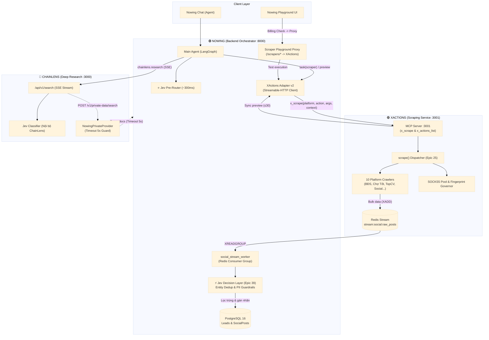

# Master Integration Plan — Nowing × XActions × ChainLens

**Ngày lập:** 2026-09-24  
**Kiến trúc sư phụ trách:** Winston (System Architect)  
**Trạng thái cơ sở:** Đã verify 100% mã nguồn thực tế trên cả 3 repositories.

---

## 1. Bối cảnh & Hiện trạng Kỹ thuật (Verified Reality)

Sau khi quét sâu toàn bộ 3 repository, hệ sinh thái đang ở vị thế rất thuận lợi nhưng còn dở dang ở các điểm tiếp giáp:

1. **Nowing (`nowing/`):**
   * ✅ **Epic 39 (Jev Decision Layer) ĐÃ HOÀN TẤT:** `DecisionService` (`app/services/decision/`), `jev_router.py` (vị trí số 10 trong `stack.py`), entity dedup scoring, voice semantic gate, và telemetry dashboard đã sẵn sàng.
   * ✅ **Cầu nối XActions đã dựng sẵn:** `app/proprietary/platforms/xactions/adapter_v2.py` và `mcp_client.py` đã code xong logic đóng gói `{platform, action, args, context}` và lắng nghe `stream:social:raw_posts`.
   * ⚠️ **Tồn dư kỹ thuật:** Vẫn duy trì 22 platform scrapers nội bộ trong `app/proprietary/platforms/` gây phình to Docker image và trùng lặp logic bảo trì.
   * ⚠️ **API Playground:** Giao diện `nowing_web/app/dashboard/[workspace_id]/playground/` đang nối vào các scraper cục bộ thay vì ủy thác sang XActions.

2. **XActions (`XActions/`):**
   * 🔄 **Epic 46 (API Contract & OpenAPI 3.1) ĐANG TRIỂN KHAI:** Đã scaffold schemas trong `api/schemas/` (`auth`, `checkpoints`, `common`, `crm`, `optimizer`, `session`, `viral`) và middleware validation/envelopes.
   * ⚠️ **Điểm nghẽn:** `src/mcp/server.js` hiện chỉ expose các tools mạng xã hội rời rạc; chưa expose tool gom `x_scrape(platform, action, args, context)` và `x_actions_list` theo chuẩn AD-2.

3. **ChainLens (`chainlens-research/`):**
   * ✅ **Đã tích hợp Jev nội bộ:** Các commit `71-9` và `71-10` đã đưa Jev vào làm pre-classification và verifier cho search.
   * ⚠️ **Rủi ro vòng lặp:** `NowingPrivateProvider` (`apps/api/src/nowing/nowing-private-data-client.ts`) gọi ngược sang Nowing `POST /v1/private-data/search`. Cần gắn circuit breaker / timeout chặt chẽ để triệt tiêu nguy cơ distributed deadlock.

---

## 2. Mục tiêu Kiến trúc (Strategic Architectural Goals)

1. **Quy tắc Single Responsibility:**
   * **XActions** là động cơ cào duy nhất (Sole Scraping Engine) cho mọi domain (BĐS, Chợ Tốt, Việc làm, Mạng xã hội, E-com).
   * **Nowing** là trung tâm điều phối (Business & Agent Orchestrator), quản lý người dùng, workspace, credits và giao diện người dùng.
   * **ChainLens** là động cơ nghiên cứu sâu (Stateless Deep Research Engine).
2. **Loại bỏ trùng lặp bảo trì (Zero Double Maintenance):** Toàn bộ việc đối phó với Cloudflare, anti-bot, proxy xoay vòng và thay đổi DOM của website mục tiêu dồn 100% về XActions.
3. **Bảo toàn trải nghiệm Playground:** Giữ nguyên giao diện API Playground trên `nowing_web`, biến backend thành Thin Proxy chuyển tiếp sang XActions có trừ credits.
4. **Tối ưu hóa dữ liệu với Jev:** Dữ liệu cào từ XActions đổ về Redis Stream sẽ được Jev (Epic 39) deduplicate và lọc PII tự động trước khi ghi vào Database.

---

## 3. Bản Đồ Tương Tác Giữa 3 Hệ Thống (Data & Control Plane)



---

## 4. Kế Hoạch Triển Khai Chi Tiết Theo 4 Giai Đoạn

### 🚀 GIAI ĐOẠN 1: Chuẩn Hóa Cầu Nối `x_scrape` Phía XActions
*Mục tiêu: Đảm bảo XActions expose đúng tool mà `adapter_v2.py` của Nowing đang chờ.*

* **Task X1.1: Hoàn thiện Tool `x_scrape` trong `XActions/src/mcp/server.js` (AD-2)**
  * Bổ sung tool `x_scrape` vào mảng `TOOLS` của MCP Server:
    ```javascript
    {
      name: 'x_scrape',
      description: 'Unified cross-platform scraper dispatcher (social, realestate, ecom, jobs).',
      inputSchema: {
        type: 'object',
        properties: {
          platform: { type: 'string', description: 'Platform identifier (batdongsan, chotot, topcv...)' },
          action: { type: 'string', description: 'Action descriptor verb (search_listings, listing_detail...)' },
          args: { type: 'object', description: 'Action-specific argument object' },
          context: { type: 'object', description: 'Multi-tenant context {targetId, workspaceId}' },
          dryRun: { type: 'boolean', default: false }
        },
        required: ['platform', 'action', 'args']
      }
    }
    ```
  * Map request vào `scrape(platform, action, args, context)` của dispatcher (`src/core/action-registry.js`).
  * Trả về 3-layer envelope: preview tối đa 30 records, báo cờ `stream: true`.

* **Task X1.2: Hoàn thiện Tool `x_actions_list` trong `XActions/src/mcp/server.js` (AD-7)**
  * Đảm bảo `x_actions_list` trả về danh mục action chuẩn (`platform`, `action`, `requiredArgs`, `optionalArgs`) để `action_matrix.py` bên Nowing có thể tự động đồng bộ (dynamic discovery).

* **Task X1.3: Bảo toàn Hook Đẩy Redis Stream (`base-crawler.js` - AD-3)**
  * Đảm bảo mọi crawler khi cào thành công mẻ dữ liệu lớn đều gọi hook `xAdd` vào `stream:social:raw_posts` với payload snake_case (`id`, `platform`, `external_post_id`, `content_snippet`, `target_id`, `workspace_id`).

---

### 🚀 GIAI ĐOẠN 2: Chuyển Đổi Gateway & Mở Rộng Playground Phía Nowing
*Mục tiêu: Nowing chuyển sang sử dụng XActions làm động cơ cào mặc định; Playground hoạt động qua proxy.*

* **Task N2.1: Hoàn tất Kích hoạt `adapter_v2.py` (Story 21.8a)**
  * Bật cờ môi trường `NOWING_XACTIONS_USE_V2=true` để toàn bộ `task(scraper)` của subagents chuyển sang gọi `XActionsMcpClient.call_tool("x_scrape", ...)`.
  * Verify luồng kết nối Streamable-HTTP giữa Nowing `:8000` và XActions `:3001/mcp`.

* **Task N2.2: Chuyển đổi các Endpoint Playground thành Thin Proxy**
  * Sửa các route điều khiển scraper trong `nowing_backend/app/routes/` phục vụ Playground UI:
    * Thay vì khởi tạo các class cào nội bộ (`BatdongsanPlatform()`, `ChototPlatform()`), router sẽ kiểm tra số dư credit của Workspace.
    * Đóng gói tham số và gọi `XActionsMcpClient.call_tool("x_scrape", ...)`.
    * Trả kết quả chuẩn hóa về cho frontend Next.js.
  * Giữ nguyên 100% catalog icon và navigation trong `nowing_web/lib/playground/catalog.ts`.

* **Task N2.3: Viết Integration Test Gateway Nowing ↔ XActions**
  * Viết test tự động: Gửi lệnh cào thử 1 listing Chợ Tốt và 1 bài đăng Facebook qua `adapter_v2.py` $\rightarrow$ Xác nhận XActions nhận lệnh, trả preview $\le 30$ records và đẩy bản ghi vào Redis Stream.

---

### 🚀 GIAI ĐOẠN 3: Dọn Dẹp Nợ Kỹ Thuật (Decommission 22 Scraper Nội Bộ)
*Mục tiêu: Giảm tải bảo trì, thu gọn Docker container của Nowing.*

* **Task N3.1: Tách Biệt Data Schemas và Crawler Execution**
  * Trong `nowing_backend/app/proprietary/platforms/`:
    * **GIỮ LẠI:** Các file định nghĩa schemas (`schemas.py`, `models.py`, `parsers.py` chuẩn hóa số điện thoại, giá tiền, địa chỉ).
    * **XÓA BỎ:** Toàn bộ code mở kết nối HTTP cào thô, bypass anti-bot, browser automation (`fetch.py`, `crawler.py`, `client.py`).
* **Task N3.2: Tinh Giảm Dependencies Trong `pyproject.toml`**
  * Gỡ bỏ các thư viện phục vụ cào trang web phức tạp không còn dùng trong Nowing backend (các dependencies headless browser, lxml thừa).
  * Build lại Docker image Nowing, verify dung lượng giảm $\ge 400\text{MB}$.

---

### 🚀 GIAI ĐOẠN 4: Khép Kín Dữ Liệu Với Jev & Bảo Vệ ChainLens
*Mục tiêu: Tối ưu chất lượng dữ liệu đầu ra và triệt tiêu nguy cơ nghẽn mạng liên repo.*

* **Task N4.1: Cắm Jev DecisionService (Story 39.3 & 39.4) vào Stream Consumer**
  * Trong `nowing_backend/app/tasks/social_stream_worker.py`:
    * Khi nhận mẻ sự kiện từ `stream:social:raw_posts`:
      1. Gọi `DecisionService.decide(entity_match)` để tính toán điểm tương đồng (`Score 0-2`). Các bản ghi có điểm $\ge 1.5$ được tự động gộp (auto-merge); từ $0.5 - 1.5$ đưa vào curator queue; $< 0.5$ lưu bản ghi mới.
      2. Gọi `DecisionService.decide(content_filter)` (`Noul battery`) để loại bỏ spam, bài đăng có mã độc injection hoặc số CCCD/CMND nhạy cảm.

* **Task C4.2: Tăng Cường Bảo Vệ Nowing ↔ ChainLens (Resilience Guard)**
  * Trong `chainlens-research/apps/api/src/nowing/nowing-private-data-client.ts`:
    * Đặt timeout nghiêm ngặt **5.0s** cho cuộc gọi `searchPrivateData`.
    * Thêm cơ chế Circuit Breaker: Nếu Nowing phản hồi chậm hoặc lỗi 5xx trong 3 lần liên tiếp, ChainLens tự động bỏ qua phần private-data và tiếp tục tổng hợp kết quả từ web công cộng, **tuyệt đối không làm nghẽn luồng Deep Research của người dùng**.

---

## 5. Ma Trận Rủi Ro & Kế Hoạch Dự Phòng (Risk Matrix & Rollback)

| Rủi ro kỹ thuật | Mức độ | Biện pháp ngăn chặn (Mitigation) | Kế hoạch dự phòng (Rollback) |
|---|---|---|---|
| **XActions sập hoặc hết Proxy pool** | Cao | Cấu hình Circuit Breaker tại `adapter_v2.py`. XActions expose `/api/governor` để Nowing kiểm tra trạng thái proxy trước khi dispatch. | Báo trạng thái `scraper_temporarily_unavailable` thân thiện trên UI, chuyển tác vụ vào hàng đợi Celery để retry sau 10 phút thay vì đâm thẳng sập server. |
| **Schema drift giữa XActions và Nowing** | Trung bình | XActions có Zod validation và commit spec `openapi.json` trong CI. Nowing dùng Pydantic để validate đầu vào. | `action_matrix.py` tự động fallback về `STATIC_FALLBACK_MATRIX` nếu catalog động bị lỗi format. |
| **Distributed Deadlock Nowing ↔ ChainLens** | Thấp | Cắt ngắn timeout xuống 5s tại `nowing-private-data-client.ts`. Nowing private data search chạy trên read-only replica. | ChainLens tự động fallback về chế độ web-only search nếu private search fail. |

---

## 6. Tiêu Chuẩn Nghiệm Thu Hoàn Thành (Definition of Done - DoD)

1. ✅ **Giao tiếp thông suốt:** Nowing Agent và Playground gửi lệnh cào qua `XActionsMcpClient` nhận về preview hợp lệ và dữ liệu đầy đủ chảy qua Redis Stream.
2. ✅ **UI nhất quán:** Giao diện Playground trên `nowing_web` chạy mượt mà, người dùng test cào dữ liệu bình thường, credit trừ chính xác.
3. ✅ **Codebase sạch sẽ:** 22 scraper cũ trong Nowing được giải phóng phần code cào, dung lượng Docker Nowing giảm rõ rệt.
4. ✅ **Dữ liệu được làm sạch bởi Jev:** 100% bài post cào từ XActions về Nowing được phân loại và dedup qua Jev Decision Layer trước khi ghi DB.
5. ✅ **Test suites pass 100%:** Toàn bộ test suites liên quan đến scraper adapter v2, Jev decision service và ChainLens search chạy pass.
