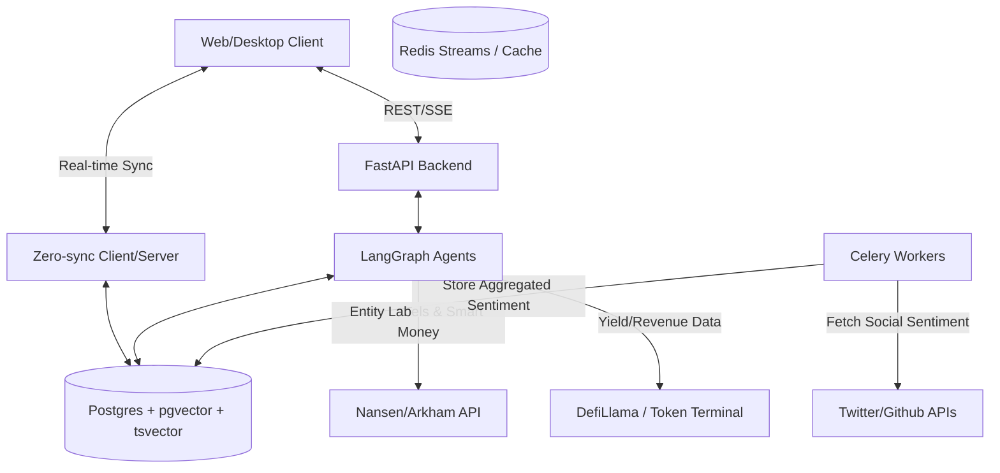

# Architecture Extension: Institutional Research Terminal (Epic 10)

> **🔄 Renamed 2026-05-06:** Originally "Epic 13" — renamed to **Epic 10** in sprint-status. Filename `architecture-extension-epic13.md` retained for git history audit; canonical reference now reads "Epic 10". All architectural decisions below remain valid.

**Document Status:** 📝 REVISED (Pragmatic Architecture)
**Date:** 2026-05-03

## 1. Introduction & Context
Epic 10 (formerly Epic 13) expands Nowing from a retail co-pilot to an institutional-grade research terminal. This requires processing high-velocity on-chain data and off-chain sentiment streams. 

Following the principle of "Boring technology for stability", this architecture aggressively favors 3rd-party APIs and existing infrastructure over deploying complex new distributed systems (e.g., deferring Kafka, Neo4j, and Elasticsearch until absolutely necessary).

## 2. Extended Architecture Diagram (Lean Approach)

## 3. Key Architectural Decisions (Pragmatic Trade-offs)

### 3.1. Entity Resolution: API First (No Graph DB)
**Why:** Deploying Neo4j increases operational complexity by 300%. Deep graph traversals on self-hosted infrastructure are risky and expensive.
**Decision:** For Phase 1 & 2, we will NOT self-host a Graph DB. We will rely entirely on the **Nansen / Arkham APIs** for entity labeling and wallet clustering. The `smart_money_analyst` agent will query these APIs directly and cache the results in Postgres using Epic 10's `CryptoDataCacheMiddleware`.

### 3.2. Data Streaming: Redis Streams (No Kafka/Spark)
**Why:** Kafka and Spark require a dedicated Data Engineering team.
**Decision:** We will use our existing **Redis** deployment utilizing **Redis Streams** for lightweight pub/sub of real-time alerts (e.g., Whale movements). If ingestion exceeds 10,000 events/second, we will evaluate Redpanda as a drop-in replacement.

### 3.3. Narrative Heatmaps: Postgres Full-Text Search (No Elasticsearch)
**Why:** Running an Elasticsearch cluster alongside Postgres is redundant for early MVP stages.
**Decision:** We will leverage Postgres's native `tsvector` and `tsquery` for full-text search, combined with `pgvector` for semantic search. Social media data fetched by Celery will be processed for sentiment (via lightweight local NLP models or LLM calls) and stored directly in Postgres. We will rely on Postgres materialized views for heatmap aggregations.

### 3.4. Tokenomics & Stress Testing Sandbox (Client-Side Simulation Engine)
**Why:** Server-side simulations for interactive UI sliders introduce unacceptable latency (>200ms).
**Decision:** The Backend (FastAPI) will act as a passthrough for raw financial data. The **Simulation Engine** will be built entirely on the Frontend (Client-side) using TypeScript (or WebAssembly if math libraries become too heavy). This ensures instant UI updates when users adjust tokenomics parameters.

## 4. Migration & Phased Rollout

- **Phase 1 (The "API Wrapper" Phase):** Implement UI components (Sankey, Heatmaps, Sandboxes). Backend acts as an orchestrator for Nansen, DefiLlama, and Token Terminal APIs. Zero new databases.
- **Phase 2 (Internal Aggregation):** Celery begins fetching and scoring social sentiment, storing it in Postgres (tsvector) to power self-hosted Narrative Heatmaps.
- **Phase 3 (The "Data Independence" Phase - ONLY IF REQUIRED):** If external API costs exceed hosting costs, or rate limits cripple the user experience, evaluate migrating specific workloads to Redpanda and Neo4j.
