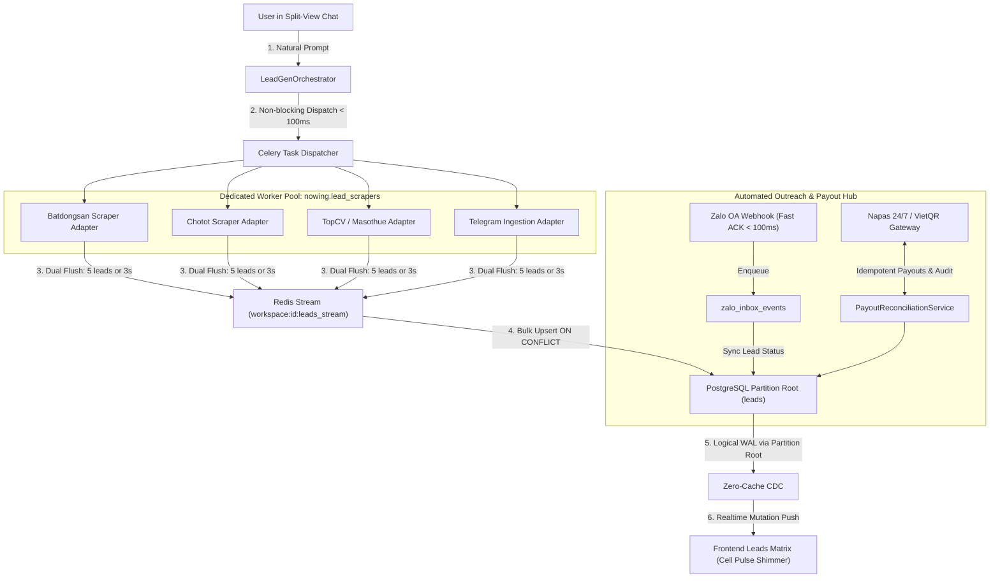

# Architecture Spine: Epic 23 — Enterprise Lead Infrastructure, Realtime Ingestion & Automated Outreach Engine

- **Status:** APPROVED & RATIFIED
- **Date:** 2026-08-16
- **Authors & Reviewers:** Winston (System Architect), Mary (Strategic BA), Sally (UX Designer), Amelia (Lead Dev), Murat (Test Architect)
- **Target System:** Nowing Backend (`nowing_backend`), Nowing Web (`nowing_web`), PostgreSQL + PgVector, Zero-Cache, Celery + Redis Streams

---

## 1. Executive Summary & Problem Statement

Nowing is expanding from a single-workspace lead scraper into an **Enterprise B2B Lead Intelligence & Outreach Engine**. To support:
1. Concurrently scraping across 15+ Vietnamese lead sources without blocking synchronous chat SSE connections.
2. Ingesting and querying 5,000,000+ lead records with sub-10ms latency and strict multi-tenant isolation.
3. Automated two-way Zalo OA Webhook and ZNS Transactional Template messaging compliant with Decree 91/2020/NĐ-CP (Anti-Spam) and Decree 13/2023/NĐ-CP (PDPD).
4. Instant 24/7 VietQR / Napas automated affiliate partner commission payouts with zero-double-spend guarantees.

---

## 2. Architectural Invariants (INV-23.1 – INV-23.11)

```
┌────────────────────────────────────────────────────────────────────────────────────────┐
│                        EPIC 23 NON-NEGOTIABLE ARCHITECTURAL INVARIANTS                 │
├────────────┬───────────────────────────────────────────────────────────────────────────┤
│ INV-23.1   │ Dedicated Celery Queue: Scrapers run on queue `nowing.lead_scrapers`.      │
│ INV-23.2   │ Bounded Redis Streams: All XADD use `MAXLEN ~ 10000` approximate cap.     │
│ INV-23.3   │ Circuit Breaker: 3 consecutive 429/anti-bot trips domain for 10m in Redis.│
│ INV-23.4   │ Composite Partition Key: `leads` PK is `PRIMARY KEY (id, workspace_id)`.  │
│ INV-23.5   │ Zero-Cache CDC: `ALTER PUBLICATION zero_publication SET                    │
│            │ (publish_via_partition_root = true);`                                     │
│ INV-23.6   │ Fail-Closed RLS: `SET LOCAL app.current_workspace_id` + FORCE RLS.        │
│ INV-23.7   │ Payout Locking: `SELECT ... FOR UPDATE` on all payout state transitions.   │
│ INV-23.8   │ Reconciliation First: No blind retry on Napas API timeout; query state.   │
│ INV-23.9   │ Payout Audit: HMAC-SHA256 signature stored on completed ledger records.   │
│ INV-23.10  │ Webhook Security: `hmac.compare_digest()` with timestamp tolerance <= 300s│
│ INV-23.11  │ Fast Webhook ACK: Return HTTP 200 < 100ms; background Celery processing.  │
└────────────┴───────────────────────────────────────────────────────────────────────────┘
```

---

## 3. High-Level Component & Data Flow Architecture



---

## 4. Zero-Downtime PostgreSQL Table Partitioning Strategy (Story 23.4)

PostgreSQL declarative partitioning requires an online, multi-stage migration:

### Phase 1: Shadow Table Creation
```sql
CREATE TABLE leads_partitioned (
    id UUID NOT NULL,
    workspace_id INTEGER NOT NULL,
    client_id VARCHAR(64) NOT NULL,
    source VARCHAR(64) NOT NULL,
    company_name TEXT,
    domain VARCHAR(255),
    value_hmac VARCHAR(64) NOT NULL,
    raw_payload JSONB DEFAULT '{}'::jsonb,
    fit_score DOUBLE PRECISION DEFAULT 0.0,
    intent_score DOUBLE PRECISION DEFAULT 0.0,
    status VARCHAR(32) DEFAULT 'new',
    created_at TIMESTAMPTZ NOT NULL DEFAULT NOW(),
    updated_at TIMESTAMPTZ NOT NULL DEFAULT NOW(),
    PRIMARY KEY (id, workspace_id),
    CONSTRAINT uq_leads_workspace_value_hmac UNIQUE (workspace_id, value_hmac)
) PARTITION BY HASH (workspace_id);

-- 16 Hash Partitions
CREATE TABLE leads_p0 PARTITION OF leads_partitioned FOR VALUES WITH (MODULUS 16, REMAINDER 0);
CREATE TABLE leads_p1 PARTITION OF leads_partitioned FOR VALUES WITH (MODULUS 16, REMAINDER 1);
-- ... up to leads_p15
CREATE TABLE leads_default PARTITION OF leads_partitioned DEFAULT;
```

### Phase 2: Dual-Writing Trigger
```sql
CREATE OR REPLACE FUNCTION trg_sync_leads_dual_write()
RETURNS TRIGGER AS $$
BEGIN
    IF (TG_OP = 'INSERT' OR TG_OP = 'UPDATE') THEN
        INSERT INTO leads_partitioned VALUES (NEW.*)
        ON CONFLICT (workspace_id, value_hmac) DO UPDATE
        SET fit_score = EXCLUDED.fit_score,
            intent_score = EXCLUDED.intent_score,
            updated_at = EXCLUDED.updated_at;
        RETURN NEW;
    ELSIF (TG_OP = 'DELETE') THEN
        DELETE FROM leads_partitioned WHERE id = OLD.id AND workspace_id = OLD.workspace_id;
        RETURN OLD;
    END IF;
END;
$$ LANGUAGE plpgsql;

CREATE TRIGGER sync_leads_to_partitioned_trg
AFTER INSERT OR UPDATE OR DELETE ON leads
FOR EACH ROW EXECUTE FUNCTION trg_sync_leads_dual_write();
```

### Phase 3: Online Batch Backfill
Background Celery task backfills historical records in chunks of 5,000 with 50ms pause between batches.

### Phase 4: Atomic Table Swap (< 50ms Transaction)
```sql
BEGIN;
LOCK TABLE leads IN ACCESS EXCLUSIVE MODE;
ALTER TABLE leads RENAME TO leads_legacy_backup;
ALTER TABLE leads_partitioned RENAME TO leads;
DROP TRIGGER sync_leads_to_partitioned_trg ON leads_legacy_backup;
COMMIT;
```

### Phase 5: RLS & Zero-Cache Reconnect
```sql
ALTER TABLE leads ENABLE ROW LEVEL SECURITY;
ALTER TABLE leads FORCE ROW LEVEL SECURITY;
CREATE POLICY leads_workspace_isolation_policy ON leads
    FOR ALL TO PUBLIC
    USING (workspace_id = NULLIF(current_setting('app.workspace_id', true), '')::int);

ALTER PUBLICATION zero_publication SET (publish_via_partition_root = true);
```

---

## 5. UI/UX Design Specifications & Motion Tokens (Sally)

### 5.1 Realtime Cell Pulse Shimmer (CSS Keyframe)
```css
@keyframes leadCellPulse {
  0% {
    background-color: #ECFDF5; /* emerald-50 */
    box-shadow: inset 0 0 0 1px #A7F3D0; /* emerald-200 */
  }
  50% {
    background-color: #D1FAE5; /* emerald-100 */
  }
  100% {
    background-color: transparent;
    box-shadow: inset 0 0 0 1px transparent;
  }
}
.streamed-lead-row-entering {
  animation: leadCellPulse 800ms cubic-bezier(0.16, 1, 0.3, 1) forwards;
  will-change: background-color, box-shadow;
}
```

### 5.2 Split-Pane ZNS Outreach Modal
- **Left Pane:** Variable Mapping & Input fields (`{customer_name}`, `{property_name}`, `{price}`).
- **Right Pane:** Live Zalo Mobile Preview with visual variable pills (`#ECFDF5` background).
- **Time-Gate:** Disable sending button if current local time is outside **08:00 – 21:30**.

---

## 6. QA Test Matrix & Chaos Scenarios (Murat)

1. **Unit Tests (100% Pass):** HMAC verification, Leaky bucket rate limiter, ZNS variable substitution, Napas idempotency reference generator.
2. **Integration Tests (PostgreSQL Container + Redis):** Concurrent Celery worker streaming, Zalo webhook ACK latency (< 100ms), Napas mutual exclusion row locking, PostgreSQL RLS tenant leakage test (`EXPLAIN ANALYZE`).
3. **4 Chaos Engineering Scenarios:**
   - *Worker SIGKILL:* Verification of `XPENDING` / `XCLAIM` task resumption without duplicate rows.
   - *Duplicate Webhook Storm:* Distributed Lock (`Redlock`) drops duplicate HTTP POSTs.
   - *Two-Generals Napas Timeout:* Payout status stays `processing` until reconciliation worker verifies status.
   - *Partition Overflow:* Fallback to `leads_default` without crashing scrapers.

---

## 7. Implementation Roadmap & Milestones

1. **Sprint Step 1 (Story 23.4):** PostgreSQL Table Partitioning Migration & RLS Fail-Closed Enforcement.
2. **Sprint Step 2 (Story 23.1):** Asynchronous Scraper Worker Pool (Celery Dedicated Queue + Redis Streams).
3. **Sprint Step 3 (Story 23.2):** Official Zalo OA Webhook & ZNS Outreach Template Hub.
4. **Sprint Step 4 (Story 23.3):** Automated VietQR Napas Affiliate Payout Reconciliation.
