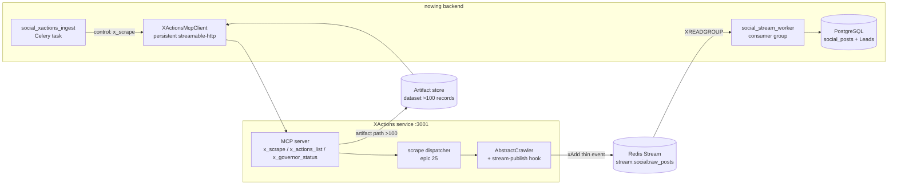

# Architecture Spine — Nowing ↔ XActions Connection

Tái định nghĩa contract kết nối dài hạn. Kế thừa `AD-SOC-1..11` (parent initiative spine, read-only); run này chốt nốt các divergence thực tế mà code hiện tại đang vi phạm.

## Design Paradigm

**Control-plane / Data-plane split**, hiện thực bằng **ports & adapters**:

- **Control plane** — MCP `streamable-http` (port 3001). Ra lệnh scrape, discovery, health, quota. Nhẹ, stateless mỗi call.
- **Data plane** — Redis Stream `stream:social:raw_posts` (thin event pointers). Bulk, cường độ cao, consumer-group scale. XActions ghi, nowing đọc.
- **Artifact plane** — file/URL cho dataset >100 records (3-layer envelope).

Nguyên tắc: **lệnh đi MCP, data đi stream, file lớn đi artifact**. Không đẩy bulk qua MCP response (envelope cap 30 preview / artifact >100).

## Inherited Invariants

| Inherited | Binds here |
| --- | --- |
| AD-SOC-1 Zero-Reinvention Delegation | Nowing không re-implement scraper; mọi crawl ủy quyền XActions. |
| AD-SOC-2 Stealth/Fingerprint Delegation | TLS/JA4, signer bridge, warmup ở XActions — nowing không đụng. |
| AD-SOC-3 Sticky SOCKS5 Proxy Pool | Proxy do XActions quản; nowing chỉ truyền `proxyUrl`/`accountId` trong args. |
| AD-SOC-4 Dual-Channel Communication | MCP streamable-http (sync) + Redis Stream (bulk). Run này **không** re-decide transport — đã chốt phương án A. |
| AD-SOC-5 Intent Classification & Entity Normalization | `intent_tag` + `raw_entities` do nowing consumer gán sau khi đọc stream. |
| AD-SOC-6 Idempotent Storage | `UNIQUE(platform, external_post_id)` ở nowing DB. |
| AD-SOC-8 3-Tier Gap-Filling | Delta-crawl do XActions checkpoint đảm nhiệm (xem AD-9). |
| AD-SOC-9 Multi-Domain + Legacy Decommission | Mọi domain qua cùng 1 contract — không fork per-domain. |
| AD-SOC-10 Data Retention | XActions giữ raw 30 ngày; nowing giữ Lead/VerifiedContact/embedding vĩnh viễn. |
| AD-SOC-11 Adaptive Rate Limiting | Governor/hibernation ở XActions; nowing đọc `x_governor_status`. |

## Invariants & Rules

### AD-1 — Một control-plane tool duy nhất `x_scrape`

- **Binds:** mọi internal caller (nowing ingest, future tools)
- **Prevents:** nowing phải biết 150+ `x_<platform>_<action>` tool name; drift khi XActions đổi action
- **Rule:** Nowing chỉ gọi `x_scrape`, `x_actions_list`, `x_schema_get`, `x_governor_status`, `x_admin_*`. Không gọi per-platform tool trực tiếp trừ khi `x_scrape` chưa cover.

### AD-2 — XActions expose `x_scrape(platform, action, args)`

- **Binds:** `src/mcp/server.js` (XActions)
- **Prevents:** `PLATFORM_TOOL_MAP` của nowing gọi `x_scrape` nhưng tool không tồn tại → 9 VN target fail `tool_not_found`
- **Rule:** `x_scrape` nhận `{platform:str, action:str, args:object, context?:{targetId?,workspaceId?}, accountId?, proxyUrl?, dryRun?}` → forward `args` vào `scrape()` dispatcher (epic 25) → trả 3-layer envelope. Map "action not available" → `PlatformError XACT_4001` + `suggestedAction: use_x_actions_list`.
  - **`args` là object lồng**, KHÔNG phẳng — nowing `args_builder` phải đóng gói toàn bộ action-args vào `args` (vá H1: hiện tại nowing gửi phẳng `hashtag/category/keyword` ngang `platform/action`).
  - **`context` là phong bì multi-tenant** do caller truyền, XActions **forward nguyên vẹn** vào stream event (xem AD-3) — bắt buộc để consumer khôi phục `target_id`/`workspace_id` (vá C2).
  - Khi `REDIS_STREAM_ENABLED=true`, `x_scrape` trả **execution metadata + `data:[]`** (preview), KHÔNG trả full dataset — data đi qua stream (vá H2 split-brain: tránh 1 bài post vừa về MCP response vừa về stream → consumer xử lý 2 lần).
  - **`action` phải là tên canonical trong descriptor của XActions**, KHÔNG do nowing tự đặt (vá sai lệch: nowing map `chotot→posts`, `batdongsan→posts`, `masothue→lookup`, `linkedin→company` nhưng descriptor chỉ có `search_listings`/`listing_detail`/`search`/`detail`/`company_profile`/`search_jobs`/`search_products`...). Nguồn truth = `x_actions_list` (AD-7) — nowing resolve, không hard-code tên.

### AD-3 — Stream-publish hook ở `AbstractCrawler`, không per-crawler

- **Binds:** `src/core/base-crawler.js` + mọi crawler extends nó
- **Prevents:** 15 VN/non-social crawler hiện 0 `xAdd` → data kẹt ở MCP cap, không có đường bulk
- **Rule:** base emit thin event sau `storeBatch`, gate bởi `REDIS_STREAM_ENABLED`, `MAXLEN ~1M`. Per-crawler chỉ override `platform` + field mapping.
  - **Wire schema = snake_case** (khớp `SocialPostEvent` của nowing consumer — vá C1 casing): `{id, platform, external_post_id, category, author_id, author_name, post_url, crawled_at, storage_ref, scraper_id, content_snippet, target_id, workspace_id}`.
  - **`content_snippet` bắt buộc** (≤4000 ký tự, hoặc full `content` nếu nhỏ) — consumer đọc `event.content` để extract SĐT/email/intent/fit-score; thiếu nó → post lưu rỗng, 0 lead (vá C3 ghost-content). Payload đầy đủ vẫn qua `storage_ref`/artifact.
  - **`target_id`/`workspace_id` forward từ `x_scrape.context`** (AD-2) — consumer `NOT NULL` trên `workspace_id`; thiếu → drop im lặng (vá C2).

### AD-4 — XActions là SOLE WRITER của `stream:social:raw_posts`

- **Binds:** `adapter_v2.ingest_raw_post_to_stream` (nowing) — **phải loại bỏ**
- **Prevents:** 2 nguồn ghi → 2 schema, duplicate, consumer đọc 2 định dạng
- **Rule:** Nowing chỉ **consume** (consumer group); không publish raw post vào stream này. Nguồn nội bộ khác của nowing ghi stream riêng tên khác hoặc thẳng DB. `[ASSUMPTION]` — xác nhận `ingest_raw_post_to_stream` chỉ là bridge tạm.
  - **Schema authority = `SocialPostEvent` của nowing consumer** (`social_stream_worker.py`). XActions emit phải khớp schema này (snake_case). Thêm trường → bump `schema_version` trong event; consumer bỏ qua field lạ, reject khi thiếu required.

### AD-5 — Persistent shared `XActionsMcpClient` per worker

- **Binds:** `XActionsMcpClient`, `social_xactions_ingest`
- **Prevents:** `async with` per-target → handshake `initialize` mỗi target (latency + session churn + leak khi scale)
- **Rule:** **loop-scoped client cache**, KHÔNG proc-singleton — `run_async_celery_task` tạo `new_event_loop()` + `loop.close()` mỗi task, nên client phải bind theo `asyncio.get_running_loop()` và re-initialize khi loop đổi (vá C4: singleton trên loop đã đóng → `RuntimeError: Event loop is closed` ở task thứ 2). Trong cùng 1 task, mọi call share 1 session keep-alive; `call_tool` stateless; `accountId`/`proxyUrl` trong args (đa tenant), không phải session.

### AD-6 — Discovery qua `x_actions_list` + fail-safe fallback

- **Binds:** `UniversalScrapeTargetMapper` (nowing)
- **Prevents:** hard-code `PLATFORM_TOOL_MAP` drift; `fallback_crawl_post` viết mà không gọi (silent `tool_not_found`)
- **Rule:** build map từ `x_actions_list` (cache TTL) thay vì hard-code — vì `PLATFORM_TOOL_MAP` hiện sai cả action lẫn arg name (reality-check). `XACT_404`/`tool_not_found` → `x_crawl_post` (post_detail→posts); action-not-available → mark target `unsupported`, không retry vô hạn. Phụ thuộc AD-7.
  - **`x_crawl_post` fallback BẮT BUỘC truyền `platform`** — `fallback_crawl_post` hiện chỉ trả `url` đơn lẻ, thiếu `platform` → XActions ném `XACT_4001 requires a platform argument`. Fallback phải trả cả `platform` lẫn `url`.

### AD-7 — `x_actions_list` trả descriptor mọi platform

- **Binds:** `executeActionListTool` (XActions) — hiện chỉ enumerate 5 social crawler
- **Prevents:** nowing không discover được VN actions → vẫn phải hard-code
- **Rule:** enumerate toàn bộ `DESCRIPTORS` registry; mỗi `ActionDescriptor` `{platform, action, requiredArgs, optionalArgs, example, outputType, requiresAuth}` — không đổi tên trường.

### AD-8 — `nowing` là 1 consumer; tenant phân biệt qua args

- **Binds:** `X-Consumer-Id`, `AdaptiveRateGovernor` quota (nowing 60 RPM / burst 15)
- **Prevents:** per-user session fan-out, RAM/leak
- **Rule:** mọi call gắn `X-Consumer-Id: nowing`; phân tenant qua `args.accountId`. Throttle theo workspace do nowing tự giới hạn trước khi gọi — không dựa vào XActions per-user quota.

### AD-9 — Nowing không truyền cursor; ACL của XActions lo resume

- **Binds:** caller args (`cursor`/`after`/`max_id`)
- **Prevents:** nowing duplicate checkpoint logic mà XActions epic 25.5/25.6 đã build (Auto Checkpoint Lookup)
- **Rule:** caller không set cursor; chỉ `resume:false` khi muốn full re-crawl. Gap-filling delta (AD-SOC-8 L3) do XActions đảm nhiệm.

### AD-10 — Error-envelope → task-behavior mapping tập trung

- **Binds:** `social_xactions_ingest`, mọi task gọi XActions
- **Prevents:** mỗi task parse `XACT_*` khác nhau
- **Rule:** 1 bảng mapping trong adapter: `XACT_4291`→`retry(countdown=retry_after)`; `ACCOUNT_HIBERNATION`/`PROXY_EXHAUSTED`/`XACT_5030`→pause; `XACT_4010`→halt; `XACT_5000`→retry×3→DLQ; `XACT_4001`+`suggestedAction`→surface. Không rải if/else.

## Consistency Conventions

| Concern | Convention |
| --- | --- |
| Control call | `x_scrape(platform, action, args)`; stateless; `dryRun` mặc định `true` ở XActions → nowing ép `dryRun:false` khi cần data. |
| Stream event | snake_case `{id,platform,external_post_id,category,author_id,author_name,post_url,crawled_at,storage_ref,scraper_id,content_snippet,target_id,workspace_id,schema_version}`; `content_snippet`≤4000 chars bắt buộc; payload đầy đủ qua `storage_ref`/artifact. Schema authority = nowing `SocialPostEvent`. |
| Error shape | 3-layer envelope `{success,data,meta,summary,error{code,type,message,retryAfter,suggestedAction}}`; `XACT_*` codes ổn định. |
| Consumer | Consumer group + `XACK`/`XAUTOCLAIM`; DLQ `stream:social:failed`. |
| Identity | `X-Consumer-Id: nowing`; `Bearer` auth; `accountId`/`proxyUrl` trong args. |
| Idempotency | `UNIQUE(workspace_id, platform, external_post_id)` ở nowing DB (scoped per workspace — `leads/social.py`), KHÔNG global; XActions `external_post_id` stable. |

## Stack

| Name | Version / value |
| --- | --- |
| Control transport | MCP `streamable-http`, `MCP_TRANSPORT=http PORT=3001` |
| MCP SDK (nowing) | `mcp` `streamablehttp_client` + `ClientSession` |
| Data transport | Redis Stream `stream:social:raw_posts` (`XADD`/`XREADGROUP`, `MAXLEN ~1M`) |
| Dispatcher | XActions `scrape(platform, action, args)` — epic 25 `DESCRIPTORS` registry |
| Checkpoint | XActions `CrawlCheckpoint` + ACL (epic 25.5/25.6) |
| Nowing adapter | `app/proprietary/platforms/xactions/{mcp_client,adapter_v2}` |
| Nowing tasks | `social_xactions_ingest`, `social_stream_worker` (Celery beat) |

## Structural Seed



## Capability → Architecture Map

| Capability / Area | Lives in | Governed by |
| --- | --- | --- |
| Ra lệnh scrape mọi domain | `x_scrape` (XActions MCP) | AD-1, AD-2 |
| Action discovery | `x_actions_list` + `UniversalScrapeTargetMapper` | AD-6, AD-7 |
| Bulk data ingest | Redis Stream → `social_stream_worker` | AD-3, AD-4, AD-SOC-4/6 |
| Delta/incremental crawl | XActions `CrawlCheckpoint` + ACL | AD-9, AD-SOC-8 |
| Rate limit / account protection | `AdaptiveRateGovernor` + `x_governor_status` | AD-8, AD-SOC-3/11 |
| Error → task behavior | adapter mapping table | AD-10 |
| Large dataset | artifact plane | envelope + `XACTIONS_ARTIFACT_ROOT` (Q1) |

## Deferred

- **Artifact delivery mechanism** (Q1): shared volume `XACTIONS_ARTIFACT_ROOT` hay presigned URL — chốt khi biết topo deploy prod.
- **Consumer-group naming + schema versioning** (Q2): tên group/consumer/DLQ + `schema_version` field trong event — chốt cùng XActions khi làm AD-3.
- **Loop-binding test** cho AD-5: cần test 2 task liên tiếp trên cùng worker xác nhận re-init sau `loop.close()` (C4) — việc implement/test, không phải contract.
- **Stream-vs-response dedup** (H2): khi `REDIS_STREAM_ENABLED`, ai chịu trách nhiệm chống double-notify nếu cùng post vừa về preview vừa về stream — nowing dedup bằng `UNIQUE(platform,external_post_id)` đã có (AD-SOC-6), nhưng alert/lead-assignment phía consumer cần idempotent-key check; chốt khi implement AD-2/AD-3.
- **Topo deploy** (A-ASSUME): `xactions` service cùng network, TLS, network policy — việc infra, không phải contract.
- **Outcome-based metering / billing hook** cho lead-enriched usage — phụ thuộc PRD pricing, không chặn spine này.
- **VN crawlers xAdd coverage matrix** — per-platform `external_post_id/category` mapping; base hook (AD-3) mở đường, từng platform điền field.
- **Canonical action/arg matrix** — bảng `platform → {action, requiredArgs}` chuẩn do `x_actions_list` (AD-7) cung cấp; nowing `SocialMonitoredTarget.platform` enum phải khớp key này. Hiện 2 bên lệch — cần 1 bảng mapping chung duy nhất.

## Deployment & Operational Envelope

```mermaid
flowchart TB
  subgraph EDGE[Internal cluster / VPC]
    direction LR
    NW[nowing-backend<br/>Celery workers + beat]
    XA[xactions daemon<br/>MCP_TRANSPORT=http :3001]
    RD[(redis<br/>stream:social:raw_posts)]
    PG[(postgres<br/>nowing DB)]
    XDB[(xactions DB<br/>CrawlCheckpoint + raw 30d)]
  end
  subgraph EXT[External]
    NET[Target platforms<br/>via SOCKS5 proxy pool]
  end

  NW -->|http (internal, Bearer+Consumer-Id)| XA
  XA -->|xAdd| RD
  NW -->|XREADGROUP| RD
  NW --> PG
  XA --> XDB
  XA -->|scrape| NET
```

| Dimension | Quyết định |
| --- | --- |
| Service topo | `xactions` là 1 daemon nội bộ (`http://xactions:3001/mcp`), cùng network nowing — không public internet. |
| Transport security | Internal HTTP + `Bearer` + `X-Consumer-Id`. TLS ở ingress/service-mesh nếu cross-cluster; không bắt buộc TLS trong cùng VPC. `[ASSUMPTION]` — topo prod chưa xác nhận. |
| Redis | Dùng chung `REDIS_APP_URL` cho stream; `MAXLEN ~1M` chặn unbounded growth; DLQ `stream:social:failed`. |
| Ops visibility | `x_governor_status` + `x_admin_stream_metrics` cho health probe (`health_probe_xactions` beat 5'). |
| Environments | dev=docker-compose service `xactions`; prod=internal service. Config qua `XACTIONS_MCP_URL/_API_KEY/_CONSUMER_ID/_ADMIN_TOKEN/_ARTIFACT_ROOT`. |
