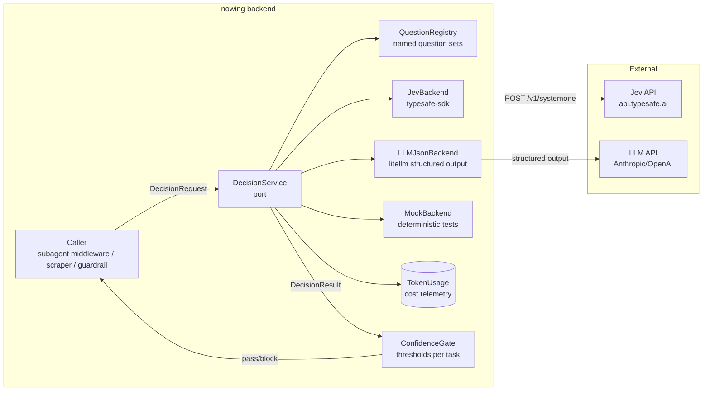

# Architecture Spine — Jev Decision Service

Tích hợp TypeSafe Jev (System One Model) vào Nowing như một **typed-decision layer** — không phải LLM, không sinh text, chỉ trả typed answers (Choice/Score/Noul) với calibrated probabilities.

## Design Paradigm

**Ports & adapters**: `DecisionService` là port (interface); `JevBackend` và `LLMJsonBackend` là adapters. Callers chỉ biết port — swap backend không đổi code caller.

```
Caller → DecisionService.decide(question_set, state) → DecisionResult
                                                    ↕
                                          JevBackend | LLMJsonBackend | MockBackend
```

Nguyên tắc: **question định nghĩa trong code, backend là implementation detail**. Cùng 1 question set chạy được trên cả Jev lẫn LLM JSON mode — Jev nhanh hơn ~30x, rẻ hơn ~400x, nhưng interface giống nhau.

## Eval Evidence (R5 complete)

| Metric | Value |
|--------|-------|
| Vietnamese accuracy | **96.3%** (77/80 cases) |
| SUBAGENT_ROUTING | **100%** (20/20) |
| CONTENT_FILTER | **100%** (20/20) |
| INTENT_CLASSIFY | **95%** (19/20) |
| ENTITY_MATCH | **90%** (18/20) |
| Median latency | **308ms** |
| Cost per decision | **~$0.00002** ($42/Btok input) |
| API errors | **0** |

Verdict: ✅ Green light for Vietnamese deployment. Full detail: `nowing_backend/scripts/jev_eval/summary.md`.

## Invariants & Rules

### AD-J1 — `DecisionService` là port duy nhất cho typed decisions

- **Binds:** mọi caller cần Choice/Score/Noul answers
- **Prevents:** Jev SDK calls rải rác trong codebase; vendor lock-in
- **Rule:** Caller tạo `DecisionRequest(state, questions)` → gọi `DecisionService.decide()` → nhận `DecisionResult`. Không import `typesafe_sdk` ngoài `JevBackend`.
- **Interface:**

```python
class DecisionService(Protocol):
    async def decide(
        self,
        state: dict[str, Any],
        questions: dict[str, Question],
        *,
        model: str | None = None,
        timeout: float = 5.0,
    ) -> DecisionResult: ...

@dataclass
class DecisionResult:
    answers: dict[str, Answer]     # keyed by question_id
    model: str                     # e.g. "jev-1.13.0"
    latency_ms: float
    input_tokens: int | None
    backend: str                   # "jev" | "llm_json" | "mock"
```

- **Validation (ported pattern):** mọi `Answer` phải qua strict structural validation trước khi vào `DecisionResult` — pattern lấy từ `jev-ultrafast` `validate_choice()` (research `technical-jev-ultrafast-...-2026-09-21`). Choice/Score: `choice`/`score` ∈ offered ids, `probabilities` keys khớp ids, values finite ∈[0,1], sum≈1±0.02, chosen=argmax. Noul: float ∈[0,1]. Fail → `InvalidDecisionAnswer` → caller fallback, không bao giờ thành action. Chặt hơn threshold-only check của `jev_router.py` hiện tại — đây là lớp phòng thủ đầu tiên chống malformed/miscalibrated output.

### AD-J2 — Backend selection qua config, không hardcode

- **Binds:** `DecisionService` factory
- **Prevents:** phải sửa code để swap Jev ↔ LLM
- **Rule:** `DECISION_BACKEND` env var: `jev` (default khi `TYPESAFE_API_KEY` set) | `llm_json` (litellm structured output) | `mock` (deterministic, tests). Fallback chain: `jev` → `llm_json` on `jev` error (5xx/timeout/529 Overloaded).

### AD-J3 — Pin model version, log version per response

- **Binds:** `JevBackend`
- **Prevents:** silent calibration shift khi `jev-latest` alias moves
- **Rule:** Default model = `jev-1.13.0` (pinned). `DECISION_JEV_MODEL` env override. Mọi `DecisionResult` log `model` field — telemetry phát hiện drift.

### AD-J4 — Confidence-gated action, không blind-trust

- **Binds:** mọi caller dùng `DecisionResult` để quyết định action
- **Prevents:** low-confidence decisions tự động execute
- **Rule:** `ConfidenceGate` là helper, không phải middleware. Caller specify threshold per use case:

```python
gate = ConfidenceGate(threshold=0.6)   # routing: auto-act if conf >= 0.6
if gate.passes(result.answers["subagent"]):
    dispatch(answer.choice)
else:
    fallback_to_main_agent()           # existing behavior
```

- **Threshold defaults per task** (tunable via env):
  - `SUBAGENT_ROUTING`: 0.6 (auto-dispatch if confident, else main agent decides)
  - `CONTENT_FILTER`: 0.5 (binary action on Noul ≥0.5)
  - `ENTITY_MATCH`: 0.7 (conservative — wrong merge is costly)
  - `INTENT_CLASSIFY`: 0.5 (informational, low blast radius)

### AD-J5 — Questions defined in `QuestionRegistry`, không inline

- **Binds:** tất cả question definitions
- **Prevents:** question text drift, inconsistent instructions across callers
- **Rule:** Registry = 1 YAML/Python dict per domain. Questions là named, versioned, reusable:

```python
# app/services/decision/questions/subagent_routing.py
SUBAGENT_ROUTING_QUESTIONS = {
    "subagent": Choice(
        instructions="Which specialist should handle this Vietnamese user request?...",
        criteria=SUBAGENT_OPTIONS,
    ),
}
```

Caller: `service.decide(state, questions=registry.get("subagent_routing"))`

### AD-J6 — Jev không thay LLM; nó bổ sung

- **Binds:** scope discipline
- **Prevents:** expectation mismatch — Jev cannot generate text
- **Rule:** Jev chỉ dùng cho **decisions** (route/classify/score/filter). Mọi generation (chat reply, report, synthesis) vẫn qua LLM. Jev's job: **make the LLM call faster and more reliable** by pre-routing and post-filtering.

### AD-J7 — Cost telemetry per call

- **Binds:** `JevBackend`, `LLMJsonBackend`
- **Prevents:** undetected cost drift
- **Rule:** Mọi `decide()` call log `input_tokens`, `output_tokens`, `latency_ms`, `model`, `backend` vào `TokenUsage` table (existing infrastructure). Dashboard query: daily cost per decision type.

### AD-J8 — Vietnamese-first question design

- **Binds:** question authors
- **Prevents:** English-only questions on Vietnamese content (calibration drops)
- **Rule:** Instructions viết English (Jev's primary language) nhưng `state` chứa Vietnamese text tự nhiên. Eval cho thấy Vietnamese in state works fine — Jev reads Vietnamese content accurately even when instructions are English. **Không dịch state sang English** — giữ nguyên tiếng Việt.

### AD-J9 — Consume-once decision semantics cho actuation paths (ported pattern)

- **Binds:** bất kỳ caller nào để `DecisionResult` trigger side-effect (không phải advisory hint)
- **Prevents:** retry/timeout double-fire một action đã quyết — pattern từ `jev-ultrafast` `agent.py` (decision null trước mọi mutation, "a retry cannot double-click")
- **Rule:** advisory hints (routing, filter) miễn — chúng idempotent. Nhưng nếu Jev sau này gate một side-effect (sequencer condition firing, anti-bot escalation, entity auto-merge commit), decision phải được **consume một lần**: đánh dấu/xóa trước khi execute để retry không fire lần 2. Không áp dụng cho Epic 39 advisory paths — là invariant bắt buộc khi mở rộng sang actuation.

### AD-J10 — Semantic freshness guard cho re-observation (ported pattern)

- **Binds:** logic quyết định "observation/state còn valid không" (scraper re-visit, anti-bot re-check, connector sync diff)
- **Prevents:** raw-HTML-diff false-positive invalidation (animated banners, tickers, timestamps phá cảm biến "đổi chưa")
- **Rule:** so sánh **semantic state** — URL + extracted-content hash + field values — thay vì so DOM/HTML thô. Pattern từ `jev-ultrafast` `snapshot.js`/`browser.py`: `pageKey` + per-node `guard` (role/name/value/checked + scoped innerText ≤6000 chars) cho phép unrelated visible updates mà không invalidate. Áp dụng cho `anti_bot_escalation.py` + scraper re-fetch quyết định "cần crawl lại không".

## Integration Points

### Primary: Subagent routing (R2 — highest impact)

Current flow: User message → LLM (main agent) → decides which subagent → calls `task(subagent_name, ...)`

New flow: User message → `DecisionService.decide(routing_questions)` → LLM (main agent) → validates/proceeds

```
User: "Tìm căn hộ 2PN Quận 7"
  ↓
DecisionService: subagent=batdongsan (conf=0.95, 280ms)
  ↓
Main agent LLM: sees suggestion, proceeds (or overrides if context demands)
  ↓
task("batdongsan", ...) → subagent runs
```

- **Where:** `checkpointed_subagent_middleware` — before `task()` tool executes, or as a pre-routing hint in the main agent's context
- **Latency saved:** ~8s LLM router → ~300ms Jev + LLM starts with routing hint already in context
- **Fallback:** confidence < 0.6 → no hint, LLM routes normally (existing behavior)
- **File targets:**
  - `app/services/decision/service.py` — DecisionService implementation
  - `app/services/decision/questions/subagent_routing.py` — question set
  - `app/agents/chat/multi_agent_chat/main_agent/middleware/` — integration hook

### Secondary: Entity resolution (R3)

- **Where:** `app/services/entity_resolution/` (scraper pipeline)
- **Decision:** Score (0=different, 1=uncertain, 2=same) per entity pair
- **Action:** score≥1.5 → auto-merge; 0.5-1.5 → curator queue; <0.5 → keep separate
- **Volume:** high — Jev's cost advantage decisive (~$0.0004/pair vs ~$0.01/pair LLM)
- **Two-stage shape (ported pattern):** speculative fan-out từ `jev-ultrafast` `choose()` — stage 1 heuristic (`SpatialWindowedDeduplicator` Jaccard/spatial, `bds_aggregator` union-find) narrow N entities → K candidates; stage 2 = **một** `decide()` call per anchor với `match_decision` Choice chứa chỉ K candidate ids + `no_match`. Jev chỉ confirm survivors, không re-score cặp đã loại — ~1 call/anchor bất kể K (cap K≤250), thay vì 1 call/cặp. Đây là cùng shape "operation + per-head target, chỉ head trúng được validate" của jev-ultrafast, map lên two-stage dedup.
- **Question set:** `entity_match` (single-pair Score) cho path A/B, `entity_match_fanout` (anchor→candidates Choice) cho dedup pipeline — cả hai trong `QuestionRegistry` (AD-J5).

### Tertiary: Content guardrails (R4)

- **Where:** chat input/output, RAG pipeline, connector sync
- **Decisions:** 3 Nouls in one call: `is_relevant`, `contains_prompt_injection`, `contains_sensitive`
- **Latency:** ~300ms for all 3 checks (parallel) — fits in request path
- **Eval result:** 100% on Vietnamese content (incl. Vietnamese injection attempts)

### Future: Voice post-STT decisions (R6)

- **Where:** `VoiceSDRAgent` — after STT, before LLM
- **Decisions:** turn-taking confidence, frustration score, transfer-to-human gate
- **Constraint:** Jev is text-only — works on STT transcript, not audio frames

## Structural Seed



## Stack

| Name | Version / value |
|------|-----------------|
| Jev SDK | `typesafe-sdk` 0.7.0 (PyPI) — `AsyncTypeSafeClient` |
| LLM fallback | `litellm` 1.88.1 — `response_format` JSON schema |
| API endpoint | `POST https://api.typesafe.ai/v1/systemone` |
| Auth | `TYPESAFE_API_KEY` env var (Bearer) |
| Model | `jev-1.13.0` (pinned); `jev-latest` alias exists |
| Rate limits | 250K tokens/sec, 1200 req/min |
| Context | 64K tokens/request (32K state + longest question) |
| Pricing | $42/Btok input, output free |
| Retry | SDK built-in exponential backoff |

## Decision → Architecture Map

| Capability | Lives in | Governed by |
|-----------|---------|------------|
| Typed decision API | `app/services/decision/service.py` | AD-J1, AD-J2 |
| Jev client wrapper | `app/services/decision/backends/jev.py` | AD-J3 |
| LLM JSON fallback | `app/services/decision/backends/llm_json.py` | AD-J2 |
| Mock backend | `app/services/decision/backends/mock.py` | tests |
| Question definitions | `app/services/decision/questions/` | AD-J5 |
| Confidence thresholds | `app/services/decision/gate.py` | AD-J4 |
| Answer validation (strict) | `app/services/decision/validation.py` | AD-J1 (ported) |
| Subagent routing hook | `checkpointed_subagent_middleware/` | AD-J4 |
| Entity match scoring | `app/services/entity_resolution/` | AD-J4, AD-J1 fan-out |
| Cost tracking | `TokenUsage` + existing telemetry | AD-J7 |

## Consistency Conventions

| Concern | Convention |
|---------|-----------|
| Question naming | `{domain}_{question}` — e.g. `routing_subagent`, `filter_is_relevant` |
| Question criteria | English instructions, Vietnamese-capable state |
| Threshold naming | `DECISION_{TASK}_THRESHOLD` env var, float 0-1 |
| Error handling | `InvalidDecisionAnswer` (malformed/miscalibrated) + `DecisionError` (backend/transport) → caller falls back to default behavior |
| Telemetry | `decision_latency_ms`, `decision_confidence`, `decision_backend` in TokenUsage |
| Feature flag | `DECISION_ENABLED` global gate + `DECISION_{TASK}_ENABLED` per task |
| Entity fan-out | anchor + `match_decision` Choice over heuristic-surviving candidate ids + `no_match` (ported jev-ultrafast shape) |

## Deferred

- **A/B test framework** — `DecisionService` supports backend selection per call, but no automated A/B harness yet. Eval script (`scripts/jev_eval/runner.py`) is manual.
- **Batch decision API** — Jev evaluates questions in parallel within one call. For batch workloads (entity resolution over 10K pairs), a batch wrapper that chunks + parallelizes is deferred.
- **Voice agent integration** (R6) — needs STT transcript → DecisionService hook in `VoiceSDRAgent`. Deferred until R2-R4 stable.
- **Fine-grained model pinning per task** — currently single `DECISION_JEV_MODEL`. Per-task pinning when model versions diverge.
- **system-one-adapter-python** — official TypeSafe adapter that reimplements client interface over LLM. Not installed yet; install when/if Jev unavailable or for A/B testing.
- **Cost alerting** — daily spend threshold → alert. Currently just logs to TokenUsage.

## Deployment & Operational Envelope

| Dimension | Quyết định |
|-----------|-----------|
| Env var | `TYPESAFE_API_KEY` in `.env.local` — already set |
| Feature flag | `DECISION_ENABLED=true/false` — master switch |
| Per-task flags | `DECISION_ROUTING_ENABLED`, `DECISION_FILTER_ENABLED`, `DECISION_ENTITY_ENABLED`, `DECISION_INTENT_ENABLED` |
| Backend select | `DECISION_BACKEND=jev` (default when key set) |
| Model pin | `DECISION_JEV_MODEL=jev-1.13.0` |
| Timeout | `DECISION_TIMEOUT_SECONDS=5.0` — callers should never wait longer |
| Fallback | On Jev error: log + fall back to LLM JSON or skip decision (existing behavior) |
| Eval re-run | `uv run scripts/jev_eval/runner.py --backend jev` — regression gate before model upgrades |
