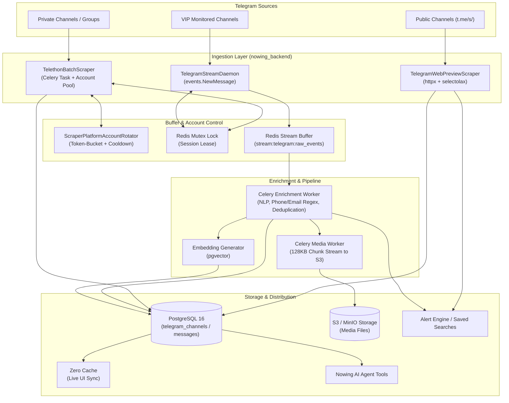

# Architecture Spine — Telegram Scraper Integration

## Design Paradigm

The Telegram Scraper subsystem follows a **Decoupled Two-Lane Ingestion with Event-Driven Buffer and Platform Account Pooling** paradigm.

1. **Ingestion Layer (Edge):** Separates fast, stateless HTTP Web Preview scraping (`t.me/s/`) from authenticated MTProto client sessions (`Telethon`).
2. **Buffer Layer (Messaging):** Decouples Telegram socket ingestion from database writes, enrichment, and AI embedding via Redis Streams and Celery queues.
3. **Storage & Serving Layer (Core):** Enforces idempotency via PostgreSQL composite keys, exposes live updates through Zero Cache, and dispatches real-time events to the Alert Engine and Agent Tools.



---

## Invariants & Rules

### AD-1 [ADOPTED] — Hybrid Two-Tier Ingestion Strategy

- **Binds:** `app/proprietary/platforms/telegram/`, all scraping tasks
- **Prevents:** Unnecessary MTProto account quota consumption, rate limits, and ban risks on public channels.
- **Rule:** For public channel message scans without comment or member requirements, workers MUST use the stateless HTTP Web Preview engine (`TelegramWebPreviewScraper` querying `https://t.me/s/{channel_name}`). The MTProto Client (`telethon`) MUST ONLY be invoked for private channels, discussion group comment threads, member scrapers, or on-demand deep historical backfills.

### AD-2 [ADOPTED] — Stateless Session Storage via Two-Tier Encrypted StringSession

- **Binds:** `scraper_platform_accounts`, `TelegramClient` connection lifecycle
- **Prevents:** File-based SQLite `.session` drift, disk state leakage, and state desynchronization across container restarts and horizontal replicas.
- **Rule:** All MTProto sessions MUST be stored as encrypted `StringSession` strings in `scraper_platform_accounts.encrypted_credentials` using `TokenEncryption(config.SECRET_KEY)`. Worker containers MUST NEVER write `.session` files to disk. Session strings are decrypted exclusively in RAM when a worker starts an operation and purged upon disconnection.

### AD-3 [ADOPTED] — Distributed Session Mutual Exclusion via Redis Lease Lock

- **Binds:** `TelegramClient` execution
- **Prevents:** Concurrent connection conflicts from multiple workers using the same Telegram session, leading to MTProto auth key invalidation or Telegram account revocation.
- **Rule:** Before establishing an MTProto client connection, a worker MUST acquire a Redis lock `telegram:session:lock:{account_id}` with a TTL of 120 seconds (auto-renewed via heartbeat during active tasks). If lock acquisition fails, the worker MUST yield and request another available account from `ScraperPlatformAccountRotator`.

### AD-4 [ADOPTED] — Strict FloodWait and Rate Limit Cooldown State Machine

- **Binds:** `ScraperPlatformAccountRotator`, `telethon client` error handlers
- **Prevents:** Aggressive retry storms that convert temporary FloodWait penalties into permanent `PeerFloodError` or account bans.
- **Rule:** Upon catching `FloodWaitError(seconds=N)`, the worker MUST immediately call:
  ```python
  await rotator.record_use(account, success=False, error_type="rate_limited")
  ```
  with `banned_until = now + N + uniform(2, 5)`. The worker MUST release the Redis session lock and either switch to an alternate account in the pool or gracefully exit the task. Workers MUST NEVER immediately retry with the same account.

### AD-5 [ADOPTED] — Asynchronous Media Streaming directly to S3 / Zero Disk Footprint

- **Binds:** `telegram_media`, Celery media worker
- **Prevents:** Worker disk fill-up, high memory footprint, and message ingestion blocking caused by synchronous media downloads.
- **Rule:** Text message ingestion MUST NOT wait for media downloads. Ingestion writes `file_id` and metadata to `telegram_messages`, and dispatches an asynchronous background task `download_telegram_media_task` to stream media in 128KB chunks directly to S3/MinIO using `aiobotocore`.

### AD-6 [ADOPTED] — Idempotent Ingestion and Data Deduplication

- **Binds:** `telegram_messages`, `telegram_channels`
- **Prevents:** Duplicate message rows, race condition inserts, and corrupted foreign key relationships during backfill and polling reruns.
- **Rule:** The `telegram_messages` table MUST enforce a composite unique constraint `(channel_id, message_id)`. All database writes MUST use PostgreSQL:
  ```sql
  INSERT INTO telegram_messages (channel_id, message_id, date, text, raw_entities, author_user_id, views, forwards, replies_count)
  VALUES (...)
  ON CONFLICT (channel_id, message_id) 
  DO UPDATE SET 
      text = EXCLUDED.text,
      views = EXCLUDED.views,
      forwards = EXCLUDED.forwards,
      replies_count = EXCLUDED.replies_count,
      raw_entities = EXCLUDED.raw_entities,
      updated_at = NOW();
  ```

### AD-7 [ADOPTED] — Dedicated Sticky Residential Proxy Binding per Account

- **Binds:** `scraper_platform_accounts.credentials.proxy`
- **Prevents:** Telegram security systems flagging accounts due to rapid ASN/geo-location hops between different data centers.
- **Rule:** Each Telegram MTProto account in the pool MUST be paired with a dedicated, sticky residential or mobile SOCKS5 proxy configuration. All proxy URLs MUST use `socks5h://` to enforce remote DNS resolution at the proxy node, preventing server IP address leaks.

### AD-8 [ADOPTED] — Realtime Event Ingestion via Redis Stream Buffer

- **Binds:** `telegram stream daemon`, `Alert Engine`, `Zero Cache`
- **Prevents:** Realtime Telegram update listener crashing or dropping packets due to slow downstream database writes or embedding calculations.
- **Rule:** Live update listeners (`events.NewMessage`) MUST only publish raw message JSON payloads to Redis Stream `stream:telegram:raw_events`. Downstream Celery enrichment workers consume the stream to perform entity extraction, pgvector embedding, and Alert Engine event dispatching.

---

## Consistency Conventions

| Concern | Convention |
| :--- | :--- |
| **Platform Identifier** | Platform string MUST be `"telegram"` across `scraper_platform_accounts`, routes, and Celery task routing. |
| **Channel Identifier** | Channels are uniquely identified by `id (BIGINT)` (Telegram peer ID with prefix `-100...` for supergroups/channels) and canonical `username` (without `@` prefix). |
| **Message IDs** | Internal message ID is UUID PK (`id`); external Telegram message ID is `message_id (BIGINT)`. Natural composite key is `(channel_id, message_id)`. |
| **Timestamps** | All database timestamps MUST be `TIMESTAMPTZ` in UTC ISO 8601 format (`YYYY-MM-DDTHH:MM:SSZ`). |
| **Entities Schema** | Extracted entities (phone, email, price, location, hashtags) MUST be stored in `telegram_messages.raw_entities` as a JSONB array of typed objects: `[{"type": "phone", "value": "...", "confidence": 0.95}]`. |
| **Error Handling** | Telegram exceptions MUST map to standard Nowing error types: `FloodWaitError` → `"rate_limited"`, `AuthKeyInvalidError`/`UserDeactivatedError` → `"restricted"`. |
| **Queue Partitioning** | Separate Celery queues: `celery_scrapers` (text/metadata), `celery_scrapers_media` (heavy binary streaming), and `celery_scrapers_realtime` (stream events). |

---

## Stack

| Component | Technology | Version | Purpose |
| :--- | :--- | :--- | :--- |
| **Runtime** | Python | `3.12+` | Core backend runtime with native AsyncIO |
| **MTProto Client** | `telethon` | `1.36.0` (pinned) | Pure-Python MTProto 2.0 client with StringSession & SOCKS5 proxy support |
| **Web Preview Engine** | `httpx` + `selectolax` | `httpx>=0.27.0`, `selectolax>=0.3.21` | High-performance async HTTP/2 & Modest engine for `t.me/s/` scraping |
| **Proxy Client** | `python-socks` | `>=2.4.0` | Async SOCKS5/HTTP proxy tunneling for MTProto sockets |
| **Database** | PostgreSQL | `16+` with `pgvector` | Structured metadata, JSONB entity storage, and vector similarity search |
| **Cache & Task Broker** | Redis | `7.2+` | Celery broker, Redis Stream buffer, Distributed Mutex Locks |
| **Replication Layer** | Zero Cache | `v0.12+` | Real-time frontend synchronization for new Telegram messages |
| **Object Storage** | S3 / MinIO | S3-compatible | Blob storage for downloaded images, audio, documents, and videos |
| **Storage Client** | `aiobotocore` / `aioboto3` | `>=2.13.0` | Asynchronous chunked media uploads to S3 |

---

## Structural Seed

### Source Code Directory Layout

```text
nowing_backend/
  app/
    proprietary/
      platforms/
        telegram/
          __init__.py                  # Platform export & factory registration
          constants.py                 # Telegram API constants, regex patterns, rate limits
          schemas.py                   # Pydantic models for TelegramChannel, TelegramMessage, TelegramMedia
          web_preview_scraper.py       # Stateless HTTP scraper for t.me/s/{channel}
          mtproto_client.py            # Telethon wrapper with StringSession, proxy, and retry logic
          entity_extractor.py          # Regex & NLP parser for VN phone numbers, BĐS prices, emails
          stream_daemon.py             # Long-running async update listener (events.NewMessage)
    routes/
      admin_scraper_platform_accounts_routes.py # Extended for Telegram OTP/2FA onboarding
      telegram_scrapers_routes.py      # REST endpoints to trigger scrapes, search, probe health
    tasks/
      celery_tasks/
        telegram_tasks.py              # Celery tasks: scrape_channel, ingest_stream, download_media
    capabilities/
      core/
        access/
          agent.py                     # AI Agent Tools: telegram_search_channel, telegram_fetch_recent_posts
```

### PostgreSQL Schema DDL Seed

```sql
-- 1. Telegram Channels Table
CREATE TABLE IF NOT EXISTS telegram_channels (
    id BIGINT PRIMARY KEY,
    username VARCHAR(255),
    title TEXT NOT NULL,
    about TEXT,
    is_megagroup BOOLEAN DEFAULT FALSE,
    members_count INT DEFAULT 0,
    last_scraped_message_id BIGINT DEFAULT 0,
    is_active BOOLEAN DEFAULT TRUE,
    created_at TIMESTAMPTZ DEFAULT NOW(),
    updated_at TIMESTAMPTZ DEFAULT NOW()
);

CREATE INDEX IF NOT EXISTS idx_telegram_channels_username ON telegram_channels(username);
CREATE INDEX IF NOT EXISTS idx_telegram_channels_updated_at ON telegram_channels(updated_at DESC);

-- 2. Telegram Messages Table
CREATE TABLE IF NOT EXISTS telegram_messages (
    id UUID PRIMARY KEY DEFAULT gen_random_uuid(),
    channel_id BIGINT NOT NULL REFERENCES telegram_channels(id) ON DELETE CASCADE,
    message_id BIGINT NOT NULL,
    date TIMESTAMPTZ NOT NULL,
    text TEXT,
    raw_entities JSONB DEFAULT '[]'::jsonb,
    author_user_id BIGINT,
    author_username VARCHAR(255),
    views INT DEFAULT 0,
    forwards INT DEFAULT 0,
    replies_count INT DEFAULT 0,
    grouped_id BIGINT,
    has_media BOOLEAN DEFAULT FALSE,
    embedding vector(1536),
    created_at TIMESTAMPTZ DEFAULT NOW(),
    updated_at TIMESTAMPTZ DEFAULT NOW(),
    CONSTRAINT uq_telegram_channel_message UNIQUE (channel_id, message_id)
);

CREATE INDEX IF NOT EXISTS idx_telegram_messages_channel_date 
ON telegram_messages(channel_id, date DESC);

CREATE INDEX IF NOT EXISTS idx_telegram_messages_entities_gin 
ON telegram_messages USING gin(raw_entities);

CREATE INDEX IF NOT EXISTS idx_telegram_messages_text_search 
ON telegram_messages USING gin(to_tsvector('simple', COALESCE(text, '')));

-- 3. Telegram Media Attachments Table
CREATE TABLE IF NOT EXISTS telegram_media (
    id UUID PRIMARY KEY DEFAULT gen_random_uuid(),
    message_id UUID NOT NULL REFERENCES telegram_messages(id) ON DELETE CASCADE,
    media_type VARCHAR(50) NOT NULL, -- 'photo', 'video', 'document', 'audio'
    file_id TEXT NOT NULL,
    file_name TEXT,
    mime_type VARCHAR(100),
    size_bytes BIGINT DEFAULT 0,
    storage_url TEXT, -- s3://bucket/path or https://cdn...
    upload_status VARCHAR(50) DEFAULT 'pending', -- 'pending', 'completed', 'failed'
    created_at TIMESTAMPTZ DEFAULT NOW()
);

CREATE INDEX IF NOT EXISTS idx_telegram_media_message_id ON telegram_media(message_id);
```

---

## Capability → Architecture Map

| Capability / Feature Area | Implementation Location | Governed By |
| :--- | :--- | :--- |
| **Public Channel Web Scraping** | `app/proprietary/platforms/telegram/web_preview_scraper.py` | `AD-1`, `AD-6` |
| **MTProto Userbot Client** | `app/proprietary/platforms/telegram/mtproto_client.py` | `AD-1`, `AD-2`, `AD-3`, `AD-4`, `AD-7` |
| **Account Pool & Rate Limiting** | `app/services/scraper_platform_account_service.py` | `AD-3`, `AD-4`, `AD-7` |
| **Media Chunk Streaming** | `app/tasks/celery_tasks/telegram_tasks.py` (`download_telegram_media_task`) | `AD-5` |
| **Realtime Stream Ingestion** | `app/proprietary/platforms/telegram/stream_daemon.py` | `AD-3`, `AD-8` |
| **Alert Engine Trigger** | `app/alerts/engine/notify.py` | `AD-6`, `AD-8` |
| **AI Agent Tooling** | `app/capabilities/core/access/agent.py` | `AD-1`, `AD-6` |
| **Live UI Zero Cache Sync** | `nowing_web/` + PostgreSQL Publication | `AD-6` |

---

## Deferred

1. **OCR Text Extraction from Telegram Images:** Pushed down to an optional asynchronous enrichment pipeline. Text and metadata ingestion must not block on vision models.
2. **Speech-to-Text for Telegram Voice Notes:** Deferred until audio-specific ingestion queue requirements are finalized.
3. **Automated Multi-Account SMS Purchasing API:** Deferred to operational admin tooling. Initial account onboarding uses the interactive Admin CLI helper (`scripts/telegram_auth_helper.py`).
4. **Channel Peer Invite Automation:** Automatic joining of private channels via invite links is deferred to avoid aggressive Telegram spam detection on fresh accounts.
