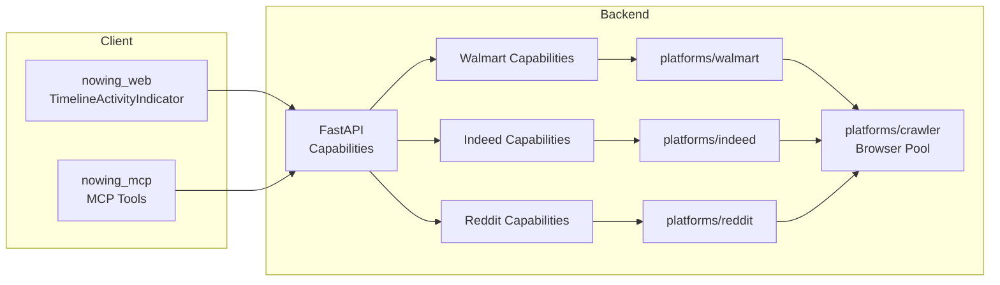
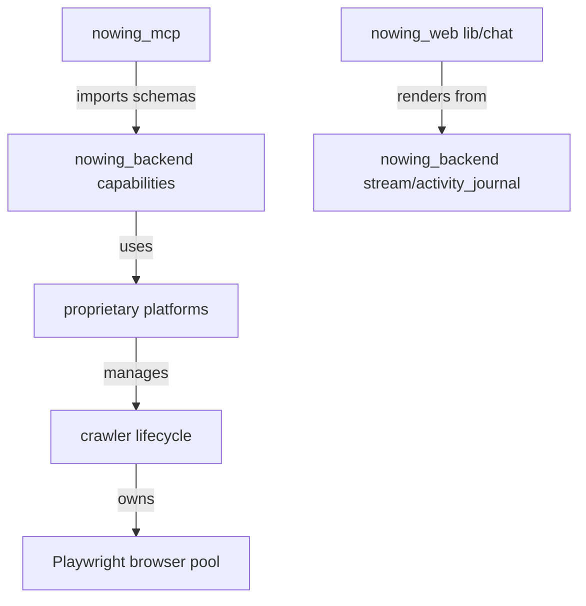

# Architecture Spine — Upstream Sync Connectors & Timeline

## Design Paradigm

**Layered Scraper Platform + Namespace Adapter.**

Kiến trúc chia làm 3 tầng:

1. **Proprietary Platform Layer** (`nowing_backend/app/proprietary/platforms/<platform>/`): chứa logic cào thực sự — fetch, parse, resolve URL, scrape, schemas. Mỗi platform là package độc lập với contract tối thiểu.
2. **Capability Layer** (`nowing_backend/app/capabilities/<platform>/`): thin adapter wrap platform, chuyển Pydantic schemas, gọi credit metering, expose qua REST/MCP.
3. **Client Layer** (`nowing_web/` + `nowing_mcp/`): UI streaming components và MCP tools, chỉ phụ thuộc vào public schemas, không gọi trực tiếp platform internals.

Upstream code (`surfsense_*`) được port file-by-file, sau đó transform namespace toàn bộ thành `nowing_*` trước khi commit. Không merge git.

## Invariants & Rules

### AD-1 — Port Strategy

- **Binds:** all
- **Prevents:** namespace collision, partial merge, leak of `surfsense_*` references
- **Rule:** Port delta từ các PR #1614, #1605, #1692, #1686 bằng file-level copy, không merge `upstream/main`. Mọi chuỗi `surfsense_` phải đổi thành `nowing_` trước khi file được thêm vào repo.

### AD-2 — Browser Lifecycle Pool

- **Binds:** CAP-1, CAP-2, CAP-3, CAP-4
- **Prevents:** orphaned/zombie headless browser processes when concurrent scraping runs
- **Rule:** Mọi platform scraper dùng Playwright/Chromium phải khởi tạo và giải phóng browser thông qua `nowing_backend/app/proprietary/platforms/crawler/` lifecycle manager. Không gọi `playwright.chromium.launch()` trực tiếp trong scraper.

### AD-3 — Capability as Thin Adapter

- **Binds:** CAP-1, CAP-2, CAP-3
- **Prevents:** business logic cào bị sao chép/chia nhỏ vào executor, drift giữa platform và capability
- **Rule:** `executor.py` trong capability chỉ được: validate request, map schema, gọi platform, map response, ghi credit. Không chứa selector, regex, hoặc anti-bot logic.

### AD-4 — MCP Tool-Capability Schema Mirror

- **Binds:** CAP-1, CAP-2, CAP-3
- **Prevents:** MCP client gửi payload không tương thích với REST API
- **Rule:** Mỗi MCP tool (`nowing_mcp/mcp_server/features/scrapers/platforms/<platform>.py`) phải dùng request/response Pydantic model giống hệt capability `schemas.py` tương ứng. Không redefine field types.

### AD-5 — Timeline Streaming State

- **Binds:** CAP-5
- **Prevents:** UI hiển thị activity status sai hoặc mất bước khi streaming
- **Rule:** `TimelineActivityIndicator` render từ journal entries do server stream xuống, qua `nowing_web/lib/chat/activity-journal.ts`. Component điều khiển tiêu đề bước (canonical progress titles), pulse animation, và step status.

### AD-6 — Reasoning Auto-scroll Isolation

- **Binds:** CAP-6
- **Prevents:** chat viewport bị cuộn mạnh, mất context khi model stream reasoning
- **Rule:** Container của reasoning/thinking item tự quản lý scroll nội bộ (`overflow-y: auto` hoặc equivalent). Dùng `IntersectionObserver` hoặc ref với `scrollIntoView({ behavior: 'smooth', block: 'nearest' })` để cuộn đến dòng hiện tại mà không scroll toàn bộ viewport.

### AD-7 — Platform Contract

- **Binds:** CAP-1, CAP-2, CAP-3
- **Prevents:** các platform cào có interface không nhất quán
- **Rule:** Mỗi package trong `proprietary/platforms/<platform>/` phải xuất ít nhất: `fetch.py`, `parsers.py`, `schemas.py`, `scraper.py`, `url_resolver.py` (nếu applicable). Scraper chính implement uniform `scrape(...)` signature trả về validated Pydantic result.

### AD-8 — Vietnamese Connector Preservation

- **Binds:** all
- **Prevents:** regression trên các connector custom của Nowing
- **Rule:** `batdongsan`, `topcv`, `itviec`, `cafef`, `vietstock`, `chotot`, `masothue`, `muaban_bds`, `vietnamworks`, `vn_bds`, `vn_jobs`, `chotot_bds` và test của chúng không được sửa đổi, xóa, hoặc di chuyển. Các test tương ứng phải pass sau mỗi đợt port.

### AD-9 — No Schema / Auth / Credit Regression

- **Binds:** all
- **Prevents:** database schema, authentication, credit-metering models bị thay đổi không kiểm soát
- **Rule:** Không port migrations, model, hoặc hàm auth/credit từ upstream. Chỉ dùng API surface hiện tại của Nowing. Nếu upstream cần field mới không tồn tại trong DB Nowing, cần giải pháp tương thích ngược hoặc trì hoãn.

### AD-10 — i18n & Identifier Policy

- **Binds:** CAP-5, CAP-6
- **Prevents:** UI tiếng Việt bị pha trộn, technical identifier bị dịch
- **Rule:** User-facing strings trong `nowing_web` sử dụng i18n keys, hỗ trợ tiếng Việt. Tên hàm, class, API endpoint, environment variable, MCP tool name, và file path giữ nguyên tiếng Anh.

### AD-11 — Validation Gate

- **Binds:** all
- **Prevents:** code port làm hỏng build hoặc gây lỗi ẩn
- **Rule:** Trước khi đánh dấu hoàn thành mỗi CAP: `pytest nowing_backend/tests` cho các platform liên quan phải pass; `pnpm build` trong `nowing_web` phải pass; `rg -i 'surfsense_' nowing_*` phải trả về rỗng.

### AD-12 — Deferred Scope

- **Binds:** all
- **Prevents:** scope creep
- **Rule:** Không port OpenTelemetry/Grafana LGTM stack, Daytona sandbox, upstream credit migration, hoặc signup credit claims. Các mục này nằm ngoài SPEC và trì hoãn sang Phase 2.

## Consistency Conventions

| Concern | Convention |
| --- | --- |
| Naming (files, packages, classes, env vars) | `nowing_*` toàn bộ; tránh `surfsense_` còn sót; platform package dùng snake_case; capability package dùng snake_case; React components dùng PascalCase `.tsx`. |
| Data & formats (request/response) | Pydantic v2; schemas phải kế thừa base model của Nowing nếu có; response envelope giữ nguyên format `{items, total, has_more, page?}` nếu upstream dùng cùng. |
| State & cross-cutting | Browser context được quản lý qua crawler lifecycle; credit metering gọi từ executor, không từ platform; lỗi platform phải raise `NowingScraperError` hoặc subclass, không raise raw Playwright/HTTP exception. |
| Logging | Logger instance lấy theo `__name__` hoặc `nowing.*` prefix; không để lại `surfsense` trong log format hoặc logger name. |
| MCP | Tool name `nowing_<platform>_<verb>`; description tiếng Anh; input schema import trực tiếp từ `nowing_backend.app.capabilities.<platform>.<verb>.schemas`. |

## Stack

| Name | Version |
| --- | --- |
| Python | 3.11+ (theo `pyproject.toml` / `uv.lock`) |
| FastAPI / Pydantic | v2 (hiện có) |
| Playwright / Chromium | hiện có trong backend |
| Next.js / React / TypeScript | hiện có trong `nowing_web` |
| Tailwind CSS | hiện có trong `nowing_web` |
| MCP SDK | hiện có trong `nowing_mcp` |
| pytest | backend test framework |
| pnpm | frontend package manager |

## Structural Seed

### System Context



### Source Tree (affected)

```text
nowing_backend/
  app/proprietary/platforms/
    walmart/           # fetch, parsers, schemas, scraper, url_resolver, next_data
    indeed/            # fetch, parsers, schemas, scraper, url_resolver
    reddit/            # fetch, parsers, schemas, scraper, url_resolver
    crawler/           # shared browser lifecycle manager
  app/capabilities/
    walmart/scrape/    # executor, definition, schemas
    walmart/reviews/   # new
    indeed/scrape/     # executor, definition, schemas
    reddit/scrape/     # executor, definition, schemas
nowing_mcp/mcp_server/features/scrapers/platforms/
  walmart.py
  indeed.py
  reddit.py
nowing_web/
  app/globals.css                 # timeline keyframes
  components/ui/
    timeline-activity-indicator.tsx
  features/chat-messages/timeline/
    items/reasoning-item.tsx
  lib/chat/activity-journal.ts
```

### Dependency Direction



## Capability → Architecture Map

| Capability | Lives in | Governed by |
| --- | --- | --- |
| CAP-1 Walmart Scrape & Reviews | `nowing_backend/app/proprietary/platforms/walmart/`, `nowing_backend/app/capabilities/walmart/<scrape_or_reviews>/`, `nowing_mcp/.../walmart.py` | AD-1, AD-2, AD-3, AD-4, AD-7, AD-11 |
| CAP-2 Indeed Jobs | `nowing_backend/app/proprietary/platforms/indeed/`, `nowing_backend/app/capabilities/indeed/scrape/`, `nowing_mcp/.../indeed.py` | AD-1, AD-2, AD-3, AD-4, AD-7, AD-11 |
| CAP-3 Reddit Community-only | `nowing_backend/app/proprietary/platforms/reddit/`, `nowing_backend/app/capabilities/reddit/scrape/`, `nowing_mcp/.../reddit.py` | AD-1, AD-2, AD-3, AD-4, AD-7, AD-11 |
| CAP-4 Browser Pool | `nowing_backend/app/proprietary/platforms/crawler/` | AD-2, AD-7 |
| CAP-5 Timeline Activity Indicator | `nowing_web/components/ui/timeline-activity-indicator.tsx`, `nowing_web/lib/chat/activity-journal.ts` | AD-5, AD-10 |
| CAP-6 Reasoning Auto-scroll | `nowing_web/features/chat-messages/timeline/items/reasoning-item.tsx`, `nowing_web/app/globals.css` | AD-6, AD-10 |

## Deferred

| Decision | Reason |
| --- | --- |
| OpenTelemetry / Grafana LGTM stack | SPEC non-goal; Nowing dùng Dokploy hiện tại. |
| Daytona code interpreter sandbox | Phase 2; không cần cho sync lần này. |
| Upstream credit claims / signup credit migration | Không thay đổi accounting/credit models hiện tại. |
| Direct git merge `upstream/main` | Tránh namespace collision; dùng file-level port. |
