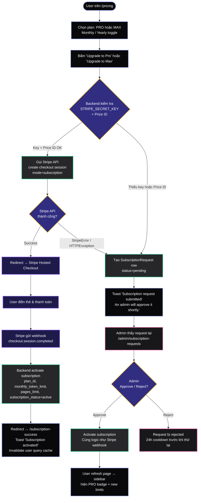
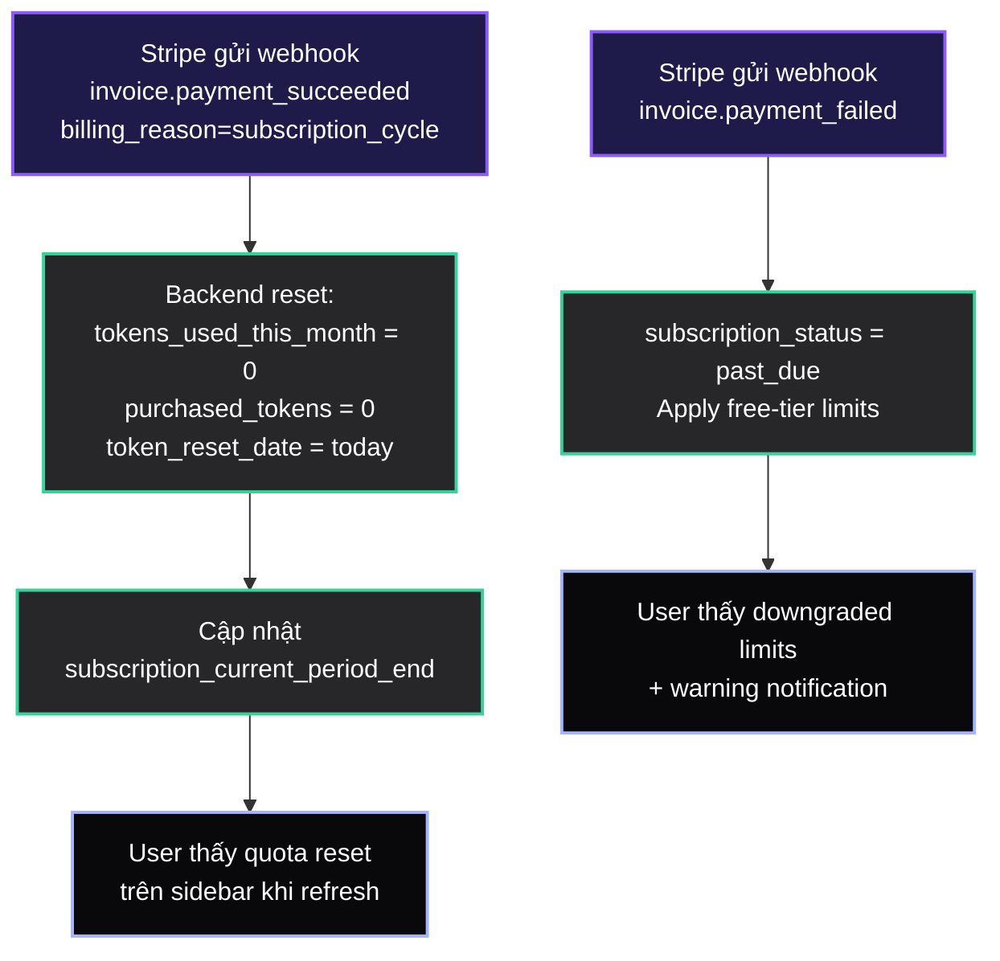
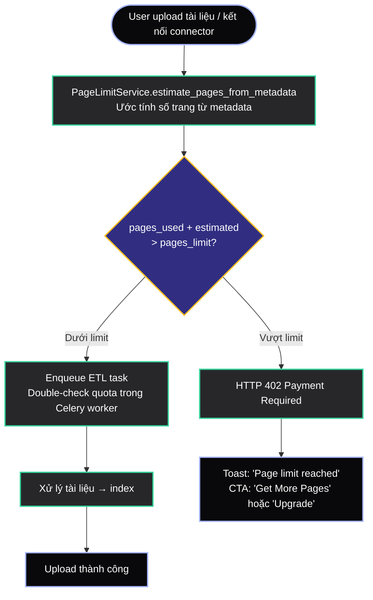
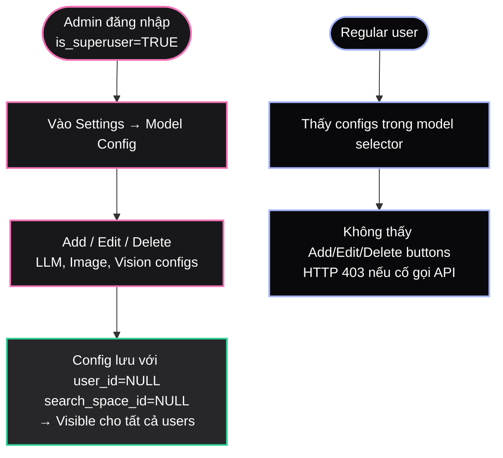

# Epic 5: Billing & Subscriptions — User Flow Diagram

## 1. Subscription Upgrade Flow



## 2. Token Top-up (PAYG) Flow

```mermaid
flowchart TD
    classDef user fill:#09090b,stroke:#a5b4fc,stroke-width:2px,color:#fff
    classDef backend fill:#27272a,stroke:#34d399,stroke-width:2px,color:#fff
    classDef stripe fill:#1e1b4b,stroke:#8b5cf6,stroke-width:2px,color:#fff
    classDef admin fill:#18181b,stroke:#f472b6,stroke-width:2px,color:#fff
    classDef decision fill:#312e81,stroke:#fbbf24,stroke-width:2px,color:#fff

    START([User trên /buy-tokens]):::user
    AMOUNT[Chọn quick amount: $1/$5/$10/$25/$50/$100<br/>hoặc nhập custom amount]:::user
    PREVIEW[Preview: 'X tokens added to your account'<br/>Rate: $1 = 100K tokens]:::user
    BUY[Bấm 'Buy X tokens for $Y']:::user

    BE_CHECK{Backend kiểm tra<br/>STRIPE_SECRET_KEY}:::decision

    STRIPE_CALL[Gọi Stripe API<br/>create checkout session<br/>mode=payment, price_data<br/>metadata: tokens_granted, purchase_type]:::backend
    STRIPE_OK{Stripe API<br/>thành công?}:::decision

    REDIRECT[Redirect → Stripe Checkout]:::stripe
    PAY[User thanh toán]:::stripe
    WEBHOOK[Webhook: checkout.session.completed<br/>mode=payment]:::stripe
    FULFILL[_fulfill_token_topup:<br/>SELECT FOR UPDATE user<br/>user.purchased_tokens += tokens_granted]:::backend
    SUCCESS[Redirect → /purchase-success<br/>Toast 'Tokens added!'<br/>Invalidate user query cache]:::user
    SIDEBAR[Sidebar cập nhật:<br/>token meter = monthly + purchased<br/>'(+Xk purchased)']:::user

    ADMIN_TOAST[Toast 'Stripe is not configured.<br/>Contact your admin to have<br/>tokens added to your account.']:::user
    ADMIN_MANUAL[Admin thêm token thủ công<br/>vào user.purchased_tokens]:::admin

    START --> AMOUNT --> PREVIEW --> BUY --> BE_CHECK
    BE_CHECK -->|Key OK| STRIPE_CALL
    BE_CHECK -->|Thiếu key| ADMIN_TOAST
    STRIPE_CALL --> STRIPE_OK
    STRIPE_OK -->|Success| REDIRECT
    STRIPE_OK -->|StripeError / HTTPException| ADMIN_TOAST
    REDIRECT --> PAY --> WEBHOOK --> FULFILL --> SUCCESS --> SIDEBAR
    ADMIN_TOAST --> ADMIN_MANUAL --> SIDEBAR
```

## 3. Billing Cycle & Token Reset Flow



## 4. Token Quota Enforcement Flow (Chat)

```mermaid
flowchart TD
    classDef user fill:#09090b,stroke:#a5b4fc,stroke-width:2px,color:#fff
    classDef backend fill:#27272a,stroke:#34d399,stroke-width:2px,color:#fff
    classDef decision fill:#312e81,stroke:#fbbf24,stroke-width:2px,color:#fff

    SEND([User gửi message trong chat]):::user
    CHECK{TokenQuotaService.check_token_quota<br/>effective_limit = monthly_limit<br/>+ purchased_tokens<br/>available = limit - used}:::decision
    
    OK[Cho phép gọi LLM]:::backend
    STREAM[Stream response + SSE events]:::backend
    TOKEN_EVENT[SSE: data-token-usage<br/>tokens_this_request, used_total,<br/>monthly_limit, remaining]:::backend
    OVERLAY[Chat UI hiện overlay:<br/>'Request: X | Used: Y/Z | Remaining: W'<br/>Đỏ khi remaining < 10%]:::user

    DENIED[HTTP 402 Payment Required<br/>'Token quota exceeded']:::backend
    TOAST_BUY[Toast: 'Token limit reached'<br/>CTA: 'Buy More Tokens']:::user

    SEND --> CHECK
    CHECK -->|Có quota| OK --> STREAM --> TOKEN_EVENT --> OVERLAY
    CHECK -->|Hết quota| DENIED --> TOAST_BUY
```

## 5. Page ETL Quota Enforcement Flow



## 6. Admin Model Configuration Flow



## 7. Sidebar State Machine

```mermaid
stateDiagram-v2
    [*] --> FREE : Đăng ký mới

    FREE --> PENDING_APPROVAL : Bấm Upgrade (no Stripe)
    FREE --> STRIPE_CHECKOUT : Bấm Upgrade (Stripe OK)
    
    STRIPE_CHECKOUT --> ACTIVE : checkout.session.completed
    PENDING_APPROVAL --> ACTIVE : Admin approve
    PENDING_APPROVAL --> FREE : Admin reject (24h cooldown)
    
    ACTIVE --> PAST_DUE : invoice.payment_failed
    ACTIVE --> CANCELED : subscription.deleted
    PAST_DUE --> ACTIVE : invoice.payment_succeeded (retry OK)
    PAST_DUE --> CANCELED : subscription.deleted

    state FREE {
        Badge: FREE
        CTAs: Upgrade_to_Pro + Buy_Tokens + Get_Free_Pages
    }
    
    state ACTIVE {
        Badge: PRO_MONTHLY / PRO_YEARLY
        CTAs: Buy_Tokens + Manage_Billing + Get_Free_Pages
        Token_Meter: monthly_limit + purchased_tokens
    }
    
    state PAST_DUE {
        Badge: FREE (downgraded limits)
        CTAs: Upgrade_to_Pro + Buy_Tokens
    }
```

## Plan Tiers Summary

| Plan | Price | Tokens/mo | Pages/mo | Models |
|---|---|---|---|---|
| FREE | $0 | 50K | 500 | Standard (GPT-4o mini, Haiku) |
| PRO | $12/mo ($8/mo annual) | 1M | 5K | Premium (GPT-4o, Claude Sonnet, Gemini) |
| MAX | $100/mo ($80/mo annual) | 20M | 20K | All models incl. Opus, Ultra |
| ENTERPRISE | Custom | Unlimited | Unlimited | All + on-prem, SSO, audit |
| Token Top-up | $1 = 100K tokens | PAYG | - | - |
