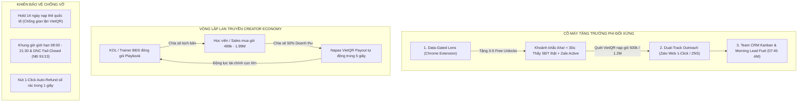

# Innovation Strategy: Nowing

**Date:** 2026-08-17  
**Strategist:** Luisphan  
**Strategic Focus:** Asymmetric User Acquisition, Growth Loops & Antifragile Lead Distribution Engine  
**Governing Reviews:** 5-Layer Advanced Elicitation (First Principles, Shark Tank, User Persona Focus Group, Inversion Analysis, Pre-Mortem Audit)

---

## 🎯 Strategic Context (Đã qua Kiểm định 5 Tầng Phản biện)

### 1. Hiện trạng Thực tế (Current Situation)
Nowing đã hoàn thiện nền tảng hạ tầng công nghệ và sản phẩm dẫn đầu thị trường Việt Nam (Vietnam-First):
- **Hệ thống Thu thập Đa kênh (Multi-Source Scraper Pool):** Đã kết nối Bất động sản, Chợ Tốt, TopCV, Facebook Groups, Telegram Channels, Masothue.
- **Bộ giải mã Định danh & Liên lạc (Phone & MST Waterfall):** Giải mã số điện thoại 3 tầng, chuẩn hóa đầu số viễn thông 2018, liên kết Mã số thuế doanh nghiệp và lọc DNC fail-closed (Nghị định 91 & Nghị định 13).
- **Công cụ Đón đầu & Phân bổ (Lead Clipper & Team CRM):** Tiện ích Chrome Extension Manifest V3 chụp lead 1-click và bảng Kanban phân bổ Round-Robin kèm ví tín dụng chung (Shared Credits).
- **Hạ tầng Thanh toán & Chia sẻ Doanh thu (VietQR Payout Hub):** Rút tiền hoa hồng tự động Napas 24/7 trong 5 giây cho đối tác Affiliate.

Thị trường B2B Lead Gen & BĐS tại Việt Nam đang có nhu cầu cực lớn nhưng đang bị phân mảnh bởi dữ liệu rác, quy trình thủ công và các công cụ nước ngoài quá đắt đỏ ($100–$500/tháng) không hiểu ngữ cảnh Việt Nam.

---

### 2. Bóc tách 5 Giả định Kế thừa vs. Chân lý Thị trường Việt Nam (First Principles Matrix)

| STT | Giả định B2B SaaS phương Tây | Chân lý Bất biến Thị trường Việt Nam | Chiến lược Tái thiết kế của Nowing |
|:---:|:---|:---|:---|
| **1** | Bắt buộc tuyển đội ngũ SDR gọi cold call đắt đỏ ($1,200/tháng/rep). | 90%+ giao dịch diễn ra trên **Zalo & Di động**; tỷ lệ nghe số lạ <2% do chặn số rác. | **1-Click Zalo Outreach & ZNS Drip:** Tiếp cận trong <5 phút với kịch bản cá nhân hóa AI. |
| **2** | Bắt buộc thu phí Subscription thẻ tín dụng định kỳ hàng tháng. | Tỷ lệ thẻ tín dụng thấp; người dùng chuộng **Nạp ví vi mô qua VietQR** (Pay-as-you-go). | **Gói nạp linh hoạt VietQR (200k - 500k - 1.2M)** qua mã QR tự động trong 2 giây. |
| **3** | Lead Clipper chỉ là công cụ cào dữ liệu thô xuất ra file CSV. | Người dùng sợ tốn thời gian; cào xong không có công cụ liên lạc sẽ bỏ hoang dữ liệu. | **Khép kín quy trình tại chỗ:** Cào $\to$ Giải mã số & Check Zalo $\to$ Mở chat 1-Click $\to$ Team CRM. |
| **4** | Tiếp thị dựa vào chạy quảng cáo Ads đắt đỏ ($50-$150/lead B2B). | Niềm tin tập trung vào **KOLs đào tạo, Thầy dạy BĐS, Trưởng nhóm kinh doanh**. | **Creator Playbook Economy:** Chia sẻ 50% doanh thu gói kịch bản, rút tiền VietQR 24/7 trong 5s. |
| **5** | Đẩy mọi rủi ro dữ liệu cho khách hàng tự chịu. | Khách hàng Việt Nam có tâm lý phòng thủ cao vì từng bị lừa mua data rác. | **Bảo hiểm rủi ro 100% (Zero-Risk):** Nút 1-Click Hoàn tiền tức thì nếu gặp số ảo/không có Zalo. |

---

### 3. Bài toán Thách thức Cốt lõi & Khiên Phòng Thủ Chống Vỡ (Antifragile Shields)

Làm thế nào để Nowing **thu hút 1,000 B2B Workspaces trả phí đầu tiên với $CAC \approx 0$** mà không dính vào các bẫy tử thần đã được mổ xẻ qua Pre-Mortem và Inversion:

#### 🛡️ 5 Giao thức Thực thi Bất biến (Core Execution Invariants):
1. **Data-Gated Intelligence Lens:** Extension không bao giờ lộ plain-text số điện thoại miễn phí; bắt buộc qua cổng mở khóa tín dụng kèm chấm điểm Lead Score $\ge 85$.
2. **Dual-Track Outreach:** Hỗ trợ cả *Track A (Zalo Web Direct 1-Click không cần OA cho môi giới cá nhân)* và *Track B (Zalo ZNS chính thức cho doanh nghiệp)*.
3. **High-Ticket Creator Packs:** Đóng gói Playbook theo combo thực chiến giá $499\text{k} - 1.99\text{M}$ VNĐ với cơ chế chia sẻ 50% cho Creator, rút tiền tức thì.
4. **Zero-Risk Data Insurance:** Nút bấm 1 chạm hoàn lại 100% credit nếu số điện thoại sai hoặc không tồn tại Zalo.
5. **Morning Lead Fuel & Telegram VIP Action Center:** Đúng 07:45 sáng đẩy 5 lead nét nhất vào dashboard và chỉ bắn thông báo Telegram cho các cơ hội điểm cao $\ge 85$.

---
