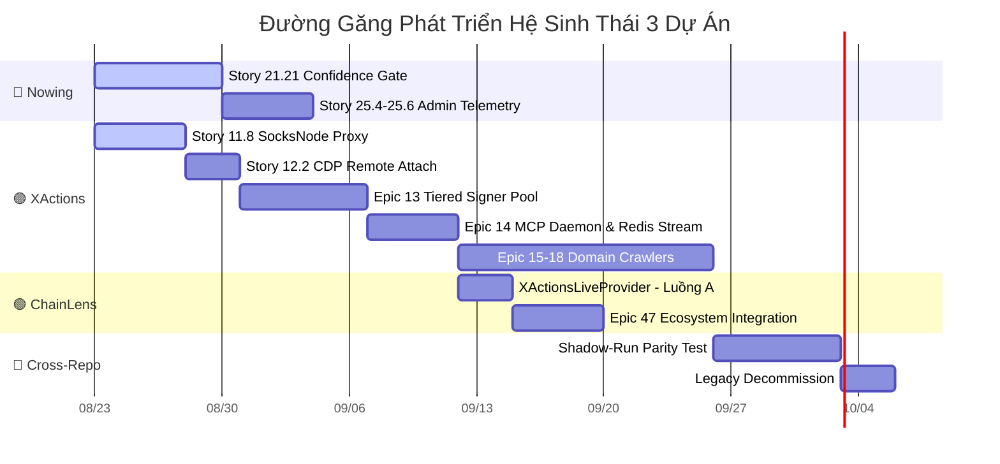

# PRD: Ecosystem Trinity Alignment
## Đặc Tả Ranh Giới Trách Nhiệm, Luồng Liên Kết & Hợp Đồng Giao Tiếp
### Nowing Platform ✕ XActions Engine ✕ ChainLens-Research

**Version:** 1.0  
**Status:** `draft` — Pending Luis review  
**Author:** Marcus (Cross-Project Coordinator) + Winston (System Architect)  
**Date:** 2026-08-23  
**Canonical:** `true` — Tài liệu này là nguồn chân lý duy nhất (Single Source of Truth) cho phân định scope liên dự án. Mọi Architecture Spine, PRD riêng lẻ và Epic mới phải tham chiếu và tuân thủ tài liệu này.

---

## 1. BỐI CẢNH & VẤN ĐỀ CẦN GIẢI QUYẾT

### 1.1 Hệ sinh thái 3 Repository
Nowing, XActions và ChainLens-Research là 3 dự án phát triển song song, bổ trợ lẫn nhau, cùng phục vụ sứ mệnh:

> **Biến dữ liệu thô trên Internet thành cơ hội kinh doanh chất lượng cao nhất có thể, với chi phí vận hành gần $0.**

| Repository | Tech Stack | Vai trò Chiến lược |
|---|---|---|
| 🔵 **Nowing** (`nowing`) | Python FastAPI + Next.js 16 + Zero-Cache + PostgreSQL pgvector | **AI Gen Leads Enterprise (Product & CRM Hub)** — Sở hữu User, Billing, Lead Intelligence, PII Vault, Team CRM & Outbound. |
| 🟣 **XActions** (`XActions`) | Node.js ESM + Prisma + Playwright Signer Pool + SocksNode | **Tactical Execution Engine** — Chuyên trách 100% việc cào dữ liệu thô, Anti-Bot, Proxy Management, Session Pool. |
| 🟢 **ChainLens-Research** (`chainlens-research`) | NestJS + Next.js + BullMQ + pgvector + Drizzle ORM | **Strategic Intelligence Engine** — Deep/Wide Research, Market GPS, Vector Retrieval, Citation & Evidence Hub. |

### 1.2 Vấn đề
Hiện tại, PRD của mỗi dự án được viết rời rạc theo từng giai đoạn. Không có một bản đặc tả liên dự án chính thức nào quy định:
- Ranh giới trách nhiệm tuyệt đối giữa 3 bên (ai được làm gì, ai cấm làm gì).
- Hợp đồng giao tiếp (API Contract, Schema, Auth) giữa từng cặp dự án.
- Chiến lược tận dụng tối đa sức mạnh liên kết giữa 3 bên.

Hệ quả: Xung đột scope (G1–G7), developer/agent dễ giẫm chân lên nhau, và bỏ lỡ cơ hội tận dụng sức mạnh liên hệ sinh thái.

---

## 2. TRIẾT LÝ SẢN PHẨM: RESEARCH-FIRST AI LEAD GENERATION

> **Nowing không phải là một công cụ cào dữ liệu thông thường.**
> **Nowing là một Autonomous Sales Workstation (Trợ lý Bán hàng Tự trị) dẫn dắt bởi Nghiên cứu Thị trường (Research-First).**

### 2.1 Tại sao Research-First?
Khi người dùng muốn gen lead (ví dụ: *"Tìm khách mua căn hộ cao cấp Quận 1"*), nếu cào bừa bãi sẽ tốn rất nhiều token LLM để lọc dữ liệu rác. Thay vào đó:

```
[BƯỚC 1: MARKET GPS — ChainLens Deep & Wide Research]
ChainLens quét tin tức, xu hướng, báo cáo thị trường:
• Kết quả: Phân khúc ICP tối ưu + Bộ từ khóa + Hội nhóm mục tiêu chính xác.
• Khi cần dữ liệu thực địa (live social data), ChainLens gọi XActions tools.
         │
         ▼ (Strategic Output: Kế hoạch săn lead chuẩn xác)
[BƯỚC 2: PRECISION HARVESTING — Nowing kích hoạt XActions]
Nowing chỉ cào đúng tọa độ mục tiêu (thay vì cào mù quáng):
• Tiết kiệm 70–90% token so với cào bừa.
         │
         ▼ (Raw Data từ đúng phễu mục tiêu)
[BƯỚC 3: ZERO-TOKEN DATA GATE — Nowing Confidence Gate (Story 21.21)]
Pass 1 Regex lọc 85%+ record (0 token), chỉ 10-15% đi vào Micro-LLM.
         │
         ▼ (Clean Leads with F1 >= 95%)
[BƯỚC 4: HYPER-PERSONALIZED OUTREACH]
Nhờ có insight từ ChainLens, Nowing tạo thông điệp cá nhân hóa chính xác.
```

### 2.2 Vai trò Tam Giác Vàng (Golden Triangle)

```
                    ┌──────────────────────────────────────────────┐
                    │         🟢 CHAINLENS-RESEARCH                │
                    │    🧠 TRÍ NÃO CHIẾN LƯỢC (Strategy Brain)    │
                    │   Deep/Wide Research, Market Trends,          │
                    │   ICP Discovery, Citation & Evidence          │
                    └──────▲───────────────────────────┬───────────┘
                           │                            │
        (A) Live Domain    │                            │ (B) Strategic Market GPS
        Grounding: Gọi     │                            │ Output: Phân khúc ICP,
        XActions tools     │                            │ Kế hoạch từ khóa
        khi cần dữ liệu   │                            │ săn lead chuẩn xác
        thực tế MXH/Ecom   │                            │
                           │                            ▼
┌──────────────────────────┴──────┐    ┌──────────────────────────────────────┐
│    🟣 XACTIONS ENGINE            │    │         🔵 NOWING PLATFORM            │
│  🦾 ĐÔI TAY TÁC CHIẾN          │    │   🏛️ BỘ MÁY SẢN PHẨM & CRM         │
│  (Tactical Execution)           │    │   (Product Hub & Orchestrator)       │
│  • Stealth Anti-Detection       │◄───│   • Confidence Gate (Story 21.21)    │
│  • TLS/JA4 & Signer Bridge     │ (C)│   • PII Vault AES-256               │
│  • SocksNode Residential IP     │    │   • Team CRM & Split-Canvas UI      │
│  • Raw Data Cache (30d TTL)     │    │   • Drip Outreach (Zalo/Telegram)   │
│  • Daemon MCP Port 3001        │    │   • Autonomous DSH Missions         │
└─────────────────────────────────┘    └──────────────────────────────────────┘
                                    (C) Targeted Precision Crawling:
                                    Nowing kích hoạt XActions cào đúng
                                    tọa độ mục tiêu đã được ChainLens định vị.
```

---

## 3. BẢNG PHÂN CÔNG TRÁCH NHIỆM BẤT BIẾN (ZERO-OVERLAP RESPONSIBILITY MATRIX)

### 3.1 Quy tắc Ranh giới Cốt lõi

> **Nguyên tắc Vàng:** Mỗi dự án CHỈ ĐƯỢC làm những gì nằm trong cột "ĐƯỢC PHÉP". Mọi hành vi nằm trong cột "CẤM" đều vi phạm kiến trúc và phải được escalate trước khi thực hiện.

| Tiêu chí | 🟣 **XActions** (Engine) | 🟢 **ChainLens** (Knowledge) | 🔵 **Nowing** (Product & CRM) |
|---|---|---|---|
| **Trọng tâm** | Cào dữ liệu thô, vượt rào cản kỹ thuật, quản lý Proxy/Session. | Nghiên cứu sâu/rộng, tổng hợp tri thức, trích dẫn nguồn, Market GPS. | Quản lý Lead, chấm điểm, PII Vault, CRM, Outbound, AI Workstation UI. |
| **ĐƯỢC PHÉP** | ✅ Render DOM, bypass WAF/Captcha/Akamai.<br>✅ Giải mã chữ ký token (a_bogus, msToken).<br>✅ Quản lý Proxy IP Pool & Account Session.<br>✅ Cung cấp MCP tools cào thô.<br>✅ Lưu raw data tạm (30d TTL).<br>✅ Operator Dashboard nội bộ. | ✅ Deep & Wide Research (Multi-Agent Swarm).<br>✅ Reranking & Vector Search.<br>✅ **Gọi XActions MCP tools khi Deep Research cần Live Domain Data.**<br>✅ Citation & Evidence extraction.<br>✅ Đo lường chi phí search/token.<br>✅ Bán API Search độc lập (Exa-like). | ✅ **Gọi ChainLens để Market GPS trước khi gen lead.**<br>✅ **Gọi XActions để cào dữ liệu thô theo tọa độ mục tiêu.**<br>✅ Confidence Gate & Micro-LLM Worker.<br>✅ PII Vault AES-256, DNC Blacklist.<br>✅ Team CRM, Kanban, Split-Canvas UI.<br>✅ Zalo/Telegram/Email Drip Outbound.<br>✅ Billing & Credit Wallet (End-user). |
| **CẤM** | ❌ KHÔNG làm Lead Scoring / Intent Tagging.<br>❌ KHÔNG xây CRM / UI End-user.<br>❌ KHÔNG lưu trữ PII lâu dài.<br>❌ KHÔNG tự ý xây Deep Research Engine.<br>❌ KHÔNG tự xây Vector Retrieval. | ❌ KHÔNG tự cào web bằng Browser (Playwright/Puppeteer).<br>❌ KHÔNG quản lý Proxy IP Pool.<br>❌ KHÔNG làm Campaign Outbound / CRM.<br>❌ KHÔNG lưu trữ PII/Personal Data.<br>❌ KHÔNG tự xây hạ tầng billing cho Nowing users. | ❌ KHÔNG cài Playwright/Chromium trong Backend Docker.<br>❌ KHÔNG tự viết crawler mới từ đầu (delegate cho XActions).<br>❌ KHÔNG tự xây Search Engine nội bộ (delegate cho ChainLens).<br>❌ KHÔNG bypass WAF/Captcha (delegate cho XActions). |

### 3.2 Quy tắc Bổ sung: Sở hữu Dữ liệu (Data Ownership)

| Loại Dữ liệu | Chủ Sở hữu Vĩnh viễn | Nơi Lưu trữ Chính | Ghi chú |
|---|---|---|---|
| Raw Scraped Data (HTML, JSON thô) | 🟣 **XActions** | PostgreSQL XActions (Prisma) | TTL 30 ngày, sau đó tự xóa. |
| Normalized Lead Records (SĐT, Email, Company) | 🔵 **Nowing** | PostgreSQL Nowing (pgvector) | Lưu trữ vĩnh viễn, mã hóa PII. |
| Public Web Knowledge Chunks (Báo chí, Nghiên cứu) | 🟢 **ChainLens** | PostgreSQL ChainLens (pgvector HNSW) | Vector embedding cho Retrieval. |
| Private Workspace Documents (User uploads) | 🔵 **Nowing** | PostgreSQL Nowing (pgvector) | RLS theo `workspace_id + client_id`. |
| Cost & Billing Telemetry | Mỗi dự án tự quản lý | PostgreSQL riêng | Nowing quy đổi `costDollars` → Nowing Credits. |

---

## 4. MA TRẬN 4 LUỒNG TƯƠNG TÁC CHÍNH (INTER-SERVICE INTERACTION CONTRACTS)

### Luồng A: ChainLens ↔ XActions (Live Domain Grounding)
**Mục đích:** Khi ChainLens chạy Deep/Wide Research, ngoài việc tìm bài báo trên web, ChainLens có thể gọi trực tiếp XActions MCP tools để lấy dữ liệu thảo luận nóng hổi từ mạng xã hội & sàn thương mại điện tử.

```
[ChainLens Research Pipeline]
    │
    ├── Layer 1: Web Search (Brave, SearXNG, Exa)
    ├── Layer 1.5: Academic (Semantic Scholar, arXiv)
    ├── Layer 2: Content Extraction (Jina, Firecrawl, Crawl4AI)
    └── Layer 2.5 (MỚI): Live Social & E-Com Grounding
         │
         └── Gọi XActions MCP tools qua HTTP:
             • x_facebook_group_posts → Bài đăng FB Groups liên quan
             • x_search_tweets → Tweet thảo luận nóng hổi
             • x_shopee_search → Sản phẩm & giá trên Shopee
             • x_chotot_search → Tin đăng BĐS/Xe/Việc làm trên Chợ Tốt
```

**Hợp đồng kỹ thuật (Contract):**
- **Giao thức:** HTTP Keep-Alive tới XActions MCP Daemon `http://xactions:3001/mcp`.
- **Xác thực:** Service Bearer Token (`XACTIONS_MCP_API_KEY`).
- **Rate Limit:** ChainLens được cấp quota riêng biệt (tách khỏi quota của Nowing) trong XActions Rate Governor. Đề xuất: Dedicated Pool `chainlens_research` với giới hạn 10 RPM cho MCP on-demand.
- **Degradation:** Nếu XActions không khả dụng hoặc trả lỗi, ChainLens tiếp tục pipeline bình thường với Web Search layers mà không bị crash. Live Social Grounding là **Best-Effort Enhancement**, không phải Hard Dependency.

---

### Luồng B: Nowing → ChainLens (Pre-Lead Strategic GPS)
**Mục đích:** Trước khi người dùng gen lead, Nowing gọi ChainLens để chạy phân tích thị trường, trả về phân khúc ICP, bộ từ khóa và chiến lược tiếp cận tối ưu.

```
[Nowing DSH Mission Planner]
    │
    ├── Bước 1: Gọi ChainLens Deep Research
    │    POST /api/v1/search
    │    { query: "Phân tích thị trường căn hộ cao cấp Q1 2026",
    │      output: "research",
    │      optimizationMode: "quality" }
    │
    ├── Bước 2: Gọi ChainLens Wide Research (so sánh chiến lược)
    │    POST /api/v1/search
    │    { query: "So sánh phân khúc khách mua: Expat vs NĐT nội địa vs End-user",
    │      output: "wide_research" }
    │
    └── Bước 3: Nhận kết quả → Lập kế hoạch cào chính xác
         Output: { targetSegments, keywords, socialGroups, platformPriority }
```

**Hợp đồng kỹ thuật (Contract):**
- **Endpoint:** `POST /api/v1/search` (SSE streaming, block-based format).
- **Xác thực:** Service Bearer Token (`CHAINLENS_API_KEY`).
- **Cost Reconciliation:** ChainLens trả `costDollars` trong khung `done`. Nowing quy đổi theo tỷ lệ: **1 Nowing Credit = 1.000 micros = $0.001 USD** (Zero markup nội bộ, pass-through cost).
- **Degradation:** Nếu ChainLens offline, Nowing fallback sang hybrid search nội bộ (Story 9.1a: Exa → Brave → DuckDuckGo). Lead gen vẫn hoạt động nhưng không có Market GPS → chất lượng targeting giảm.

---

### Luồng C: Nowing → XActions → Nowing (Precision Harvesting)
**Mục đích:** Nowing gửi đúng tọa độ mục tiêu (từ kết quả ChainLens) sang XActions để cào dữ liệu thô.

```
[Nowing Lead Gen Orchestrator]
    │
    ├── On-Demand (Realtime query):
    │    Gọi XActions MCP Daemon (HTTP/SSE Port 3001)
    │    Tool: x_facebook_group_posts, x_chotot_search, x_dangkykinhdoanh
    │
    └── Bulk Ingestion (Background crawl):
         XActions đẩy thin events vào Redis Stream
         stream:social:raw_posts
         │
         └── Nowing Celery Consumer Group "nowing_nlp_workers"
              ├── Bóc tách SĐT/Email (Pass 1 Regex — 0 token)
              ├── Confidence Gate scoring
              ├── Pass 2 Micro-LLM Fallback (chỉ record < 0.70)
              ├── Deduplication (HMAC-SHA256)
              ├── PII Vault AES-256 encryption
              └── Lưu Lead CRM + Kích hoạt Drip Outreach
```

**Hợp đồng kỹ thuật (Contract):**
- **On-Demand:** HTTP Keep-Alive tới `http://xactions:3001/mcp` với Service Bearer Token (`XACTIONS_MCP_API_KEY`).
- **Bulk Stream:** Redis Stream `stream:social:raw_posts`, Consumer Group `nowing_nlp_workers`. Thin Event format: `{ id, platform, externalId, category, authorId, crawledAt, storageRef }`.
- **Backpressure:** Khi Nowing consumer lag > 10.000 messages, XActions Rate Governor tự động giảm 25% nhịp cào bulk (AD-SOC-4 & AD-13).
- **Degradation:** Khi XActions bị proxy exhaustion hoặc Signer crash:
  1. XActions trả error envelope: `{ code: "PROXY_EXHAUSTED", retryAfter: 300, suggestedAction: "wait_or_reduce_scope" }`.
  2. Nowing Adapter ghi log `warning`, giữ lead ở trạng thái `partial` và tạo alert cho admin.
  3. Nowing KHÔNG tự fallback sang cào nội bộ (tuân thủ AD-SOC-1: Universal Scraping Delegation).

---

### Luồng D: Nowing ↔ ChainLens (Bidirectional Knowledge Exchange)
**Mục đích:** Trao đổi tri thức 2 chiều giữa Nowing và ChainLens.

```
[Nowing → ChainLens: Vertical Data Feed]
    Nowing Scrapers (BĐS, Tuyển dụng, Tài chính) chuẩn hóa dữ liệu
    thành Chunk[] và đẩy sang ChainLens:
    POST /v1/ingest/scraper
    { chunks: Chunk[], source: "nowing", dedup_key: UUIDv5 }
    → ChainLens lưu vào Vertical Index (pgvector)

[ChainLens → Nowing: Private Data Recall]
    Khi ChainLens cần dữ liệu nội bộ workspace:
    POST /api/v1/private-data/search (Nowing endpoint)
    { query, workspaceId, userId }
    → Nowing trả kết quả đã áp dụng RLS
    → ChainLens KHÔNG lưu trữ bản sao (Stateless)
```

---

## 5. GIẢI QUYẾT CÁC GAP ĐÃ PHÁT HIỆN

### G1: ChainLens không biết XActions tồn tại
**Giải pháp:** Bổ sung **Luồng A (Live Domain Grounding)** vào Architecture Spine và PRD của ChainLens. ChainLens cần đăng ký XActions MCP tools như một `SearchProvider` mới (`XActionsLiveProvider`) trong Layer 2.5.

**Action Items:**
- [ ] Tạo `XActionsLiveProvider` trong `chainlens-research/apps/api/src/providers/xactions-live.provider.ts` implement interface `SearchProvider`.
- [ ] Cập nhật `chainlens-research` Architecture Spine thêm AD về Live Domain Grounding.
- [ ] Thêm biến môi trường `XACTIONS_MCP_URL` và `XACTIONS_MCP_API_KEY` vào ChainLens config.

### G2: Xung đột định vị ChainLens v4 vs v5
**Giải pháp chốt (Ruling):**

> **ChainLens là DualProduct — vừa là Microservice Engine cho Nowing, vừa là Standalone Search Platform (Exa-like).**

- **Khi phục vụ Nowing:** ChainLens hoạt động như một Internal Microservice, xác thực bằng Service Token, chi phí pass-through (zero markup).
- **Khi bán độc lập:** ChainLens có Auth riêng (Supabase), Billing riêng (Stripe/Momo), Dashboard riêng. Người dùng ChainLens độc lập KHÔNG có quyền truy cập Nowing features.
- **Ranh giới không chồng chéo:** ChainLens KHÔNG xây CRM/Lead Management/Outbound. Nowing KHÔNG xây Search Engine/Deep Research Engine.

### G3: Xung đột chiều Ingestion (AD-101 vs Epic 20)
**Giải pháp chốt (Ruling):**

> **Luồng Ingestion là song hướng (Bidirectional) theo Luồng D:**
> - Nowing → ChainLens: Đẩy Vertical Domain Data (BĐS, Tuyển dụng) vào ChainLens Vertical Index.
> - ChainLens → Nowing: Cung cấp Knowledge Recall khi Nowing cần context.
> - **AD-101 sẽ được cập nhật** để phản ánh mô hình Bidirectional thay vì Unidirectional.

### G4: Thiếu API Contract cho Epic 47
**Giải pháp:** Được định nghĩa chi tiết trong Luồng D (Mục 4).
- **Action:** Tạo Zod schema cho `POST /v1/ingest/vertical` và `POST /api/v1/private-data/search` trong `packages/types`.

### G5: Thiếu Internal Pricing Reconciliation
**Giải pháp chốt:**
- **Tỷ lệ quy đổi nội bộ:** `1 Nowing Credit = 1.000 micros = $0.001 USD`.
- **Chi phí ChainLens → Nowing:** Pass-through at cost (Zero markup nội bộ). ChainLens trả `costDollars` → Nowing nhân với 1000 → trừ micros từ workspace credit balance.
- **Action:** Cập nhật `nowing_backend/app/services/token_tracking_service.py` để áp dụng quy đổi chuẩn.

### G6: Thiếu SLA phân bổ tài nguyên On-demand vs Bulk (XActions)
**Giải pháp:**
- XActions Rate Governor phân chia 2 pool riêng biệt:
  - **Realtime Pool** (cho MCP on-demand từ Nowing/ChainLens): 30% proxy capacity, ưu tiên cao, timeout 5s.
  - **Bulk Pool** (cho background crawl): 70% proxy capacity, có thể bị throttle khi Realtime Pool cần tài nguyên.
- **Action:** Cập nhật `XActions` AD-13 (Adaptive Rate Governor) thêm quy tắc dual-pool.

### G7: Thiếu Degradation Protocol khi XActions bị chặn
**Giải pháp:**
- XActions trả Error Envelope chuẩn: `{ code, type, message, retryAfter, suggestedAction }`.
- Nowing Adapter:
  1. `PROXY_EXHAUSTED` → Chờ `retryAfter` giây, giữ lead ở `partial`.
  2. `SIGNER_CRASH` → Alert admin, retry sau 60s tối đa 3 lần.
  3. `ACCOUNT_HIBERNATION` → Chuyển sang account pool khác (nếu có).
  4. Sau 3 lần retry thất bại → Ghi `failed` vào lead record, tạo Telegram alert.
- ChainLens: Live Domain Grounding là Best-Effort, skip và tiếp tục pipeline.

---

## 6. CHIẾN LƯỢC PHÁT TRIỂN SONG SONG (PARALLEL DEVELOPMENT STRATEGY)

### 6.1 Thứ tự Ưu tiên Hiện tại (Critical Path)



### 6.2 Quy tắc Phát triển Song song
1. **Nowing Story 21.21** có thể bắt đầu ngay lập tức — không phụ thuộc vào XActions hay ChainLens.
2. **XActions Epics 11.8 → 12.2 → 13 → 14** phải hoàn thành theo thứ tự — đây là đường găng kiến trúc.
3. **ChainLens XActionsLiveProvider** chỉ bắt đầu sau khi XActions Epic 14 (MCP Daemon) hoàn thành.
4. **Shadow-Run (Story 20.1)** chỉ bắt đầu sau khi XActions có ít nhất 3 domain crawlers hoạt động ổn định.

---

## 7. DANH SÁCH THAY ĐỔI CẦN CẬP NHẬT VÀO CÁC TÀI LIỆU HIỆN CÓ

| Tài liệu cần cập nhật | Repository | Nội dung cập nhật |
|---|---|---|
| `ARCHITECTURE-SPINE.md` AD-101 | 🔵 Nowing | Cập nhật Ingestion Model thành Bidirectional (Luồng D). |
| `ARCHITECTURE-SPINE.md` (mới) | 🟢 ChainLens | Thêm AD về Live Domain Grounding (Luồng A) và XActions MCP integration. |
| `ARCHITECTURE-SPINE.md` AD-7, AD-13 | 🟣 XActions | Thêm Dual-Pool SLA (Realtime vs Bulk) và ChainLens consumer quota. |
| `epics.md` (mới Epic) | 🟢 ChainLens | Thêm story: Implement `XActionsLiveProvider` trong Epic 47. |
| `prd.md` v5 | 🟢 ChainLens | Thêm mục "Ecosystem Integration: Live Domain Grounding via XActions". |
| `prd.md` Canonical | 🟣 XActions | Thêm FRs cho Epics 21–22 và ChainLens consumer quota trong Rate Governor. |
| `ECOSYSTEM-CROSS-SPRINT-STATUS.md` | 🔵 Nowing | Cập nhật Handshake Table thêm Luồng A (ChainLens ↔ XActions). |
| `MEMORY.md` | 🔵 Nowing | Cập nhật Marcus Memory với Research-First philosophy. |

---

## 8. CROSS-REPO INVARIANTS (BẤT BIẾN LIÊN DỰ ÁN)

Các bất biến sau đây là **luật tối thượng** của hệ sinh thái, không được vi phạm trong bất kỳ story/epic nào:

| Mã | Bất biến | Mô tả |
|---|---|---|
| **TRINITY-1** | **Single Responsibility per Repo** | Mỗi repo chỉ sở hữu 1 vai trò chính: XActions = Cào thô, ChainLens = Nghiên cứu, Nowing = Sản phẩm & CRM. |
| **TRINITY-2** | **Zero Browser in Nowing Backend** | Nowing backend Docker KHÔNG được cài Playwright/Chromium. Mọi browser automation delegate cho XActions. |
| **TRINITY-3** | **Zero PII in ChainLens** | ChainLens KHÔNG lưu trữ SĐT, Email, hoặc bất kỳ PII nào. Chỉ lưu Public Web Knowledge. |
| **TRINITY-4** | **Zero Search Engine in Nowing** | Nowing KHÔNG tự xây Deep Research Engine. Mọi nghiên cứu delegate cho ChainLens. |
| **TRINITY-5** | **Zero CRM in ChainLens/XActions** | ChainLens và XActions KHÔNG xây Lead Management, Campaign, hoặc CRM UI. |
| **TRINITY-6** | **Research-First Lead Generation** | Trước khi gen lead hàng loạt, Nowing PHẢI gọi ChainLens để định vị chiến lược (Market GPS). |
| **TRINITY-7** | **Best-Effort Cross-Service** | Mọi luồng liên dự án (A, B, C, D) đều có Degradation Fallback. Không dự án nào bị crash khi dự án kia offline. |
| **TRINITY-8** | **Pass-Through Internal Cost** | Chi phí nội bộ giữa 3 dự án = pass-through at cost ($0 markup). |
| **TRINITY-9** | **Dual-Pool Resource Isolation** | XActions phân chia Realtime Pool (30%) vs Bulk Pool (70%) để không nghẽn lẫn nhau. |
| **TRINITY-10** | **ChainLens DualProduct** | ChainLens vừa là Microservice cho Nowing, vừa là Standalone Platform. Hai vai trò này không xung đột. |

---

_Tài liệu này là nguồn chân lý duy nhất (Single Source of Truth) cho phân định scope liên dự án. Mọi Architecture Spine, PRD riêng lẻ và Epic mới phải tham chiếu và tuân thủ tài liệu này._

_Tạo bởi Marcus (Cross-Project Coordinator) + Winston (System Architect) dựa trên phân tích toàn diện tài liệu từ cả 3 repositories._
