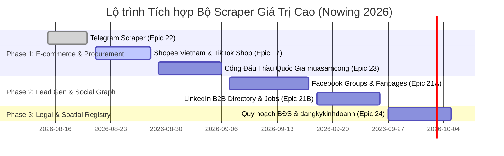

# Strategic Scraper Expansion Roadmap — High-Impact Data Intelligence Platforms

**Ngày lập:** 2026-08-15  
**Tác giả:** Mary (BMAD Strategic Business Analyst)  
**Phê duyệt:** Luis (Founder & Tech Lead)  
**Mục tiêu:** Xây dựng bản đặc tả chiến lược và lộ trình tích hợp toàn diện 5 cụm Scraper có giá trị thương mại và dữ liệu cao nhất cho hệ sinh thái Nowing: **Shopee & E-commerce**, **Facebook Groups/Pages**, **Cổng Đấu Thầu Quốc Gia (muasamcong)**, **LinkedIn B2B Intelligence**, và **Bản đồ Quy hoạch BĐS & ĐKKD**.

---

## 🗺️ TỔNG QUAN LỘ TRÌNH TRIỂN KHAI (EXPANSION ROADMAP MATRIX)

---

## 📦 CHI TIẾT 5 CỤM NỀN TẢNG DỮ LIỆU ĐƯỢC PHÊ DUYỆT

---

### 🛍️ CỤM 1: SHOPEE VIETNAM & TIKTOK SHOP (EPIC 17: E-COMMERCE INTELLIGENCE)

#### 1. Bài toán Kinh doanh & Doanh thu (Business Value)
* **Khách hàng mục tiêu:** Thương hiệu D2C, Nhà bán lẻ (Sellers), Agency phân tích thị trường, Nhà đầu tư F&B/Retail.
* **Giá trị cốt lõi:**
  * **Price Drop & Promotion Alerts:** Thông báo giảm giá tức thì qua Saved Searches khi sản phẩm mong muốn chạm mức giá mục tiêu.
  * **Competitor Benchmarking:** Giám sát doanh số ước tính (historical units sold), lượng tồn kho, giá bán và rating của đối thủ.
  * **Review Intelligence (Sentiment Analysis):** Bóc tách hàng nghìn review khách hàng để tìm lỗi sản phẩm / nhu cầu chưa được đáp ứng.

#### 2. Kiến trúc Thu thập Dữ liệu (Ingestion Architecture)
* **Shopee Ingestion (Fast JSON API Path):**
  * *Endpoint:* `https://shopee.vn/api/v4/search/search_items` (Search), `https://shopee.vn/api/v4/item/get` (Product Details), `https://shopee.vn/api/v2/item/get_ratings` (Reviews).
  * *Header Injection:* `af-ac-enc-dat`, `X-Shopee-Client-Version`, User-Agent di động.
  * *Chi phí/Hiệu năng:* Phản hồi JSON thô < 200ms, không cần render Chromium.
* **TikTok Shop Ingestion:**
  * Thu thập dữ liệu livestreaming trends, top selling SKUs và influencer engagement qua reverse GraphQL/REST mobile endpoints.

#### 3. Bảng Dữ liệu Đề xuất (PostgreSQL Schema)
* `ecommerce_products`: `id`, `platform ('shopee'|'tiktok_shop')`, `item_id`, `shop_id`, `name`, `current_price`, `original_price`, `historical_sold`, `rating_star`, `category_path`, `shop_type ('mall'|'preferred'|'normal')`, `raw_specs JSONB`, `created_at`, `updated_at`.
* `ecommerce_price_history`: `id`, `product_id`, `price`, `discount_rate`, `recorded_at`.
* `ecommerce_reviews`: `id`, `product_id`, `rating`, `comment`, `author_username`, `sentiment_score`, `created_at`.

---

### 🏛️ CỤM 2: CỔNG THÔNG TIN ĐẤU THẦU QUỐC GIA (`muasamcong.mpi.gov.vn` - EPIC 23)

#### 1. Bài toán Kinh doanh & Doanh thu (Business Value)
* **Khách hàng mục tiêu:** Doanh nghiệp Xây dựng, Nhà thầu Thiết bị Y tế / CNTT, Doanh nghiệp Tư vấn Đầu tư, Quỹ tài chính.
* **Giá trị cốt lõi (High-Ticket B2B ARR):**
  * Doanh nghiệp sẵn sàng trả **500 – 2,000 USD/tháng** để có AI Agent theo dõi 24/7 toàn bộ các gói thầu công lập phù hợp với ngành nghề và năng lực tài chính của mình.
  * **Auto-Tender Matchmaking:** Tự động so khớp hồ sơ năng lực của doanh nghiệp với Hồ sơ Mời Thầu (HSMT) và gửi cảnh báo đỏ trước ngày đóng thầu.
  * **Document Parsing & Extraction:** Tự động đọc và tóm tắt file đính kèm HSMT (PDF/DOCX dung lượng lớn) trích xuất tiêu chí kỹ thuật, bảng tiên lượng và điều kiện thanh toán.

#### 2. Kiến trúc Thu thập Dữ liệu (Ingestion Architecture)
* *Nguồn dữ liệu:* Hệ thống Mạng Đấu thầu Quốc gia e-GP (Bộ Kế hoạch & Đầu tư).
* *Giao thức:* REST API nội bộ của Cổng Dịch vụ công e-GP (`/api/v1/tender/search`, `/api/v1/tender/detail/{bid_id}`).
* *Xử lý Tài liệu HSMT:* Celery pipeline tải các file PDF/ZIP đính kèm, sử dụng Nowing OCR/Document Parser (`app/services/okf/`) để chuyển hóa thành vector chunks đưa vào Knowledge Base.

#### 3. Bảng Dữ liệu Đề xuất (PostgreSQL Schema)
* `tender_projects`: `id`, `bid_code (Số TBMT)`, `bid_name`, `investor_name (Chủ đầu tư)`, `bid_price (Giá trị gói thầu VNĐ)`, `procurement_field ('Xây lắp'|'Mua sắm hàng hóa'|'Tư vấn'|'Phi tư vấn')`, `funding_source`, `bid_closing_time`, `location`, `document_urls TEXT[]`, `status`, `summary_md TEXT`, `embedding vector(1536)`.

---

### 👥 CỤM 3: FACEBOOK GROUPS & FANPAGES (EPIC 21A: SOCIAL LEAD GEN INTELLIGENCE)

#### 1. Bài toán Kinh doanh & Doanh thu (Business Value)
* **Khách hàng mục tiêu:** Môi giới BĐS, Recruiter/Headhunter, Đội ngũ B2B Sales Outreach, Chuyên viên phân tích thị trường.
* **Giá trị cốt lõi:**
  * Khai thác nguồn cung BĐS chính chủ, việc làm chưa đăng trên web, và nhu cầu mua bán trực tiếp từ 100,000+ nhóm Facebook tại Việt Nam.
  * **Intent Signal Detection:** AI phân loại bài đăng thành `[BÁN]`, `[MUA]`, `[TUYỂN DỤNG]`, `[TÌM VIỆC]` và tự động bóc tách Số điện thoại, Tên liên hệ, Địa chỉ, Tầm giá vào CRM.

#### 2. Kiến trúc Thu thập Dữ liệu (Ingestion Architecture)
* **Session Pool & Anti-Ban:**
  * Sử dụng cơ chế `ScraperPlatformAccountRotator` với tài khoản Facebook phụ (Cookie session) gán cố định với Sticky SOCKS5 Residential Proxy.
  * Parser giao diện nhẹ `mbasic.facebook.com` kết hợp reverse GraphQL queries để tối ưu tốc độ và không tốn RAM chạy headless browser.
* **Stream Buffer & Realtime Ingestion:**
  * Đẩy bài đăng mới từ các nhóm VIP vào Redis Stream `stream:facebook:raw_posts` $\rightarrow$ Celery Worker bóc tách Entity $\rightarrow$ Kích hoạt Saved Search Alerts.

#### 3. Bảng Dữ liệu Đề xuất (PostgreSQL Schema)
* `facebook_monitored_groups`: `id`, `group_id`, `group_name`, `group_url`, `category ('bds'|'recruitment'|'crypto'|'general')`, `is_active`, `scrape_interval_minutes`.
* `facebook_posts`: `id`, `group_id`, `post_id`, `author_id`, `author_name`, `content`, `published_at`, `reactions_count`, `comments_count`, `raw_entities JSONB (phone, price, email, location)`, `embedding vector(1536)`.

---

### 💼 CỤM 4: LINKEDIN DIRECTORY & JOBS (EPIC 21B / EPIC 12: B2B EXECUTIVE LEADS)

#### 1. Bài toán Kinh doanh & Doanh thu (Business Value)
* **Khách hàng mục tiêu:** B2B SaaS Founders, Doanh nghiệp B2B Tech, Công ty Săn đầu người (Headhunt Agencies).
* **Giá trị cốt lõi:**
  * **Decision Maker Mapping:** Xác định đúng người ra quyết định (CEO, CTO, VP Engineering, HR Director) của các doanh nghiệp đang tuyển dụng nhiều hoặc vừa gọi vốn.
  * **Job Growth Tracking:** Doanh nghiệp đăng tuyển 50 vị trí Tech trong tháng $\rightarrow$ Tín hiệu mở rộng mạnh mẽ (Intent signal mua giải pháp bảo mật, cloud, HR tool).

#### 2. Kiến trúc Thu thập Dữ liệu (Ingestion Architecture)
* **Public Guest Jobs API:** `https://www.linkedin.com/jobs-guest/jobs/api/seeMoreJobPostings/search` (Không cần login, cào việc làm diện rộng với proxy xoay vòng).
* **Company Insights & People Enrichment:** Tích hợp Waterfall API enrichment (Cleanlist/BetterContact) kết hợp session pool có giới hạn token bucket an toàn.

#### 3. Bảng Dữ liệu Đề xuất (PostgreSQL Schema)
* `linkedin_jobs`: `id`, `job_id`, `company_name`, `title`, `location`, `workplace_type ('remote'|'hybrid'|'onsite')`, `description_text`, `skills TEXT[]`, `posted_at`, `raw_entities JSONB`.
* `linkedin_companies`: `id`, `company_urn`, `name`, `industry`, `headcount_range`, `website`, `executive_contacts JSONB`.

---

### 🗺️ CỤM 5: BẢN ĐỒ QUY HOẠCH BĐS & ĐĂNG KÝ KINH DOANH QUỐC GIA (EPIC 24: LEGAL & SPATIAL DATA)

#### 1. Bài toán Kinh doanh & Doanh thu (Business Value)
* **Khách hàng mục tiêu:** Nhà đầu tư BĐS cá nhân/tổ chức, Văn phòng công chứng, Pháp chế doanh nghiệp, Ngân hàng thẩm định giá.
* **Giá trị cốt lõi:**
  * **Kiểm tra Quy hoạch Nhanh (Zoning Check):** Nhập tọa độ hoặc địa chỉ $\rightarrow$ Trả về loại đất quy hoạch (Đất ở đô thị ONT/ODT, Đất cây xanh, Đất giao thông mở đường).
  * **Xác minh Pháp lý Doanh nghiệp (`dangkykinhdoanh.gov.vn`):** Lấy dữ liệu đăng ký gốc có giá trị pháp lý (vốn điều lệ thực tế, danh sách cổ đông sáng lập, thay đổi đăng ký kinh doanh).

#### 2. Kiến trúc Thu thập Dữ liệu (Ingestion Architecture)
* **Quy hoạch Không gian (Spatial GIS Scraper):**
  * Thu thập các tile vector/raster từ hệ thống bản đồ quy hoạch công khai các tỉnh thành (Hà Nội, TP.HCM, Bình Dương, Đà Nẵng).
  * Lưu trữ tọa độ GeoJSON trong PostgreSQL với extension `PostGIS`.
* **Cổng Đăng Ký Kinh Doanh:**
  * Query endpoint tra cứu doanh nghiệp công khai theo Mã số thuế (MST) và bóc tách bảng PDF công bố thay đổi nội dung ĐKKD.

#### 3. Bảng Dữ liệu Đề xuất (PostgreSQL Schema)
* `spatial_planning_zones`: `id`, `province`, `district`, `zone_code ('ONT'|'CLN'|'DGT'|'CX')`, `planning_period ('2030'|'2050')`, `polygon_geometry GEOMETRY(Polygon, 4326)`, `legal_doc_ref`.
* `official_business_profiles`: `id`, `tax_code`, `legal_name`, `charter_capital_vnd`, `legal_representative`, `incorporation_date`, `industry_codes JSONB`, `shareholders JSONB`.

---

## 🎯 BẢNG ÁNH XẠ EPIC & THỨ TỰ THỰC THI (EPIC ASSIGNMENT)

| Epic Code | Tên Epic | Nền tảng Scraper Chính | Thời gian Dự kiến |
| :--- | :--- | :--- | :---: |
| **Epic 22** | Telegram Scraper & Channel Ingestion Engine | Telegram Web Preview + MTProto Session Pool | **Đang thực thi (Sprint hiện tại)** |
| **Epic 17** | E-commerce Intelligence & Pricing Engine | Shopee Vietnam + TikTok Shop | **Sprint tiếp theo** |
| **Epic 23** | National Tender & Procurement Intelligence | `muasamcong.mpi.gov.vn` (Đấu thầu công) | **Sau Epic 17** |
| **Epic 21A** | Social Lead Generation & Community Crawl | Facebook Groups & Fanpages (`mbasic`) | **Sau Epic 23** |
| **Epic 21B** | B2B Decision Maker & Headhunt Intelligence | LinkedIn Jobs & Company Directory | **Cùng Epic 21A** |
| **Epic 24** | Real Estate Spatial Planning & Legal Registry | Bản đồ Quy hoạch BĐS + `dangkykinhdoanh.gov.vn` | **Sau Epic 21** |

---

Bản đặc tả chiến lược này đã được lưu giữ lâu dài tại:  
📁 `_bmad-output/planning-artifacts/research/strategic-scraper-expansion-roadmap-2026-08-15.md`
