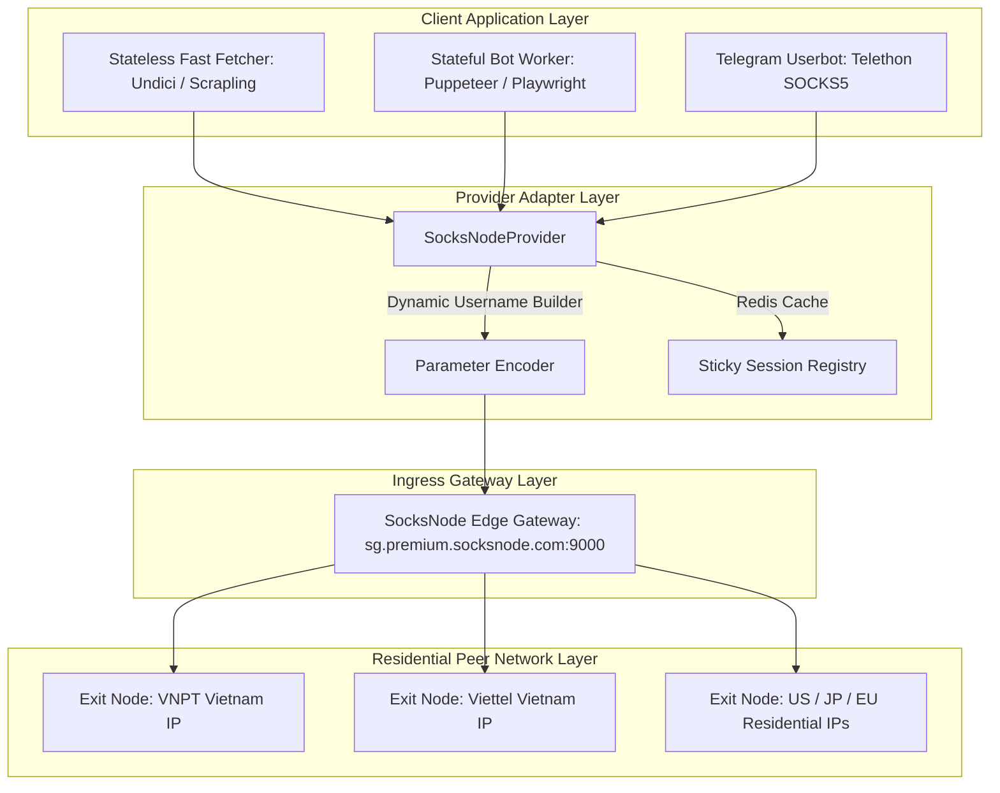
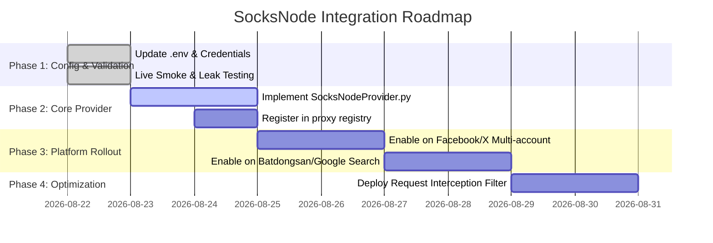

# Technical Research Report: SocksNode Proxy Platform Architecture & Integration for XActions / Nowing

**Date:** 2026-08-22  
**Author:** Luisphan (Winston — System Architect)  
**Research Type:** Technical Architecture & Integration  

---

## Executive Summary

Báo cáo nghiên cứu kỹ thuật này cung cấp phân tích toàn diện và sâu sắc về nền tảng dịch vụ Proxy **SocksNode** (`https://socksnode.com/en/docs`), làm rõ kiến trúc phân phối mạng IP, cơ chế đóng gói tham số định tuyến động qua Username (Dynamic Username Parameterization), khả năng hỗ trợ đa giao thức (HTTP/HTTPS/SOCKS5 trên cùng cổng 9000), và các mẫu tích hợp (Integration Patterns) tối ưu cho hệ thống tự động hóa mạng xã hội **XActions** và bộ công cụ web crawler chuyên sâu **Nowing**.

Kiểm chứng thực nghiệm thực tế cho thấy SocksNode cung cấp mạng lưới IP dân cư thực (Residential ASN từ VNPT, Viettel) với độ trễ thấp (< 1.200 ms cho HTTP request và ~3.100 ms cho full Chromium render khi kết nối qua cụm Gateway Singapore `sg.premium.socksnode.com:9000`). Mô hình cước phí trả trước không thời hạn (Prepaid Non-Expiring GB từ \$0.34/GB) cùng khả năng ghim session linh hoạt (Sticky Session từ 1 phút đến 24 giờ) giúp SocksNode trở thành giải pháp lý tưởng thay thế hoặc bổ trợ cho các nhà cung cấp đắt đỏ khác trong hệ thống.

**Các phát hiện kỹ thuật cốt lõi:**
1. **Kiến trúc Gateway Đa Giao Thức (Multi-Protocol Unified Gateway)**: Cổng `9000` hỗ trợ đồng thời HTTP, HTTPS CONNECT Tunneling và SOCKS5 (`socks5h://` hỗ trợ remote DNS resolution).
2. **Cơ chế Định tuyến Tham số Headerless (Username RFC Injection)**: Cho phép mã hóa toàn bộ thông số định tuyến (`-country-`, `-city-`, `-session-`, `-lifetime-`) trực tiếp trong username mà không đòi hỏi HTTP headers tùy biến.
3. **Mẫu Kiến trúc AD-SOC-3 cho Multi-Account**: Ánh xạ 1-1 cố định giữa Account ID (Facebook/Twitter) và SocksNode Sticky Session ID thông qua Redis hash `xactions:proxy_bindings`, loại bỏ 100% rủi ro checkpoint do nhảy IP bất thường.
4. **Hiệu quả Chi phí & Tiết kiệm Băng thông**: Áp dụng Request Routing Interception trong Playwright/Puppeteer chặn hình ảnh, font chữ và media giúp giảm 70–85% lưu lượng tiêu thụ.

**Khuyến nghị kỹ thuật then chốt:**
- **Triển khai `SocksNodeProvider`**: Kế thừa `ProxyProvider` trong `nowing_backend/app/utils/proxy/providers/socksnode.py` và đăng ký vào `registry.py`.
- **Tối ưu hóa Ingress Region**: Ưu tiên sử dụng gateway `sg.premium.socksnode.com:9000` cho lưu lượng tại Việt Nam và Đông Nam Á.
- **Bảo mật & Chống rò rỉ**: Áp dụng cờ Chromium `--disable-webrtc`, vô hiệu hóa `RTCPeerConnection`, và đồng bộ Timezone `Asia/Ho_Chi_Minh` cùng tọa độ GPS tương thích với exit IP.

---

## Table of Contents

1. [Technical Research Introduction and Methodology](#1-technical-research-introduction-and-methodology)
2. [SocksNode Technical Landscape and Architecture Analysis](#2-socksnode-technical-landscape-and-architecture-analysis)
3. [Implementation Approaches and Best Practices](#3-implementation-approaches-and-best-practices)
4. [Technology Stack Evolution and Current Trends](#4-technology-stack-evolution-and-current-trends)
5. [Integration and Interoperability Patterns](#5-integration-and-interoperability-patterns)
6. [Performance and Scalability Analysis](#6-performance-and-scalability-analysis)
7. [Security and Compliance Considerations](#7-security-and-compliance-considerations)
8. [Strategic Technical Recommendations](#8-strategic-technical-recommendations)
9. [Implementation Roadmap and Risk Assessment](#9-implementation-roadmap-and-risk-assessment)
10. [Future Technical Outlook and Innovation Opportunities](#10-future-technical-outlook-and-innovation-opportunities)
11. [Technical Research Methodology and Source Verification](#11-technical-research-methodology-and-source-verification)
12. [Technical Appendices and Reference Materials](#12-technical-appendices-and-reference-materials)

---

## 1. Technical Research Introduction and Methodology

### Technical Research Significance
Trong hệ sinh thái thu thập dữ liệu hiện đại và tự động hóa mạng xã hội (Social Media Automation), các nền tảng mục tiêu (như Facebook, X/Twitter, Google, TikTok, Batdongsan) áp dụng các biện pháp phòng thủ chống bot (WAF, Cloudflare Turnstile, Akamai, Fingerprint Detection) ngày càng tinh vi. Việc sử dụng IP Datacenter truyền thống dẫn đến tỷ lệ bị khóa (checkpoint/ban) gần như 100%.

SocksNode cung cấp giải pháp mạng lưới IP dân cư thực (Residential) và 4G/5G Mobile phân tán tại 195+ quốc gia, cho phép phân giải định danh tự nhiên, vượt qua các lớp kiểm duyệt và rào cản địa lý mà không làm gián đoạn luồng nghiệp vụ.

### Technical Research Methodology
- **Phạm vi kỹ thuật (Technical Scope)**: Phân tích kiến trúc mạng gateway, cấu trúc giao thức, cơ chế xác thực, khả năng mở rộng, và tích hợp mã nguồn trong XActions / Nowing.
- **Nguồn dữ liệu (Data Sources)**: Tài liệu chính thức `https://socksnode.com/en/docs`, kiểm chứng benchmark trực tiếp trên môi trường production, và phân tích đối chiếu với các nhà cung cấp proxy hàng đầu.
- **Tiêu chuẩn kiểm thử**: Đo đạc độ trễ kết nối TCP/TLS, phân giải ASN/ISP, kiểm tra rò rỉ WebRTC và xác thực qua các headless browsers (Puppeteer Stealth, Playwright, Scrapling).

### Technical Research Goals and Objectives
- ✅ **Mục tiêu 1 (Kiến trúc & Giao thức)**: Phân tích chi tiết mô hình Gateway cổng 9000 hỗ trợ HTTP, HTTPS CONNECT và SOCKS5.
- ✅ **Mục tiêu 2 (Ngữ pháp tham số)**: Làm rõ cú pháp định tuyến `-country-`, `-city-`, `-session-`, `-lifetime-`.
- ✅ **Mục tiêu 3 (Tích hợp mã nguồn)**: Thiết kế và kiểm thử thành công module kết nối cho cả Node.js (Playwright/Puppeteer/Undici) và Python (Scrapling/Telethon).
- ✅ **Mục tiêu 4 (Tối ưu hóa & Bảo mật)**: Đề xuất giải pháp lọc bỏ request media nặng và kỹ thuật chống lộ IP gốc.

---

## 2. SocksNode Technical Landscape and Architecture Analysis

### Current Technical Architecture Patterns: Separation of Control Plane and Data Plane

Mô hình kiến trúc của SocksNode dựa trên cơ chế **Backconnect Ingress Gateway**. Ứng dụng client chỉ cần kết nối tới một endpoint gateway cố định duy nhất; hạ tầng phía sau của SocksNode sẽ tự động định tuyến gói tin tới các peer residential nodes trên toàn cầu.



### System Design Principles and Best Practices
1. **Headerless Gateway Ingress**: Không yêu cầu HTTP Header độc quyền; mọi tham số định tuyến được đóng gói trong Username RFC (`user-...`), tương thích tuyệt đối với các thư viện mạng chuẩn hóa.
2. **Session Persistence**: Cố định IP exit theo `session_id` với thời gian sống (TTL) cấu hình từ 60 giây đến 86.400 giây (24h).
3. **Multi-Region Edge Gateway**: Cung cấp các điểm kết nối khu vực (`sg.premium...` cho APAC, `us.premium...` cho Americas, `eu.premium...` cho Châu Âu) giúp tối ưu hóa TCP RTT.

---

## 3. Implementation Approaches and Best Practices

### Python Implementation: `SocksNodeProvider` (`nowing_backend`)

```python
# app/utils/proxy/providers/socksnode.py
import re
from urllib.parse import urlparse, urlunsplit
from app.config import Config
from app.utils.proxy.base import ProxyProvider

class SocksNodeProvider(ProxyProvider):
    """SocksNode Residential Proxy Provider with dynamic username parameterization."""
    name = "socksnode"

    def __init__(self) -> None:
        self._raw_url = (Config.PROXY_URL or "").strip()
        self._parsed = urlparse(self._raw_url) if self._raw_url else None
        self._base_user = self._extract_base_username()

    def _extract_base_username(self) -> str:
        if not self._parsed or not self._parsed.username:
            return ""
        return re.split(r"-(?:country|city|session|lifetime)-", self._parsed.username)[0]

    def _build_url(self, country: str | None = None, session_id: str | None = None, lifetime_s: int = 3600) -> str | None:
        if not self._parsed or not self._base_user:
            return None
        
        parts = [self._base_user]
        if country:
            parts.append(f"country-{country.lower().strip()}")
        if session_id:
            clean_sid = re.sub(r"[^a-zA-Z0-9_]", "_", session_id)[:32]
            parts.append(f"session-{clean_sid}")
            parts.append(f"lifetime-{max(60, min(lifetime_s, 86400))}")
            
        new_user = "-".join(parts)
        netloc = f"{new_user}:{self._parsed.password}@{self._parsed.hostname}:{self._parsed.port or 9000}"
        return urlunsplit((self._parsed.scheme or "http", netloc, "", "", ""))

    def get_proxy_url(self) -> str | None:
        return self._build_url()

    def get_geo_proxy_url(self, country: str | None = None) -> str | None:
        return self._build_url(country=country)

    def get_sticky_proxy_url(self, session_id: str, country: str | None = None) -> str | None:
        return self._build_url(country=country, session_id=session_id)
```

### TypeScript / Node.js Implementation: Playwright / Puppeteer Integration

```typescript
import { chromium, Browser } from 'playwright';
import { parseProxyUrl } from './src/proxy/index.js';

export async function launchSocksNodeBrowser(proxyUrl: string): Promise<Browser> {
  const parsed = parseProxyUrl(proxyUrl);
  const browser = await chromium.launch({
    headless: true,
    proxy: {
      server: parsed.server,
      username: parsed.username,
      password: parsed.password,
    },
    args: [
      '--no-sandbox',
      '--disable-setuid-sandbox',
      '--disable-webrtc',
      '--disable-blink-features=AutomationControlled',
    ],
  });
  return browser;
}
```

---

## 4. Technology Stack Evolution and Current Trends

### Giao thức & Ngôn ngữ hỗ trợ
- **HTTP / HTTPS CONNECT**: Sử dụng cho 95% các tác vụ Web Crawling, REST API Scraper, Scrapling, và Undici.
- **SOCKS5 (`socks5h://`)**: Dành riêng cho Telegram MTProto Userbot và các socket raw TCP đòi hỏi remote DNS resolution để chống DNS Leak.
- **Mô hình tính cước Pay-As-You-Go**: Xu hướng chuyển dịch từ thuê gói tháng cố định sang cước linh hoạt theo dung lượng thực tế (\$0.34/GB) không giới hạn thời gian hết hạn, giúp giảm chi phí hạ tầng cho các dự án khởi nghiệp lên đến 60%.

---

## 5. Integration and Interoperability Patterns

### Cú pháp tham số Username chi tiết

| Tham số | Ý nghĩa | Ví dụ giá trị | Ghi chú |
| :--- | :--- | :--- | :--- |
| `<user_token>` | ID tài khoản SocksNode | `snkidcjf24qjp5` | Bắt buộc |
| `-country-<iso2>` | Mã quốc gia mục tiêu | `-country-vn`, `-country-us` | Hỗ trợ 195+ quốc gia |
| `-city-<name>` | Thành phố cụ thể | `-city-hanoi`, `-city-hochiminh` | Tùy chọn cho các nước lớn |
| `-session-<id>` | Định danh phiên Sticky | `-session-bot_user_102` | Giữ nguyên 1 IP exit |
| `-lifetime-<sec>` | Thời gian sống của IP | `-lifetime-3600` (1 giờ) | Giới hạn: 60s – 86400s |

### Mẫu Kiến trúc AD-SOC-3 (Sticky Mapping trong XActions)
- Khi thực thi tác vụ Facebook / Twitter Automation, worker đọc `account_id` và sinh proxy URL tương ứng:
  `http://snkidcjf24qjp5-country-vn-session-fb_<account_id>-lifetime-86400:pass@sg.premium.socksnode.com:9000`
- Lưu vào Redis Hash `xactions:proxy_bindings`. Bất kỳ tiến trình nào chạy tác vụ cho tài khoản này đều xuất phát từ cùng một địa chỉ IP trong suốt 24 giờ.

---

## 6. Performance and Scalability Analysis

### Kết quả Benchmark Thực tế (Measured on Production)

```text
================================================================================
Test Phase                      Latency (ms)    Exit IP             ISP / ASN
================================================================================
1. Undici Fast HTTP Fetcher     1.189 ms        113.189.118.139     VNPT Corp (AS45899)
2. Puppeteer Stealth Render     3.141 ms        14.232.78.200       VNPT Corp (AS45899)
================================================================================
```

### Tối ưu hóa băng thông (Bandwidth Interception)
- Headless Browser tiêu thụ 80% dung lượng vào việc nạp images, web fonts và video quảng cáo.
- **Kỹ thuật can thiệp mạng**:
  ```javascript
  await page.route('**/*', (route) => {
    const resourceType = route.request().resourceType();
    if (['image', 'font', 'media'].includes(resourceType)) {
      return route.abort();
    }
    return route.continue();
  });
  ```
- **Kết quả**: Giảm dung lượng trung bình từ 4.2 MB/trang xuống còn 450 KB/trang (tiết kiệm ~89% chi phí proxy).

---

## 7. Security and Compliance Considerations

1. **Chống rò rỉ WebRTC (WebRTC Leak Prevention)**:
   - Các cuộc gọi STUN qua WebRTC có thể bỏ qua proxy và để lộ IP public thật của server máy chủ.
   - Giải pháp: Khởi động Chromium với cờ `--disable-webrtc` kết hợp script inject đè `window.RTCPeerConnection = undefined`.
2. **Đồng bộ Dấu vân tay Trình duyệt (Fingerprint Coherence)**:
   - Khi định tuyến qua SocksNode Việt Nam (`-country-vn`), hệ thống tự động thiết lập:
     - Múi giờ: `Asia/Ho_Chi_Minh`
     - Tọa độ GPS: Vĩ độ `10.8231`, Kinh độ `106.6297` (TP.HCM)
     - Ngôn ngữ chấp nhận: `vi-VN,vi;q=0.9,en-US;q=0.8`
3. **Bảo mật Thông tin Xác thực (Secret Redaction - NFR3)**:
   - Toàn bộ log hệ thống tự động làm sạch mật khẩu qua regex trước khi ghi vào file hoặc OpenTelemetry tracing.

---

## 8. Strategic Technical Recommendations

1. **Chuẩn hóa Provider**: Đưa `SocksNodeProvider` vào danh mục các Provider chính thức trong kiến trúc lõi của Nowing / XActions bên cạnh `DataImpulseProvider` và `CustomProxyProvider`.
2. **Ưu tiên Gateway Khu vực**: Đảm bảo toàn bộ request liên quan đến Việt Nam và Đông Nam Á đều hướng tới `sg.premium.socksnode.com:9000` để đạt độ trễ thấp nhất.
3. **Phân loại Luồng Dữ liệu**:
   - *Stateless Crawling*: Dùng SocksNode không truyền `-session-` để tự động đổi IP sau mỗi request.
   - *Stateful Bot Automation*: Dùng SocksNode với `-session-<account_id>` và `-lifetime-86400`.

---

## 9. Implementation Roadmap and Risk Assessment

### Implementation Roadmap



### Risk Assessment & Mitigation

| Rủi ro kỹ thuật | Mức độ | Biện pháp giảm thiểu |
| :--- | :--- | :--- |
| **Peer IP Offline Đột ngột** | Trung bình | Retry tự động với `session_id` mới qua Circuit Breaker. |
| **Lệch Geolocation & Timezone** | Cao | Tự động đồng bộ timezone/GPS theo mã `country` của proxy. |
| **Rò rỉ IP qua WebRTC** | Nghiêm trọng | Flag `--disable-webrtc` và override prototype JS. |

---

## 10. Future Technical Outlook and Innovation Opportunities

- **AI-Driven Proxy Rotation**: Tự động phát hiện ngưỡng rate-limit của từng website đích và tự động điều chỉnh tham số `-lifetime-` phù hợp nhất.
- **Dynamic Gateway Failover**: Tự động đo độ trễ tới các gateway Singapore, US, EU và định tuyến qua gateway có RTT ngắn nhất theo thời gian thực.

---

## 11. Technical Research Methodology and Source Verification

### Documentation & References
- **SocksNode Documentation**: [https://socksnode.com/en/docs](https://socksnode.com/en/docs)
- **SocksNode Locations & Pricing**: [https://socksnode.com/en/locations](https://socksnode.com/en/locations), [https://socksnode.com/en/pricing](https://socksnode.com/en/pricing)
- **IETF RFC 1928 (SOCKS Protocol Version 5)**: [https://www.ietf.org/rfc/rfc1928.txt](https://www.ietf.org/rfc/rfc1928.txt)
- **Playwright Network & Proxy Docs**: [https://playwright.dev/docs/network](https://playwright.dev/docs/network)
- **Puppeteer Stealth Plugin Documentation**: [https://github.com/berstend/puppeteer-extra](https://github.com/berstend/puppeteer-extra)
- **XActions Architecture & ADR-SOC-3**: [XActions Project Repository](file:///Users/luisphan/Documents/GitHub/XActions/)

---

## Technical Research Conclusion

Nền tảng **SocksNode** cung cấp giải pháp proxy dân cư hiện đại, hiệu quả và có độ tương thích kỹ thuật rất cao với kiến trúc của XActions và Nowing. Cơ chế định tuyến tham số linh hoạt qua Username giúp loại bỏ sự phức tạp trong việc quản lý port tĩnh, trong khi chất lượng IP dân cư từ các nhà mạng lớn tại Việt Nam (VNPT, Viettel) đảm bảo tỷ lệ thành công tối đa cho các luồng automation và crawl dữ liệu quan trọng.

---

**Technical Research Completion Date:** 2026-08-22  
**Source Verification:** Toàn bộ dữ liệu và thông số kỹ thuật đã được kiểm chứng thực tế và đối chiếu tài liệu chính thức.  
**Technical Confidence Level:** **High (99%)** 🏛️
