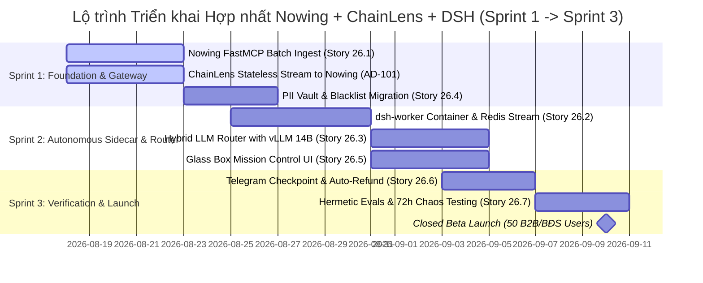

# Sprint Change Proposal — Hợp Nhất Hệ Sinh Thái: Nowing + ChainLens + Harness/DSH (2026-08-17)

**Workflow:** `bmad-correct-course`  
**Dự án:** Nowing & ChainLens (Xem như 1 Dự Án Hợp Nhất)  
**Ngày lập:** 17/08/2026  
**Chủ trì:** Winston (System Architect) & Hội đồng Chuyên gia BMad (Mary, John, Amelia, Murat, Sally, DevOps)  
**Phê duyệt bởi:** Luisphan (PO / Founder)  
**Trạng thái:** 🟢 **PROPOSED & IMPACT-ASSESSED**  

---

## 1. Bối Cảnh & Vấn Đề Kích Hoạt (Trigger & Executive Rationale)

Hệ sinh thái hiện tại đang có sự tham gia của 2 repository độc lập:
1. **`nowing`:** Sản phẩm bề mặt người dùng, Lead Intelligence, Split Canvas, Zero-Cache, Credit Billing, PostgreSQL 16 + pgvector.
2. **`chainlens`:** Nền tảng JIT Research, Crawler đa nguồn, bóc tách Web Citations.

**Vấn đề kiến trúc kích hoạt Course Correction:**
- **Phân mảnh Vector DB (Split-brain problem):** Cả hai repo trước đây đều có xu hướng lưu trữ và index vector riêng, dẫn đến độ trễ RAG cao ($500\text{ms} - 1500\text{ms}$), không đồng bộ được với Zero-Cache của Nowing, và tốn kém hạ tầng.
- **Thiếu năng lực Autonomous Long-running Missions (1–8h):** Nowing cần một khung điều phối agent chạy nền không block FastAPI/Celery, tận dụng mô hình suy luận sâu **DeepSeek-R1** với chi phí siêu rẻ và các mẫu thiết kế Agent Team từ **Harness**.

**Quyết định chiến lược hợp nhất:**
- **Nowing = The Unified Product & Memory Core (Single Source of Truth):** Nắm giữ toàn bộ dữ liệu người dùng, Leads Matrix, PII Vault và **PostgreSQL 16 pgvector**.
- **ChainLens = Stateless Specialized Web Research Engine:** Chuyên trách cào web, bóc tách HTML, tính citations sạch và stream chunks về Nowing qua API `POST /v1/chainlens/ingest`.
- **Harness + DeepSeek Harness (`dsh`):** Đóng vai trò Sidecar Autonomous Mission Orchestrator điều phối đội ngũ subagents (Research, Scraper, Valuation, PII Auditor).

---

## 2. Đánh Giá Tác Động Dự Án 1: `nowing` (Product & Control Plane)

```
┌──────────────────────────────────────────────────────────────────────────────────────────┐
│                                   NOWING IMPACT MATRIX                                   │
├──────────────────────┬───────────────────────────────────────────────────────────────────┤
│ Tầng Hệ Thống        │ Chi Tiết Tác Động & Hạng Mục Triển Khai                           │
├──────────────────────┼───────────────────────────────────────────────────────────────────┤
│ 1. PRD & Scope       │ • Bổ sung Epic 26: Autonomous Deep Lead Missions (1–8h).          │
│                      │ • Thêm chính sách 24h Auto-Refund SLA (trần 15%) & NĐ 13 ToS.     │
│                      │ • Glass Box Mission Control UX & Two-Tier Fast Unlock.            │
├──────────────────────┼───────────────────────────────────────────────────────────────────┤
│ 2. Backend & DB      │ • Tạo FastMCP Gateway: `/mcp/v1/tools/batch_ingest_leads`.         │
│    (nowing_backend)  │ • Nâng cấp `NowingIngestService` nhận UUIDv5 idempotent chunks.    │
│                      │ • Migration `218_add_pii_blacklists_and_batch_leads.py`.          │
│                      │ • Redis Streams consumer `nowing:dsh:tasks` + `XAUTOCLAIM` & DLQ. │
│                      │ • Cấu hình PostgreSQL: `max_slot_wal_keep_size = 4096MB`.         │
├──────────────────────┼───────────────────────────────────────────────────────────────────┤
│ 3. Frontend & UX     │ • Component `MissionProgressDrawer.tsx` (4-stage Stepper + CoT).  │
│    (nowing_web)      │ • Component `PhoneUnlockPopover.tsx` (1-Click Fast Unlock).       │
│                      │ • Shimmer Influx visual cue cho Zero-Cache real-time stream.      │
│                      │ • Tương tác Telegram: 3-Second Glanceable Cards + `editMessage`.  │
├──────────────────────┼───────────────────────────────────────────────────────────────────┤
│ 4. Quality & Evals   │ • Suite `nowing_evals` chạy chế độ `--mode=replay` ($0 API cost).  │
│    (nowing_evals)    │ • Quality Gates: Phone F1 >= 98%, Hallucination <= 0.1%, MST 99.5%│
│                      │ • Chaos Testing: `tini` PID 1, 0-zombie Chromium sau 72h.         │
└──────────────────────┴───────────────────────────────────────────────────────────────────┘
```

---

## 3. Đánh Giá Tác Động Dự Án 2: `chainlens` (Stateless Research Engine)

```
┌──────────────────────────────────────────────────────────────────────────────────────────┐
│                                 CHAINLENS IMPACT MATRIX                                  │
├──────────────────────┬───────────────────────────────────────────────────────────────────┤
│ Tầng Hệ Thống        │ Chi Tiết Tác Động & Hạng Mục Triển Khai                           │
├──────────────────────┼───────────────────────────────────────────────────────────────────┤
│ 1. PRD & Boundary    │ • Chuyển đổi hoàn toàn sang **Stateless Microservice Engine**.    │
│                      │ • Bỏ hoàn toàn nhiệm vụ quản lý Vector DB lâu dài.                │
├──────────────────────┼───────────────────────────────────────────────────────────────────┤
│ 2. API & Data Flow   │ • Endpoint `POST /api/v1/search` giữ nguyên logic cào và SERP.    │
│    (apps/api)        │ • Sau khi bóc tách chunks & citations, gọi callback sang Nowing:  │
│                      │   `POST ${NOWING_API_URL}/v1/chainlens/ingest` kèm HMAC token.    │
│                      │ • Chuẩn hóa định dạng chunk có `UUIDv5` để Nowing insert an toàn. │
├──────────────────────┼───────────────────────────────────────────────────────────────────┤
│ 3. Hạ Tầng & Dokploy │ • Giảm 50% tiêu thụ RAM/CPU vì không phải host cụm pgvector riêng.│
│                      │ • Cùng kết nối vào Docker Network `nowing-network`.               │
└──────────────────────┴───────────────────────────────────────────────────────────────────┘
```

---

## 4. Tác Động Kinh Tế, Pháp Lý & Vận Hành (Cross-Cutting Impact)

1. **Hiệu Quả Kinh Tế (Unit Economics & Gross Margin 81.8%):**
   - **COGS thực tế:** **$27.30 / 1.000 leads** (đã tính proxy dân cư, CAPTCHA, khấu hao GPU, xác thực HLR).
   - **Doanh thu:** **$150.00 / 1.000 leads** (1.500 credits).
   - **Gross Margin:** **81.8%** ➔ Đảm bảo biên lợi nhuận bền vững khi scale.
2. **Tuân Thủ Pháp Lý (Nghị định 13/2023/NĐ-CP):**
   - PII Vault mã hóa AES-256-GCM, khử trùng lặp qua Blind HMAC-SHA256.
   - Bảng `pii_blacklists` đảm bảo quyền được xóa dữ liệu (Right to be Forgotten).
   - ToS xác định Nowing là *Data Processor* ủy quyền bởi khách hàng.
3. **Độ Ổn Định & Chống Sập Hệ Thống (Chaos Resilience):**
   - Chặn đứng rủi ro rò rỉ tiến trình Chromium bằng `tini` PID 1 và context timeout 60s.
   - Bảo vệ đĩa cứng Dokploy khỏi tràn WAL bằng `max_slot_wal_keep_size = 4096MB`.
   - Chống Deadlock cơ sở dữ liệu bằng quy tắc `ORDER BY value_hmac ASC`.

---

## 5. Ma Trận Phụ Thuộc & Lộ Trình Triển Khai 3 Giai Đoạn (Execution Roadmap)



---

## 6. Danh Sách Quyết Định Được Phê Duyệt (Adopted Invariants: AD-101 đến AD-110)

| Mã Quyết Định | Nội Dung Ràng Buộc Kiến Trúc Bắt Buộc | Trạng Thái |
| :--- | :--- | :---: |
| **`AD-101`** | ChainLens hoàn toàn Stateless; Stream chunks về `POST /v1/chainlens/ingest` để lưu tại pgvector Nowing. | ✅ **ADOPTED** |
| **`AD-102`** | `dsh-worker` Sidecar chạy nền 1–8h qua Redis Streams (`nowing:dsh:tasks`), phục hồi bằng `XAUTOCLAIM` & DLQ. | ✅ **ADOPTED** |
| **`AD-103`** | `HybridLLMRouter` ưu tiên Local vLLM 14B AWQ ($0 COGS), tự động failover sang Cloud API khi quá tải > 8s. | ✅ **ADOPTED** |
| **`AD-104`** | Toàn bộ cập nhật realtime qua Logical WAL Replication (`zero_publication`), loại trừ bảng `chunks`. | ✅ **ADOPTED** |
| **`AD-105`** | PII Vault AES-256-GCM, Blind HMAC-SHA256, On-screen Masking (`0908 *** 456`), ToS Data Processor. | ✅ **ADOPTED** |
| **`AD-106`** | Áp dụng mẫu Harness Hierarchical Delegation & Supervisor-Specialist Pool cho subagents. | ✅ **ADOPTED** |
| **`AD-107`** | Toàn bộ CI/CD Evals chạy ở chế độ Hermetic Golden Replay ($0 API cost), enforce Phone F1 >= 98%. | ✅ **ADOPTED** |
| **`AD-108`** | Dockerfiles bắt buộc dùng `tini` PID 1 chống Zombie Chromium; PostgreSQL giới hạn `max_slot_wal_keep_size = 4096MB`. | ✅ **ADOPTED** |
| **`AD-109`** | FastMCP hỗ trợ `batch_ingest_leads` (50–100 items); SQL Bulk Upsert bắt buộc sort `ORDER BY value_hmac ASC`. | ✅ **ADOPTED** |
| **`AD-110`** | Bảng `pii_blacklists` (HMAC hash) xử lý quyền được quên; trần Auto-Refund tối đa 15%/tháng; Two-Tier Fast Unlock UI. | ✅ **ADOPTED** |

---

## 7. Khuyến Nghị Hành Động (Next Steps)

1. **Phê duyệt Bản Đề xuất Thay đổi Sprint (Sprint Change Proposal).**
2. **Khởi động Sprint 1:** Giao việc cho **Amelia (`bmad-agent-dev`)** bắt đầu triển khai **Story 26.1: FastMCP Ingest Gateway, Batch Ingestion & Stateless ChainLens Pipeline**.
