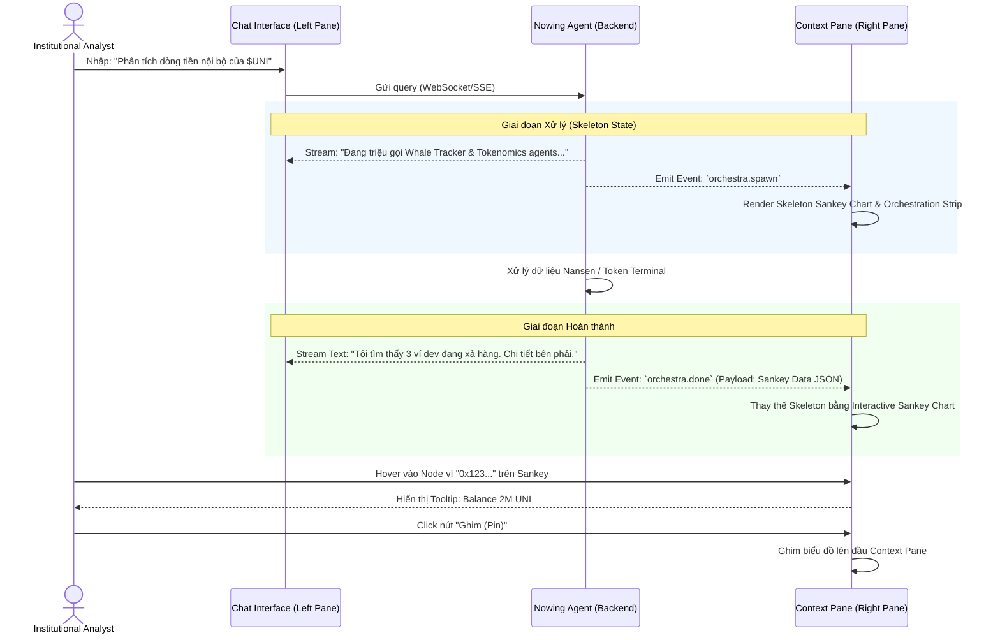
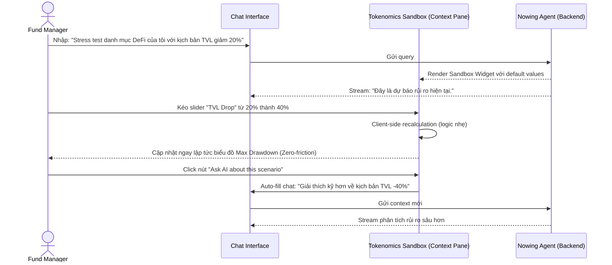

---
stepsCompleted:
  - 1
  - 2
  - 3
  - 4
  - 5
  - 6
  - 7
  - 8
  - 9
  - 10
  - 11
  - 12
  - 13
  - 14
inputDocuments:
  - _bmad-output/planning-artifacts/prd.md
  - _bmad-output/planning-artifacts/architecture.md
  - docs/project-overview.md
lastStep: 14
status: 'complete'
# UX Design Specification Nowing

**Author:** Luisphan
**Date:** 2026-04-13

---

## Executive Summary

### Project Vision
Nowing là nền tảng tìm kiếm và trích xuất ngữ cảnh (Agentic RAG) được thiết kế đặc biệt với kiến trúc Local-first. Sứ mệnh cốt lõi của ứng dụng là mang tới trải nghiệm truy vấn siêu tốc (Time-to-First-Token < 1 giây) và khả năng hoạt động liền mạch ngay cả khi mất kết nối mạng. Hệ thống phá bỏ rào cản về độ trễ của các ứng dụng RAG truyền thống dựa trên cloud nhờ việc đồng bộ hoá ngầm kho dữ liệu trực tiếp về thiết bị người dùng (Zero-cache). 

### Target Users
1. **Người dùng chính (Alex - Data Researcher):** Làm việc với lượng lớn tài liệu phân mảnh, có yêu cầu khắt khe về việc tổng hợp thông tin, trích dẫn chính xác và không có thời gian chờ đợi web load (loading spinners).
2. **Kỹ sư vận hành (Jamie - DevOps) & Nhóm dev tích hợp (Sam - Developer):** Cần giám sát hệ thống phân tán minh bạch, tích hợp AI streaming qua SSE một cách dể hiểu, đảm bảo background workers không làm nghẽn luồng chat.

### Key Design Challenges
1. **Truyền đạt trạng thái kết nối mạng phức tạp (Local-first logic):** Cần chỉ báo UI (indicators) tinh tế thể hiện trạng thái `Syncing`, `Offline`, hoặc `Online` mà không gây rối rắm.
2. **Quản lý kỳ vọng thời gian thực:** Giao diện cần placeholder khéo léo để User an tâm chờ đợi tiến trình trích xuất tài liệu (Embedding) qua Celery.
3. **Hiển thị Streaming và Trích dẫn (Citations):** Giao diện AI chat phát sinh văn bản theo luồng SSE cực mượt, pop-up hiển thị nguồn tham khảo tự nhiên.

### Design Opportunities
1. **Trải nghiệm truy xuất không có 'Loading':** Biến việc chờ đợi thành dĩ vãng nhờ Rocicorp Zero. UI phản hồi tức thì cho các thao tác nội bộ.
2. **Tương tác Desktop-like trên Web:** Áp dụng tư duy tương tác layout mở đa khung giống một phần mềm biên tập nội dung, thay vì danh sách chat cuộn đơn tuyến.

## Core User Experience

### Defining Experience
- **Hành động nòng cốt:** Tiến hành "Trò chuyện mang tính Khám phá" (Exploratory Chat) với kho dữ liệu cá nhân. 
- Mọi thao tác xoay quanh việc hỏi đáp cực kỳ tự nhiên, trong đó văn bản do người dùng tải lên sẽ đóng vai trò bệ đỡ (grounding) vô hình hỗ trợ đằng sau mà không bắt ép người dùng phải thao tác chọn file quá rườm rà.


## Design Direction Decision

### Design Directions Explored

Tôi đã phát triển 3 hướng thiết kế (Design Directions) tập trung vào việc tích hợp các tính năng Institutional Research (Epic 10) vào hệ thống Agentic RAG hiện tại:

1. **Direction 1: The Dense Terminal (Bloomberg-lite)** - Một giao diện tối (Dark mode), mật độ dữ liệu cao với nhiều panel hiển thị cùng lúc (Sankey, Heatmap, Order Book). Cửa sổ chat AI bị thu nhỏ lại thành một dòng lệnh (Command Line) ở dưới cùng.
2. **Direction 2: The Clean Analyst (Messari style)** - Giao diện tập trung vào việc đọc báo cáo tĩnh. AI đóng vai trò như một trợ lý trôi nổi (Floating assistant) ở góc phải để hỏi đáp thêm sau khi đã xem xong báo cáo.
3. **Direction 3: Split-Pane Conversational (Current Evolution)** - Cửa sổ chat vẫn là trung tâm thao tác. Bất cứ khi nào AI tạo ra dữ liệu phức tạp (Biểu đồ Sankey, Tokenomics Sandbox), nó sẽ bật mở một Context Pane ở bên phải để người dùng tương tác sâu hơn, thay vì nhồi nhét vào trong luồng chat.

### Chosen Direction

**Direction 3: Split-Pane Conversational (Current Evolution)** là sự lựa chọn tối ưu nhất.

### Design Rationale

- **Phù hợp với Tầm nhìn (Vision Alignment):** Nowing định hình là một "Trợ lý Chat" (Copilot) chứ không phải một "Bảng điều khiển" (Dashboard) tĩnh. Direction 3 giữ cho AI ở vị trí trung tâm của mọi thao tác.
- **Quản lý sự phức tạp (Complexity Management):** Dữ liệu của Epic 10 (Sankey flow, Portfolio Stress Testing) quá lớn để hiển thị trực tiếp trong bong bóng chat (chat bubble). Việc tách chúng ra Context Pane bên phải giúp giao diện chat không bị vỡ (break layout) mà người dùng vẫn có thể thao tác (kéo thả slider) một cách thoải mái.
- **Tiến hóa tự nhiên (Natural Evolution):** Nó kế thừa trực tiếp từ kiến trúc giao diện hiện tại của dự án (đã có Split-Pane cho Citation), chỉ mở rộng thêm các tab mới cho Interactive Widgets.

### Implementation Approach

- **Layout Structure:** Tiếp tục duy trì layout 3 cột: Sidebar (Navigation) -> Chat Area (Main interaction) -> Context Pane (Interactive Widgets & Citations).
- **Widget System:** Các biểu đồ phức tạp của Epic 10 (Sankey, Heatmap) sẽ được xây dựng dưới dạng các React Client Components độc lập, được render vào Context Pane dựa trên Event (hoặc JSON payload) từ SSE stream do LangGraph trả về.
- **Đa luồng Widget (Multi-Widget Management):** Context Pane không chỉ hiển thị một kết quả tĩnh, mà cho phép "Ghim" (Pin) các widget lại với nhau theo chiều dọc hoặc Pop-out thành cửa sổ nổi (PIP) để Institutional Users dễ dàng đối chiếu song song nhiều token/biểu đồ.
  - *Defensive UX (Temporal Binding):* Các widget được ghim phải được "neo" trực quan (màu sắc, viền highlight) với tin nhắn sinh ra nó trong luồng chat. Nếu người dùng cuộn chat ra xa khỏi tin nhắn đó, widget sẽ mờ đi để tránh gây nhầm lẫn ngữ cảnh.
- **Responsive Graceful Degradation:** Trên các thiết bị Tablet/Mobile, Context Pane sẽ không ép khung chat nhỏ lại mà sẽ chuyển đổi thành dạng "Bottom Sheet" (khay trượt từ dưới lên). Người dùng có thể vuốt lên (swipe up) để mở rộng toàn màn hình biểu đồ và vuốt xuống để quay lại đoạn chat.
  - *Defensive UX (Strict Gesture Zones):* Để tránh xung đột với các thao tác zoom/pan bên trong biểu đồ, Bottom Sheet chỉ nhận diện thao tác vuốt đóng/mở ở phần Header (Drag Handle). Các biểu đồ phức tạp sẽ có nút "Fullscreen Expand" riêng biệt.
- **Skeleton States & Micro-animations:** Không sử dụng Loading Spinner vô hồn. Khi Sub-agents đang xử lý dữ liệu, Context Pane sẽ hiện ngay "Bóng mờ" (Skeleton) đúng với hình thái biểu đồ (Sankey, Heatmap) sắp xuất hiện, kết hợp cùng Orchestration Strip (các dòng log trạng thái của Agent) để giảm cảm giác chờ đợi tâm lý của người dùng.
  - *Defensive UX (Progressive Disclosure):* Nếu nhiều agents chạy cùng lúc, chỉ hiển thị Skeleton cho Widget dữ liệu chính để tránh loạn thị (cognitive overload). Các dữ liệu phụ được gom vào một thanh trạng thái nhỏ ở đáy Pane và chỉ bung ra khi tải xong.
- **Edge Cases, Accessibility & Monetization:**
  - *Intelligent Empty States:* Khi Context Pane chưa có dữ liệu từ cuộc hội thoại, nó sẽ mặc định hiển thị "Workspace Watchlist" và "Trending Narratives" để không lãng phí không gian.
  - *Freemium Teasers (Monetization):* Đối với người dùng Free, các widget nâng cao (Pro Widgets) thuộc Epic 10 sẽ hiển thị mờ (blur) kèm nút CTA "Nâng cấp" ngay trong Context Pane, tạo động lực chuyển đổi (conversion) mượt mà.
  - *Auto-collapse & Widget History Tray:* Các widget cũ không được "Ghim" sẽ tự động thu gọn. Để người dùng không có cảm giác mất dữ liệu, một "Khay lịch sử Widget" (dạng thanh icon dọc mỏng) sẽ nằm ở mép phải màn hình để lưu trữ và khôi phục nhanh (restore) các widget đã đóng.
  - *Data Accessibility (Table View Toggle):* Mọi biểu đồ trực quan (Sankey, Heatmap) phải có nút chuyển đổi sang dạng Bảng dữ liệu thô (Data Table) để hỗ trợ trình đọc màn hình (Screen Readers) và cho phép copy/paste.
  - *Client-side Performance:* Chế độ Table View sẽ mặc định giới hạn hiển thị Top 100 kết quả để tránh treo trình duyệt (OOM), hỗ trợ tải thêm dạng cuộn vô tận (infinite scroll).


## User Journey Flows

### Smart Money Discovery Flow

Luồng này mô tả cách một nhà phân tích yêu cầu AI kiểm tra một token, quá trình AI spawn các agent và trả về một biểu đồ Sankey trên Context Pane, thể hiện khả năng xử lý thời gian thực và quản lý kỳ vọng (Skeleton states).



### Portfolio Stress Testing Flow

Luồng này tập trung vào tính năng Tokenomics Sandbox, minh họa mô hình Zero-friction nơi người dùng kéo thả các slider trên Context Pane để cập nhật rủi ro client-side mà không cần reload trang hay chat lại.



### Journey Patterns

Across these flows, we establish standard interaction patterns:

- **"Query-to-Widget" Pattern:** Mọi yêu cầu phân tích phức tạp đều bắt đầu từ giao diện Chat (ngôn ngữ tự nhiên) và kết thúc bằng việc kích hoạt một Interactive Widget ở Context Pane bên phải, tránh ép người dùng phải tự tìm công cụ trong menu.
- **"Widget-to-Chat" Pattern (Context Loop):** Người dùng thao tác trên Widget (ví dụ: kéo slider mô phỏng, chọn một cụm ví), sau đó có thể nhấn một nút để đẩy thẳng bối cảnh (context) đó ngược lại Chat Box để AI tiếp tục giải thích, tạo thành vòng lặp nghiên cứu khép kín.
- **"Graceful Degradation" Pattern:** Nếu xảy ra sự cố mạng (network lag), hệ thống luôn ưu tiên hiển thị Skeleton state và giữ lại văn bản chat đã nhận được. Nếu User chưa nâng cấp (Free tier), các bước gọi Agent nâng cao vẫn chạy, nhưng Widget cuối cùng sẽ bị làm mờ (Blurred) với CTA "Nâng cấp" (Freemium Teaser).

### Flow Optimization Principles

- **Minimize Cognitive Overload:** Không bao giờ hiển thị đồng thời cả dữ liệu dạng bảng và text chat dài. Sử dụng Skeleton để "mua thời gian" nhưng không gây nhiễu thị giác.
- **Temporal Consistency:** Các widget sinh ra từ chat phải được liên kết trực quan (màu sắc/border) với tin nhắn tương ứng để người dùng không bị "lạc" khi cuộn xem lịch sử.


## Component Strategy

### Design System Components
Dự án sử dụng nền tảng **Tailwind CSS kết hợp Radix UI / Shadcn**. Nền tảng này cung cấp độ bao phủ (coverage) tuyệt vời cho các UI primitives:
- **Available:** Buttons, Forms, Dialogs, Dropdowns, basic Sidebar layouts, Data Tables.
- **Gaps (Khoảng trống cần lấp đầy):** Layout quản lý không gian 3 cột động (Split-Pane/Bottom Sheet), bộ hiển thị tiến trình đa luồng (Orchestrator), và các biểu đồ tài chính cấp độ tổ chức (Institutional Widgets).

### Custom Components

#### 1. `<ContextPaneManager />`
**Purpose:** Trái tim của Direction 3. Vùng chứa động bên phải màn hình để hiển thị các Interactive Widgets sinh ra từ chat.
**Anatomy:** Gồm Header (Tên widget, nút Table/Chart toggle, nút Pin, nút Đóng), Body (Biểu đồ/Skeleton), và Footer (Nguồn trích dẫn).
**States:** Mở rộng (Expanded - chiếm 40% màn hình), Thu gọn (Collapsed - thành Icon trên Widget History Tray), Trống (Empty - hiện Watchlist mặc định).
**Responsive Behavior:** Tự động chuyển đổi thành Modal/Bottom Sheet trên viewport nhỏ.

#### 2. `<OrchestraStrip />`
**Purpose:** Giúp người dùng theo dõi tiến trình làm việc của hàng loạt Sub-agents khi chạy lệnh "Phân tích toàn diện", giảm cảm giác chờ đợi tâm lý (thỏa mãn NFR-P1/P2).
**Anatomy:** Một hàng ngang (strip) hoặc danh sách dọc gồm nhiều `<AgentRow />` (vd: Whale Tracker, Tokenomics Analyst).
**States:** Pending (xám nhạt), Running (hiệu ứng pulse sáng, có text mô tả việc đang làm), Done (tick xanh lá), Fallback/Error (cảnh báo vàng, fallback sang Web Search).

#### 3. Institutional Data Widgets (`<SankeyFlowWidget />`, `<HeatmapWidget />`)
**Purpose:** Trực quan hóa dữ liệu từ Epic 10 (Sankey, Heatmap).
**Variants:**
- `Skeleton`: Khung xương mô phỏng chính xác hình thái biểu đồ (không dùng spinner tròn vô hồn) hiển thị ngay lập tức khi Agent vừa được gọi.
- `Chart`: Biểu đồ D3.js/ECharts cho phép tương tác (Pan, Zoom, Hover Tooltip).
- `Table View`: Bảng dữ liệu thô (Toggle để hỗ trợ Accessibility/Screen Readers và Copy ra Excel).
- `Freemium`: Dạng Chart nhưng bị blur mờ với CTA "Upgrade to Pro" đè lên trên (dành cho Free Users).

#### 4. `<TokenomicsSandbox />`
**Purpose:** Môi trường mô phỏng rủi ro (Stress testing) Client-side.
**Anatomy:** Form nhập liệu/Slider (TVL drop, Inflation rate) liên kết 2 chiều (two-way binding) với Line Chart dự báo.
**Interaction Behavior:** Kéo thả slider sẽ làm biểu đồ cập nhật tức thì (Client-side recalculation - Zero friction). Có nút "Gửi kịch bản này cho AI" để đẩy context về lại luồng chat chính.

### Implementation Roadmap

**Phase 1 - Core Layout & Feedback:**
- Xây dựng `<ContextPaneManager />` (Desktop & Mobile behaviors).
- Xây dựng `<OrchestraStrip />` để bắt các sự kiện SSE từ luồng Chat.

**Phase 2 - Data Visualization:**
- Tích hợp thư viện biểu đồ (ECharts/D3) để xây dựng `<SankeyFlowWidget />` và `<TokenomicsSandbox />`.
- Đảm bảo tính năng Table View Toggle hoạt động mượt mà cho mọi biểu đồ.

**Phase 3 - Polish & Monetization:**
- Áp dụng các hiệu ứng Skeleton chuyên sâu (Progressive Disclosure).
- Triển khai tính năng Widget History Tray và Blur Freemium cho các gói trả phí.

### Experience Principles
1. **Khởi tác Tức thì (Instant Action):** UI không bao giờ bị "đóng băng" kể cả khi đang có background work. Mọi click đều phải phản hồi state dưới 10ms.
2. **Lùi bước Âm thầm (Graceful Degradation):** Khi mất mạng, giao diện ngầm đổi màu sang trạng thái "Offline" tinh tế. Nút "Tạo Embedding" tự động disable nhẹ nhàng (chứ không báo lỗi popup) và khuyến khích họ đọc lịch sử.
3. **Hiển thị Rành mạch (Clear Provenance):** Không bao giờ để User phải tự đoán AI lấy câu trả lời từ đâu. Tính năng pop-up Trích dẫn (Citation) là trái tim của giao diện hiển thị câu trả lời AI.

## Desired Emotional Response

### Primary Emotional Goals
- **Quyền năng & Tự chủ (Empowered & In Control):** Người dùng cảm thấy họ đang nắm giữ một "bộ não thứ hai" (second brain) có khả năng đọc hiểu khối lượng kiến thức khổng lồ ngay lập tức.
- **Tin tưởng tuyệt đối (Absolute Trust):** Hoàn toàn yên tâm về tính bảo mật (dữ liệu nằm trên máy) và độ tin cậy của câu trả lời (luôn có trích dẫn minh bạch).
- **Kinh ngạc vì sự êm ái (Delightfully Frictionless):** Cảm giác ngạc nhiên, thích thú khi không phải chờ đợi các vòng quay "Loading" nhàm chán như môi trường web truyền thống.

### Emotional Journey Mapping
- **Tiếp xúc ban đầu (First Discovery):** Tò mò và ngỡ ngàng trước tốc độ phản hồi tức thì khi thả file vào (dữ liệu được sync ngầm bằng Rocicorp Zero).
- **Trong quá trình Chat (Core Action):** Cảm giác trôi chảy (Flow state). Suy nghĩ không bị đứt đoạn nhờ AI gõ trả lời không độ trễ.
- **Sau khi hoàn thành (Task Completion):** Thoả mãn và minh mẫn, lấy được câu trả lời kèm nguồn tham chiếu rõ ràng.
- **Sự cố mất mạng/Vào vùng lõm (Disruption/Offline):** Cảm giác an tâm, thở phào nhẹ nhõm vì giao diện chỉ nhẹ nhàng chuyển sang màu "Offline" nhưng mọi dữ liệu chat hay tài liệu vẫn hiện diện để đọc tiếp.

### Micro-Emotions
- **Tự tin (Confidence) > Bối rối (Confusion):** Người dùng luôn biết câu trả lời này được trích xuất từ văn bản gốc nào nhờ cơ chế Highlight Citation.
- **Thư giãn (Relaxed) > Căng thẳng (Anxiety):** Không lo sợ ấn nhầm nút làm mất đi đoạn chat dài, vì mọi state được lưu xuống IndexedDB (PGLite) liên tục.

### Design Implications
- *Nếu muốn tạo sự Tự chủ:* Giấu đi các thiết lập Agent rườm rà, nhường chỗ cho giao diện chat/đọc tài liệu rộng rãi; chỉ hiển thị trạng thái "Đang đồng bộ (Syncing)" là một icon nhỏ gọn không chặn thao tác (Non-blocking UI).
- *Nếu muốn tạo sự Tin tưởng:* Giao diện hiển thị Nguồn trích dẫn (Citations) phải cực kỳ nổi bật, có thể click thẳng vào để nhảy đến đúng trang PDF/đoạn text bên sidebar.
- *Nếu muốn tạo Delight:* Áp dụng các micro-animations (ví dụ: nút "Gửi" biến đổi mượt mà khi AI đang type), nhưng phải giữ cho mọi animation có thời lượng cực ngắn (<150ms).

### Emotional Design Principles
1. **Thiết kế vì trạng thái Dòng chảy (Design for Flow):** Loại bỏ mọi pop-up chặn màn hình.
2. **Minh bạch là Đáng tin (Transparency is Trust):** AI phải luôn "thừa nhận" nguồn gốc kiến thức của nó, nếu không biết thì thể hiện giao diện trung lập thay vì bịa (hallucinate).
3. **Im lặng là Vàng (Quiet Background):** Trạng thái Embeddings hay Syncing để làm việc với dữ liệu lớn phải diễn ra như một nhịp thở nhẹ ở dưới đáy UI, không đòi hỏi sự chú ý.

## UX Pattern Analysis & Inspiration

### Inspiring Products Analysis
1. **Linear:**
   - *Điểm xuất sắc:* Tốc độ tuyệt đối nhờ kiến trúc Local-first (sync ngầm). Cảm giác mượt mà, phản hồi lập tức (zero-latency).
   - *Bài học xử lý:* Không bao giờ dùng thanh Loading (Spinner) chặn luồng làm việc. Sử dụng phím tắt (Cmd+K) để tăng tốc thao tác.
2. **Obsidian / Logseq:**
   - *Điểm xuất sắc:* Quản lý kiến thức mạnh mẽ, cảm giác dữ liệu hoàn toàn thuộc về mình (nằm trên máy tính local). Khả năng chia đa màn hình (Split-pane) để vừa đọc nội dung vừa ghi chú.
3. **Perplexity / Cursor (Tính năng Composer/Chat):**
   - *Điểm xuất sắc:* Minh bạch về nguồn dữ liệu (Sources). Cách trích dẫn (Citations) nhỏ gọn `[1]` nhưng có thể click để tra cứu ngược nguồn gốc câu trả lời rất thuyết phục.

### Transferable UX Patterns
- **Kiểu bố cục Tách viền (Split-Pane Layout):** Góc Chat một bên, góc Đọc/Tra cứu tài liệu (PDF/Text Viewer) một bên. Người dùng không phải chuyển tab để kiểm chứng độ chính xác của câu trả lời.
- **Trích dẫn có tính tương tác (Interactive Citations):** Khi di chuột hoặc click vào số trích dẫn trong câu trả lời báo cáo, đoạn văn bản gốc tương ứng trong file PDF/Text ở pane bên cạnh sẽ tự động scroll tới và highlight.
- **Micro-Sync Indicator (Hiển thị đồng bộ tinh tế):** Học từ Linear - sử dụng một chấm nhỏ hoặc icon xoay góc màn hình để báo hiệu "Đang đồng bộ" (Syncing lên PGlite/Local) thay vì khoá màn hình.

### Anti-Patterns to Avoid
- **The Chatbot Island (Chatbot đơn độc):** Chỉ thiết kế một khung chat ở giữa màn hình mà giấu nhẹm đi khu vực hiển thị tài liệu gốc. Điều này tước mất công cụ đối chiếu của người dùng.
- **Blocking Spinners (Vòng lặp chờ đợi):** Bắt người dùng nhìn Icon xoay màn hình trong 10-15 giây để chờ AI tạo Embedding hoặc khi mạng chậm.
- **Blackbox AI (AI Hộp đen):** Trả lời một câu dài nhưng không có bất kỳ dòng trích dẫn nào, khiến người dùng mất niềm tin nếu phát hiện ra ảo giác (hallucination).

### Design Inspiration Strategy
- **Điều sẽ Áp dụng (Adopt):** 
  - Mô hình UI phản hồi tức thời (Optimistic UI) cho các thao tác nội bộ và thêm file.
  - Card/Badge hiển thị rõ ràng Nguồn (Sources) được dùng cho mỗi response.
- **Điều sẽ Biến tấu (Adapt):** 
  - Đưa Layout Split-pane vào Web truyền thống (Dùng cơ chế kéo thanh chia hoặc tự động bật mở ngăn tài liệu khi người dùng click vào trích dẫn).
- **Điều sẽ Tránh xa (Avoid):** 
  - Ẩn quá trình Index dữ liệu. Chúng ta phải "cho thấy âm thầm" việc tài liệu đang được học (Indexed) thông qua một thanh tiến trình nhỏ gắn liền với từng file cụ thể, không ảnh hưởng chat chính.

## Design System Foundation

### 1.1 Design System Choice
**shadcn/ui + Tailwind CSS (Themeable/Custom Hybrid)**

### Rationale for Selection
- **Kiểm soát tuyệt đối (Total Control):** Khác với các thư viện đóng gói sẵn (như Ant Design hay MUI), `shadcn/ui` cho phép chúng ta cài đặt thẳng mã nguồn component (với Tailwind) vào dự án. Điều này tối quan trọng để Frontend Dev có thể can thiệp sâu vào các micro-animation, đáp ứng tiêu chí "Khởi tác Tức thì" (Instant Action) dưới 150ms mà không bị xung đột thư viện.
- **Tốc độ và Hiệu suất:** Dựa trên nền tảng Radix UI Primitives, các logic phức tạp như Focus, Keyboard Navigation đều được xử lý chuẩn mực. Điều này hoàn toàn thích hợp với mục tiêu theo đuổi kiến trúc Local-first (Rocicorp Zero), nơi mọi tương tác UI đều được phản hồi lập tức.
- **Phong cách Hiện đại:** Mặc định `shadcn/ui` mang hơi hướng thẩm mỹ "sạch", trung tính và hiện đại, rất tương đồng với trải nghiệm "Desktop-like" của Linear hay Notion mà chúng ta đang nhắm tới.

### Implementation Approach
- Các component cơ bản (Button, Dialog, Toast, Tooltip) sẽ được khởi tạo qua shadcn CLI để tái sử dụng chuẩn kiến trúc.
- Riêng hệ thống **Tách viền (Split-Pane)** kết hợp không gian Chat và Đọc Tài liệu sẽ được custom chuyên sâu bằng thư viện chuyên dụng cho resizable panel (ví dụ `react-resizable-panels`) kết hợp Tailwind để chịu tải tốt nhất khi nội dung AI đang streaming thay đổi DOM liên tục.

### Customization Strategy
- **Design Tokens:** Tinh chỉnh `tailwind.config.ts` để gán màu sắc trực quan cho các trạng thái mạng (Online/Syncing/Offline) dưới dạng Non-blocking UI.
- **Typography:** Sử dụng Font chữ tối ưu cho việc "Nghiên cứu/Đọc" (ví dụ: Inter, hoặc các font phổ biến cho tài liệu học thuật) kết hợp với phông Monospace riêng cho các đoạn Code / Raw text.
- **Animation Constraints:** Tạo quy tắc khắt khe về thời lượng chuyển động (VD: Khai báo `@layer utilities` các class `duration-fast` < 150ms) để giữ cho cảm giác mọi thứ thao tác đều lập tức ngay dưới tay người dùng, không bao giờ bắt họ phải chờ một cái Dialog mất 0.5s để hiện lên.

## 2. Core User Experience

### 2.1 The Defining Experience
**Trò chuyện Phân tích Định hướng Nguồn (Source-grounded Analytical Chat)**
Mọi thứ trong Nowing xoay quanh một tương tác vàng: *Hỏi một câu phức tạp dựa trên bộ tài liệu cá nhân, và ngay lập tức nhận về luồng văn bản trả lời đi kèm các trích dẫn (citations) trực quan.* Nếu làm đúng tương tác này, người dùng sẽ cảm thấy họ đang nắm trong tay một đội ngũ trợ lý nghiên cứu làm việc song song không mệt mỏi.

### 2.2 User Mental Model
- **Thói quen hiện tại (Status Quo):** Người dùng phải mở hàng chục tab PDF, dùng Ctrl+F tìm từ khoá, copy-paste từng đoạn sang ChatGPT/Claude để hỏi, và sau đó hoang mang vì AI có thể tóm tắt dông dài hoặc bịa đặt (hallucinate). Trải nghiệm rất chắp vá.
- **Kỳ vọng đối với Nowing:** "Tôi gom 10 file báo cáo thả vào app, tôi hỏi một câu, hệ thống đọc cả 10 file đó và trả cho tôi câu trả lời được đúc kết lại, đồng thời **chỉ rõ luôn là lấy từ dòng nào của file nào**."

### 2.3 Success Criteria
1. **Khẳng định Bản sắc:** Người dùng ngay lập tức nhận ra đây là công cụ "Nghiên cứu tài liệu" (Research), chứ không phải công cụ tán gẫu (General Chat) như ChatGPT.
2. **Speed-to-First-Token:** Kéo thả tệp xong, click hỏi, phản hồi (Token) đầu tiên của AI xuất hiện tức thì nhờ cơ chế cache/sync tối ưu.
3. **Citations == Trust (Trích dẫn là Niềm tin):** Trích dẫn không chỉ ghi dạng text `[Source: document.pdf]`, mà phải là một Badge tương tác. Click vào Badge, nguyên bản tài liệu bật lên đúng ở dòng đó.

### 2.4 Novel UX Patterns
- **Established (Kế thừa mẫu quen thuộc):** Ô nhập câu hỏi Chat kiểu bong bóng (giống ChatGPT) để người dùng không phải học cách dùng mới.
- **Novel (Sự đột phá khác biệt):** Layout động (Dynamic Split-pane). Khi chat bình thường là 1 khung trung tâm rộng rãi. Khi click vào 1 trích dẫn `[2]`, màn hình mượt mà trượt sang trái, mở ra nửa màn hình bên phải là trình đọc PDF (PDF Viewer) scroll sẵn tới đúng vùng được highlight.

### 2.5 Experience Mechanics
1. **Initiation (Bắt đầu):** Người dùng kéo/thả một tệp PDF vào khung chat. File lập tức bay vào mục "Current Collection" một cách ảo diệu (Syncing chạy ngầm, không có thanh loading tròn chặn màn hình).
2. **Interaction (Tương tác thao tác):** Người dùng gõ "Nguyên nhân chính là gì?" và Enter. Token được lưu tức thì xuống db local (PGLite) bằng Rocicorp Zero, giao diện đẩy bong bóng tin nhắn lên ngay lập tức mà không khựng 1 giây.
3. **Feedback (Phản hồi thị giác):** Response trả về dồn dập (streaming). Cứ mỗi lần AI rải xong một fact (sự kiện), một thẻ Badge `[1]` nhỏ nhắn hiện ra phía cuối câu.
4. **Completion (Khoảnh khắc Aha):** Người dùng click dứt khoát vào `[1]`. Giao diện tách đôi, file PDF/Text gốc hiện ra tô vàng đúng câu AI vừa trích dẫn. Người dùng gật gù tin tưởng và yên tâm gõ tiếp câu hỏi số 2.

## Visual Design Foundation

### Color System
**Chiến lược "Trung tính & Một điểm nhấn" (Monochrome with Accent)**
Khác với ứng dụng giải trí, Nowing là công cụ phân tích tài liệu, mắt người dùng sẽ phải đọc chữ liên tục. Sự rườm rà về màu sắc sẽ làm người dùng phân tâm.
- **Base (Nền tảng):** Sử dụng dải màu `Zinc` hoặc `Slate` của Tailwind. Chế độ Dark Mode sẽ là chủ đạo (với nền `#09090b`), tạo cảm giác "hacker/researcher" bí ẩn nhưng sang trọng. Light Mode sử dụng nền trắng `#ffffff` tinh khiết.
- **Accent (Điểm nhấn):** `Indigo` (Tím xanh) hoặc `Teal` (Xanh cổ vịt). Màu Accent chỉ xuất hiện ở các vị trí: Nút thao tác chính (Call-to-Action), viền Focus, và đặc biệt là **Màu của Thẻ Trích dẫn (Citations)** để thu hút sự chú ý.
- **Semantic/Status Indicators:** Bỏ qua các khối màu to. Chỉ sử dụng glow (đốm sáng) hoặc viền mỏng:
  - *Syncing:* Ánh sáng vàng cam (Amber glow) nhẹ nhàng ở góc màn hình.
  - *Offline:* Các nút bị vô hiệu hoá chuyển sắc xám nhạt (Muted Gray).
  - *Success:* Xanh ngọc (Emerald) vụt sáng rồi tắt khi file được Vector hoá thành công.

### Typography System
**Tập trung vào Tính Dễ Đọc (High Legibility)**
- **Primary Typeface (UI & Giao diện):** `Inter` hoặc `Geist Sans`. Font chữ không chân, trung tính, hiện đại, đảm bảo UI nhìn gọn gàng ở kích thước 12-14px.
- **Reading Typeface (Văn bản & Trả lời AI):** Có thể giữ nguyên `Inter` nhưng tăng `line-height` lên `1.6` (leading-relaxed) để tối ưu cho việc đọc đoạn văn dài.
- **Monospace Typeface:** `JetBrains Mono` hoặc `Fira Code`. Dành riêng cho giao diện hiển thị Raw Text, đoạn Code, hoặc Metadata của tài liệu, tạo sự phân biệt rõ ràng với văn bản văn xuôi.

### Spacing & Layout Foundation
**Hệ thống Lưới không gian (Airy vs Dense)**
- **Base Grid:** Dựa theo hệ số 8px mặc định của Tailwind (VD: 8, 16, 24, 32px).
- **Phân bổ không gian:** 
  - *Khu vực Chat:* Cần khoảng không thoáng đãng (Airy) giữa các tin nhắn (padding lớn, margin lớn) để làm chậm nhịp độ tiếp nhận thông tin, giúp người dùng "thở" khi xử lý dữ liệu phức tạp.
  - *Khu vực Đọc PDF/Document (Bên phải):* Mật độ cao (Dense/Compact) để chứa được nhiều chữ nhất có thể trên một khung hình, tối ưu việc dò tìm.
- **Split-Pane Layout:** Trên màn hình Desktop (>1024px), giới hạn khung Chat ở mức maxWidth cố định (khoảng 800px), toàn bộ phần hẹp dư thừa rẽ băng nhường chỗ cho khung Document Panel.

### Accessibility Considerations
- **Contrast Ratios (Độ Tương phản):** Tất cả Text (đặc biệt là nội dung AI sinh ra) phải đạt chuẩn WCAG AA (nhịp tương phản 4.5:1). Chữ xám trên nền xám đen cần kiểm tra kỹ.
- **Focus States (Dành cho Pro Users):** Vì phần mềm đề cao phím tắt (Cmd+K), hiệu ứng Focus (ví dụ viền `ring-2 ring-indigo-500`) phải nổi bật rõ ràng khi người dùng dùng phím `Tab` duyệt qua các Citation.

<!-- UX design content will be appended sequentially through collaborative workflow steps -->

---

## Crypto Orchestra UX (Epic 9 — Multi-Agent Parallel Analysis)

> **Scope addendum:** UX cho Journey #8 (Crypto Power User "Khoa"), kế thừa baseline streaming/SSE UI từ Epic 7 (Chainlens Deep Research). Không thay đổi layout Split-Pane gốc — chỉ mở rộng vùng "AI Response" và "Citation Badge" để chứa được tới 11 sub-agents chạy song song với P95 < 90s và graceful degradation > 98%.

### 🔗 Cross-References (bidirectional links)

**Sources (PRD inputs):**
- [`prd.md` — User Journey #8 "Crypto Power User - Multi-Agent Crypto Orchestra"](./prd.md#L155-L158) — driver persona "Khoa", luồng comprehensive analysis $UNI.
- [`prd.md` — FR27 → FR35 Crypto Orchestra requirements](./prd.md#L304-L313) — 6 sub-agents Epic 9 + parallel/smart-selection/degradation requirements.
- [`prd.md` — NFR-Q1..Q4 Quality Gates](./prd.md#L339-L343) — drives ETA hint, telemetry events, conflict resolution UX.

**Backend stories (no direct FE AC — UX components require new FE story):**
- [`stories/9-1-tokenomics-analyst.md`](./stories/9-1-tokenomics-analyst.md) — agent emit `event: orchestra.update` cần OrchestraStrip render.
- [`stories/9-2-whale-tracker.md`](./stories/9-2-whale-tracker.md) — Chainlens fallback path → triggers DegradationNotice.
- [`stories/9-3-token-unlock-scheduler.md`](./stories/9-3-token-unlock-scheduler.md) — full 10-agent orchestra → tests OrchestraStrip horizontal-scroll edge case.
- [`stories/9-4-yield-optimizer.md`](./stories/9-4-yield-optimizer.md) — deterministic tools (DeFiLlama) → ConflictCompare khi APY khác Chainlens.
- [`stories/9-5-governance-analyst.md`](./stories/9-5-governance-analyst.md) — subjective synthesis → tooltip popover cần escape long labels.
- [`stories/9-6-technical-analyst.md`](./stories/9-6-technical-analyst.md) — 11-agent full orchestra → OrchestraStrip auto-collapse rule kicks in.

> ⚠️ **Frontend gap:** Stories 9-1..9-6 không có frontend AC. Cần **NEW STORY** `9-FE-1: Orchestra Conductor Strip + Citation Stacking` (Phase 2 sprint, sau khi 9-1/9-4 backend done) để wire 7 components mới ở Sec 6. Reference: `ux-crypto-orchestra-handoff.md` cho dev brief.

**Cross-cutting:**
- [`stories/0-5-parallel-execution-validation.md`](./stories/0-5-parallel-execution-validation.md) — `ParallelismTelemetryMiddleware` emit `orchestra.spawn|update|done|fail` events được FE consume (Sec 6 Zustand store).
- [`architecture.md`](./architecture.md) — §9 Crypto Orchestra Architecture — **RESOLVED 2026-04-23**: per-agent SSE event contract (6 events: `orchestra.{spawn|update|done|fail|cancel|complete}`) defined in `app/schemas/sse_events.py` + 5 open design questions answered (§9.Q1-Q5).
- [`sprints/sprint-plan-phase2-crypto-orchestra.md`](./sprints/sprint-plan-phase2-crypto-orchestra.md) → cần insert FE phasing 9.0/9.1/9.2 (Sec 9).

### 1. Context & Design Constraints

**User Trigger:** Khoa gõ một câu duy nhất kiểu *"Phân tích toàn diện $UNI cho long position 6 tháng"* hoặc *"comprehensive analysis $SOL"* → Main agent spawn song song subset/full-suite của **11 sub-agents** (6 Epic 9: `tokenomics_analyst`, `whale_tracker`, `token_unlock_scheduler`, `yield_optimizer`, `governance_analyst`, `technical_analyst` + 5 Epic 1-2: `defillama_analyst`, `news_analyst`, `sentiment_analyst`, `smart_contract_analyst`, `chainlens_deep_research`).

**Hard UX constraints rút từ PRD/NFR:**
| Ràng buộc | Yêu cầu | Nguồn |
|---|---|---|
| Time-to-first-feedback | UI phải báo "đang spawn N agents" < 1.5s sau Submit | NFR-P1 |
| Full response (P95) | Stream xong tổng hợp ≤ **90s** | NFR-Q4 |
| Graceful degradation | ≥ 1 agent fail vẫn render response, **mention unavailable sources** | FR-35, NFR-Q3 |
| Citation density | Mỗi fact phải có ≥ 1 source badge clickable, hỗ trợ 6-11 nguồn cùng lúc | "Citations == Trust" (Sec 2.3) |
| No blocking spinner | Không full-screen spinner, dùng inline progress | Anti-pattern (Sec UX Pattern Analysis) |
| Mobile fallback | Tablet/Mobile gập Split-Pane, progress dock xuống bottom-sheet | Platform Strategy (Sec 1) |

**Design philosophy carry-over:** *"Im lặng là Vàng (Quiet Background)"* + *"Hiển thị Rành mạch (Clear Provenance)"* — Multi-agent activity phải **hiển thị đầy đủ nhưng không la hét**, citation phải **luôn truy vết được nguồn**.

---

### 2. Per-Agent Progress Display — "Orchestra Conductor Strip"

Đặt một **horizontal strip** ngay phía trên bubble response của AI (kế bên/under nút Stop), hiển thị tất cả sub-agents được spawn trong query hiện tại như một dàn nhạc giao hưởng. **Không** hiển thị thanh tiến trình tròn ở giữa màn hình.

#### Layout (Desktop ≥ 1024px)

```
┌─────────────────────────────────────────────────────────────────────┐
│ 🎼 Orchestrating 8 agents · 23s elapsed · ETA ~45s    [Stop] [▾]   │
├─────────────────────────────────────────────────────────────────────┤
│ ⚡ tokenomics    ✓ done (4.1s)   • 12 facts • Messari, CryptoRank  │
│ ⚡ whale-track   ⟳ running (18s)  • streaming…                      │
│ ⚡ unlock-sched  ✓ done (6.8s)   • 3 events • TokenUnlocks         │
│ ⚡ yield-opt     ✓ done (2.3s)   • 5 pools  • DeFiLlama            │
│ ⚡ governance    ⟳ running (22s) • Snapshot, Tally                  │
│ ⚡ technical     ⟳ running (19s) • DexScreener, TradingView         │
│ ⚡ news          ✗ rate-limited (degraded — see notice below)       │
│ ⚡ sentiment     ⟳ running (15s)                                    │
└─────────────────────────────────────────────────────────────────────┘
```

#### Per-agent row anatomy

| Slot | Element | State variants |
|---|---|---|
| Lead glyph | `⚡` (mono icon, 14px) — agent class indicator | static |
| Name | snake_case → human ("whale-track"), max 18ch | static |
| Status icon | `⟳` spinner / `✓` emerald glow / `✗` muted gray / `◷` queued | animated < 150ms |
| Elapsed | `(18s)` real-time counter, mono font | tick mỗi 500ms |
| Mini-summary | "12 facts • Messari, CryptoRank" — render khi `done` | append-only |
| Failure tag | `rate-limited` / `timeout` / `unavailable` — chip muted-gray | append on error |

#### Visual rules

- **Strip background:** `bg-zinc-900/60 dark` hoặc `bg-zinc-50/80 light`, border-top `1px ring-zinc-800` (không box bo góc lớn — hoà với chat stream).
- **Status colors** (theo Sec Visual Foundation):
  - Running → ⟳ Indigo `#6366f1` (accent), spin 1.2s linear infinite (CSS only, không Lottie).
  - Done → ✓ Emerald `#10b981` glow 600ms rồi tắt.
  - Failed → ✗ Muted `text-zinc-500` + chip `bg-zinc-800/60` (KHÔNG dùng đỏ rực — failure phải "êm", không gây panic).
- **Density:** padding-y `4px`, font 12px JetBrains Mono cho timing, Inter 13px cho name. Strip **collapsible** qua `[▾]` — sau khi tất cả `done` thì auto-collapse sau 3s, để lại dòng summary `"8 agents · 7 succeeded · 1 degraded · 47s total"`.
- **Optimistic spawn:** Strip render NGAY khi user nhấn Submit (< 100ms) bằng placeholder rows từ orchestrator manifest (server stream `event: orchestra.spawn` qua SSE đầu tiên), kể cả khi agents chưa thực sự bắt đầu chạy. Đáp ứng "Khởi tác Tức thì" (Sec 1).

#### Empty / Single-agent state

Nếu Khoa chỉ hỏi *"$UNI tokenomics?"* → Smart Agent Selection (FR-34) chỉ spawn 1-2 agents → strip rút gọn thành **1 dòng inline** ngay trước response, không có header `[Stop] [▾]`. Tránh over-engineer UI cho query nhỏ.

---

### 3. Graceful Degradation Display

Khi 1+ agents fail (NFR-Q3, FR-35), main agent vẫn ship response. UI cần làm rõ **3 lớp thông tin**:

#### Lớp A: Inline notice ngay đầu response bubble

Render một **slim notice card** (chip-shape, không banner đỏ) ngay trên paragraph đầu tiên của câu trả lời:

```
ⓘ Phân tích này được tổng hợp từ 7/8 nguồn. 
   1 nguồn không sẵn sàng: news_analyst (rate-limited).  [Xem chi tiết ▾]
```

- **Style:** `bg-amber-50/30 dark:bg-amber-900/15`, border-left `2px amber-400`, icon `ⓘ` 12px, padding `px-3 py-2`, copy 12-13px Inter. **Không dùng warning đỏ** — degradation không phải lỗi.
- **Click "Xem chi tiết"** → expand thành list:
  - `news_analyst` — Rate limited (CryptoPanic 429). Sẽ retry sau 60s nếu user nhấn 🔄.
  - Affected scope: "Sentiment trend & 24h news cycle".
  - **CTA:** `[Retry just this agent]` (chỉ re-spawn agent fail, giữ nguyên các kết quả đã có).
- **Không** lặp lại notice nếu user scroll lại — chỉ hiển thị 1 lần per response.

#### Lớp B: Inline disclosure ở đoạn bị thiếu data

Trong nội dung response, ở chỗ nào đáng lẽ có data từ agent đã fail, render placeholder inline thay vì im lặng:

```
**Sentiment & news context:** _Dữ liệu sentiment chưa khả dụng cho 
phân tích này (news_analyst rate-limited). Các đánh giá dưới đây 
dựa trên on-chain & technical signals._
```

- Style: italic `text-zinc-500`, font Inter 13px. Không phải "I don't know" — phải nói rõ **agent nào** fail và **cố gắng vẫn trả lời từ data còn lại**. Đây là core của "Hiển thị Rành mạch".

#### Lớp C: Strip footer summary

Conductor strip (mục 2) **luôn** hiển thị tổng kết cuối: `"8 agents · 7 succeeded · 1 degraded · 47s total"` — anchor sự thật cho user, có thể hover để xem lại danh sách agents.

#### Anti-patterns nghiêm cấm

- ❌ Toast "Có lỗi xảy ra" rồi biến mất.
- ❌ Modal chặn màn hình bắt user "Retry / Cancel".
- ❌ Render thiếu data mà không nói gì (silent degradation → mất trust).
- ❌ Dùng red `#dc2626` cho rate-limit (chỉ dùng red cho hard errors như invalid token contract, network down).

---

### 4. Multi-Source Citations — "Stacked Provenance Badges"

Baseline citation pattern từ Epic 7 là badge `[1]` đơn lẻ inline. Với Crypto Orchestra, một fact thường được **xác nhận chéo bởi nhiều agents** (ví dụ tokenomics + whale-track cùng confirm "10% supply unlock cuối tháng"). Cần mở rộng:

#### Citation badge variants

| Variant | Khi nào | Ví dụ render |
|---|---|---|
| **Single-source** | 1 agent / 1 source | `[1]` (Indigo accent, 11px mono, height 16px) |
| **Multi-source stacked** | 2-4 agents confirm cùng fact | `[1·3·5]` — số được ngăn bằng `·` (middle dot), tooltip ghi rõ agents |
| **Confidence cluster** | ≥ 5 sources confirm | `[5+◆]` — diamond glyph báo "high confidence", click để expand full list |
| **Conflicting sources** | Agents disagree (ví dụ DeFiLlama vs Chainlens APY khác nhau) | `[2≠4]` — `≠` glyph muted-amber, tooltip "Sources differ — see sidebar" |

#### Hover / click behavior (kế thừa Sec 2.4 "Interactive Citations")

- **Hover badge** (300ms delay) → tooltip dạng popover (max-width 320px):
  ```
  ⚡ tokenomics_analyst — Messari (2026-04-22)
  ⚡ whale_tracker — Arkham Intelligence
  ⚡ unlock_sched — TokenUnlocks.app
  
  [Open all 3 sources in panel →]
  ```
- **Click badge** → mở Document Panel bên phải (Split-Pane mở rộng từ Sec 2.5), nhưng thay vì single PDF, hiển thị **vertical tabs** mỗi tab là 1 source. User dễ chuyển giữa Messari report → Arkham wallet view → TokenUnlocks calendar.
- **Cmd/Ctrl+click** → mở source trong tab mới (browser tab) — pro power-user shortcut.

#### Citation grouping rule

Nếu một đoạn văn có >5 inline badges liên tiếp → footer của đoạn render **"Sources: tokenomics(2) · whale-track(3) · unlock(1)"** dạng chip line, để main paragraph không bị nhiễu visual. Áp dụng heuristic: `if badges_in_paragraph > 5: collapse_to_footer`.

#### Conflicting-source resolution

Khi `[2≠4]` xuất hiện, sidebar Document Panel hiện thêm **comparison view** dạng 2-column mini-table:

```
┌─ DeFiLlama ─────┬─ Chainlens (Beefy) ─┐
│ APY: 12.4%      │ APY: 14.1%          │
│ TVL: $4.2M      │ TVL: $4.1M          │
│ Last sync: 2m   │ Last sync: 8h       │
└─────────────────┴─────────────────────┘
[Why differ? ▾] — auto-explanation từ main agent
```

Điều này biến "data conflict" từ trust-killer thành **trust-builder** ("AI nói thẳng số liệu lệch nhau, mình tự quyết").

---

### 5. Long-Running Progress Feedback (Bridging the 90-second gap)

90s là một **eternity** trong UX. User không được phép cảm thấy app đứng. 4 cơ chế đồng thời:

#### 5.1 Three-stage perceived progress

| Stage | Window | UI signal |
|---|---|---|
| **T+0 — 1.5s** | Spawn | Conductor strip render với placeholder rows + "Orchestrating N agents…" header. **TTFT thoả NFR-P1.** |
| **T+1.5 — ~30s** | Streaming partial | Agents nào done sớm (yield_opt thường <5s) flush summary ngay vào strip. Main response bubble vẫn rỗng nhưng có shimmer placeholder line ngắn (1 dòng `bg-zinc-800/40 animate-pulse`). |
| **T+30s — done** | Synthesis streaming | Khi ≥ 60% agents done, main agent bắt đầu stream response token-by-token (SSE từ Epic 7). Strip vẫn live update các agents còn lại. |

Câu thần chú: **"Luôn luôn có cái gì đó moving trên màn hình"** — kể cả khi LLM đang suy luận, strip vẫn tick elapsed counter mỗi 500ms.

#### 5.2 ETA hint (heuristic-based)

Header strip hiển thị `ETA ~45s` tính dựa trên:
```
ETA = max(individual agent p50) — elapsed
```
Không cam kết chính xác, chỉ là gợi ý. Update mỗi 2s. **Không render** ETA nếu < 15s còn lại (tránh "ETA jumping" khó chịu).

#### 5.3 Cancellation affordance

Nút `[Stop]` ở header strip — click sẽ:
- Send `event: orchestra.cancel` về backend qua SSE close.
- Strip render dòng cuối: "Cancelled at 23s · 4/8 agents done".
- Bubble response render kết quả partial từ 4 agents đã done (không vứt đi).
- Keyboard shortcut `Esc` cũng trigger cancel.

#### 5.4 "Soft attention break" milestone

Khi reach mốc **30s** mà chưa có response token nào, render dòng inline trước placeholder:

```
🎻 Vẫn đang phân tích — agents đang chéo soát data on-chain.
   Cảm ơn anh đã kiên nhẫn. (avg ~50s cho full analysis)
```

Style: 12px italic `text-zinc-400`, không màu accent, không icon spinner. Mục đích: thừa nhận thời gian chờ, biến nó thành moment trust-building thay vì frustration. **Render duy nhất 1 lần** — không lặp.

#### 5.5 Background mode (advanced)

Nếu user click ra session khác trong khi orchestra đang chạy → query tiếp tục background, conductor strip pin xuống **status-bar dưới cùng** dạng thumbnail:
```
🎼 $UNI analysis · 23s · 5/8 done    [Resume view]
```

## Crypto Orchestra UX Patterns & Component Mapping

> **🔄 Renamed 2026-05-06:** Section heading was previously "UX Consistency Patterns" — collided với canonical generic patterns at line 749 below. This section is **Crypto-Orchestra-specific** UX patterns + component library mapping (Orchestra Strip, Agent Row, Degradation Notice, Citation Badge variants). The first 4 sub-sections (Feedback/Error/Split-Pane/Form patterns) duplicate the canonical version at line 749 and should be deduped in future cleanup pass.

Để đảm bảo trải nghiệm người dùng đồng nhất xuyên suốt toàn bộ ứng dụng Nowing (đặc biệt là với các tính năng phức tạp của Agentic RAG và Epic 10), chúng ta áp dụng các mẫu (patterns) chuẩn sau:

### Feedback & Loading Patterns (Mẫu Phản hồi & Tải dữ liệu)

**Khi nào sử dụng (When to use):** 
Xử lý các khoảng thời gian chờ do độ trễ của Network, API bên thứ 3, hoặc LLM Processing.

**Guidelines:**
- **No Spinners for Data:** Tránh tuyệt đối việc sử dụng vòng xoay (circular spinners) cho vùng nội dung lớn. Thay vào đó, luôn sử dụng **Skeleton Screens** mô phỏng hình dáng nội dung sắp tải (Ví dụ: Skeleton của biểu đồ Sankey, Skeleton của khối văn bản).
- **Streaming over Waiting:** Khi LLM đang tạo văn bản, **không hiển thị trạng thái "Đang suy nghĩ..." quá 1.5 giây**. Ký tự đầu tiên phải được stream ngay lập tức (First Token).
- **Micro-feedback:** Đối với các thao tác nội bộ (như xóa file, đổi tên chat), áp dụng **Optimistic UI** (cập nhật giao diện ngay lập tức trước khi server xác nhận) kết hợp với các toast notification mỏng ở góc màn hình.

### Error & Graceful Degradation Patterns (Mẫu Xử lý lỗi & Hạ cấp duyên dáng)

**Khi nào sử dụng (When to use):** 
Xử lý khi mất kết nối mạng, API bên thứ 3 (Nansen, DefiLlama) sập, hoặc Token hết hạn.

**Guidelines:**
- **Silent Fallbacks (Lùi bước âm thầm):** Nếu một Sub-agent thất bại (vd: lỗi lấy giá CoinGecko), không được làm sập toàn bộ câu trả lời. Main agent sẽ tiếp tục tổng hợp thông tin từ các agent khác và để lại một ghi chú tinh tế: *"Dữ liệu giá hiện không khả dụng"*.
- **Offline States:** Khi mất kết nối Internet, giao diện không hiển thị lỗi toàn màn hình. Thay vào đó, thanh trạng thái (Orchestra Strip) chuyển sang màu xám/vàng với text "Offline Mode". Khung chat cũ vẫn đọc bình thường nhờ Zero-sync. Các nút gọi AI (Send) bị disable nhẹ (opacity 50%) thay vì biến mất.
- **Actionable Errors:** Nếu lỗi yêu cầu người dùng can thiệp (ví dụ: Hết quota API), thông báo lỗi phải luôn đi kèm nút Call-to-Action (CTA), ví dụ: "Nâng cấp gói Pro" thay vì chỉ báo "Lỗi 429".

### Split-Pane & Interactive Widget Patterns

**Khi nào sử dụng (When to use):** 
Khi AI sinh ra các biểu đồ, công cụ mô phỏng rủi ro, hoặc các thẻ trích dẫn (Citations) dài.

**Guidelines:**
- **Right-side Context:** Mọi nội dung "phi văn bản" (non-text) sinh ra từ chat phải được mở ở Context Pane bên phải, không được chèn ép (inline) vào giữa luồng hội thoại.
- **Hover to Highlight (Temporal Binding):** Khi người dùng di chuột qua một Widget ở Pane phải, tin nhắn chat đã sinh ra nó ở Pane trái sẽ được highlight viền nhẹ (và ngược lại), giúp người dùng luôn kết nối được nguyên nhân - kết quả.
- **Escape Hatch:** Mọi Widget đồ họa phức tạp đều phải có nút đóng (Dismiss) hoặc thu nhỏ (Minimize) để nhường chỗ cho nội dung khác, cũng như nút "Table View" để xem dữ liệu thô.

### Data Entry & Form Patterns

**Khi nào sử dụng (When to use):** 
Cài đặt Workspace, thanh toán Gift Subscription, đổi thông số Tokenomics Sandbox.

**Guidelines:**
- **Auto-save (Zero Friction):** Form cài đặt hoặc các thanh trượt (slider) mô phỏng không cần nút "Save/Submit". Mọi thay đổi đều được tự động lưu và phản ánh tức thì qua state client-side.
- **Inline Validation:** Báo lỗi ngay khi người dùng gõ sai (đổi màu viền input sang đỏ) thay vì đợi họ nhấn Submit.

Map sang component library hiện có (Sec Design System Foundation):

| Component mới | Base | Variants | File suggested |
|---|---|---|---|
| `<OrchestraStrip />` | Custom (no shadcn analog) | `default`, `collapsed`, `single-agent` | `components/chat/orchestra-strip.tsx` |
| `<AgentRow />` | Custom + `Tooltip` | Status: idle/running/done/failed/queued | `components/chat/agent-row.tsx` |
| `<DegradationNotice />` | shadcn `Alert` (variant amber) | `inline`, `expanded` | `components/chat/degradation-notice.tsx` |
| `<MultiCitationBadge />` | Extends current `<CitationBadge />` | `single`, `stacked`, `cluster`, `conflict` | `components/chat/citation-badge.tsx` |
| `<SourceTabsPanel />` | shadcn `Tabs` (vertical) | inside Split-Pane right side | `components/document-panel/source-tabs.tsx` |
| `<ConflictCompare />` | Custom 2-col grid | for `≠` citations | `components/document-panel/conflict-compare.tsx` |
| `<ProgressMilestone />` | Custom inline text | "soft attention break" | `components/chat/progress-milestone.tsx` |

#### Animation tokens (Sec 1, < 150ms rule)

- Strip expand/collapse: `duration-150 ease-out` (Tailwind preset).
- Agent status transition (running→done): emerald glow `animation: glow 600ms ease-out forwards` (one-shot).
- Spinner: `animate-spin` Tailwind default (1s linear) — nhưng giới hạn 1 spinner per agent row, không nhiều hơn.
- **Forbidden:** Lottie, framer-motion spring animations, parallax. Stick to CSS for predictable perf khi 8+ rows update concurrent.

#### State management

- Conductor state lives in **Zustand store** `useOrchestraStore`, sync với SSE events từ backend (`event: orchestra.{spawn|update|done|fail|cancel}`).
- **Local-first persistence:** Snapshot `OrchestraSession` ghi xuống PGLite mỗi 2s qua Rocicorp Zero mutator → đáp ứng "Background mode" (Sec 5.5) và recover sau refresh.
- Agent results cached theo `(query_hash, agent_name)` trong PGLite — nếu user re-ask cùng query trong 5 phút, hit cache cho agents đã thành công, chỉ re-spawn agents fail (matches FR-35 retry pattern).

---

### 7. Interaction Flow Mapping (Journey 8 — Full sequence)

Synthesize lại Journey 8 với UX checkpoints rõ ràng:

```
[T+0]   Khoa types: "Phân tích toàn diện $UNI cho long position 6 tháng"
        ↓ presses Cmd+Enter (keyboard-first, Sec 1 Linear-inspired)
[T+0.1] User bubble appear (optimistic, Local-first)
        Conductor strip render với 8 placeholder rows ("◷ queued")
        Header: "Orchestrating 8 agents…"
[T+1.2] Backend SSE event: orchestra.spawn — strip rows transition ◷→⟳
        TTFT achieved (NFR-P1)
[T+2.3] yield_optimizer done (✓ emerald glow), summary append: 
        "5 pools · DeFiLlama"
[T+4.1] tokenomics done, append "12 facts · Messari, CryptoRank"
[T+6.8] unlock_sched done
[T+15s] news_analyst rate-limited → row turns ✗ muted-gray, 
        chip "rate-limited"
[T+30s] Soft attention break milestone render (Sec 5.4)
        Main bubble shimmer continues
[T+32s] ≥ 5 agents done → main agent starts streaming response
        First sentence with [1·3·5] multi-citation badge
        DegradationNotice render at top of bubble: "7/8 nguồn"
[T+47s] All possible agents done → main response complete
        Strip auto-collapse to summary line after 3s
        Conductor footer: "8 agents · 7 succeeded · 1 degraded · 47s"
[T+50s] Khoa hovers [1·3·5] → tooltip popover shows 3 sources
[T+52s] Khoa clicks [1·3·5] → Split-Pane opens right side with 
        SourceTabsPanel: 3 vertical tabs
        Right-pane scrolls to highlight in Messari report
[T+90s] Khoa decides to cross-check the 1 conflicting APY value
        Clicks [2≠4] → ConflictCompare 2-col view appears
        Reads "Why differ?" auto-explanation, makes informed decision
```

**Aha moment** (per Sec 2.5): Khoa nhận ra app **không hide failure** mà nói thẳng "1 nguồn unavailable" + cung cấp tool resolve conflict — đây là moment build trust nhất, vượt trội mọi consumer crypto chatbot.

---

### 8. Accessibility & Telemetry Hooks

#### A11y (extends Sec Visual Foundation Accessibility)

- **ARIA live region:** Conductor strip header wrap trong `<div role="status" aria-live="polite" aria-atomic="false">` để screen reader announce agent status changes ("tokenomics analyst completed, 12 facts found"). KHÔNG dùng `aria-live="assertive"` — sẽ spam screen reader khi 8 agents update concurrent.
- **Keyboard nav:** Strip rows focusable (`tabIndex=0`), Enter mở per-agent detail modal. `Esc` cancel orchestra. `Cmd+K` palette có entry "Cancel running orchestra".
- **Reduced-motion:** Honor `prefers-reduced-motion: reduce` → tắt spinner CSS, thay bằng dấu `…` text-only; tắt emerald glow, dùng border-color change instant.
- **Color-blind safe:** Status không chỉ dùng màu — mỗi state có icon riêng (`⟳ ✓ ✗ ◷`), kể cả khi đặt hai badge `done` và `failed` cạnh nhau, glyph đã đủ phân biệt.
- **Citation badges:** Min hit area 24×24px (mobile-friendly), focus ring `ring-2 ring-indigo-500 ring-offset-1`.

#### Telemetry events (cho NFR-Q1..Q4 measurement)

Frontend emit qua existing analytics pipe:

| Event | Payload | Purpose |
|---|---|---|
| `orchestra.spawn` | `{query_hash, agents: string[], spawn_count}` | Smart selection accuracy (FR-34) |
| `orchestra.agent_done` | `{agent_name, duration_ms, source_count}` | Parallelism check (NFR-CS2) |
| `orchestra.agent_fail` | `{agent_name, reason: 'rate_limit'|'timeout'|'unavailable'}` | Degradation rate (NFR-Q3) |
| `orchestra.completed` | `{total_duration_ms, success_count, fail_count, p95_bucket}` | NFR-Q4 P95 tracking |
| `orchestra.cancelled` | `{at_ms, partial_results: bool}` | UX abandon signal |
| `citation.click` | `{badge_type, source_count, conflict: bool}` | Multi-source UX engagement |
| `degradation.notice_expanded` | `{}` | Trust signal (user actively reads) |
| `degradation.retry_clicked` | `{agent_name}` | Recovery flow effectiveness |

Dashboard Khoa-persona builds trên các event này (sample): "P95 full-suite latency", "% requests user clicked retry", "% conflict citations user explored".

---

### 9. Design Decision Summary (cho dev handoff)

| Decision | Choice | Why |
|---|---|---|
| Progress UI placement | Inline strip above response | Không blocking, parallel với streaming |
| Strip orientation | Horizontal stacked rows | 8-11 agents fit dễ hơn vertical column |
| Failure color | Muted gray + amber notice | Avoid panic; degradation ≠ error |
| Multi-citation | `[1·3·5]` stacked + `[5+◆]` cluster | Compact với 11 sources, scannable |
| Conflict citation | `[2≠4]` glyph + comparison panel | Turn data conflict into trust builder |
| Long-wait UX | 4-stage perceived progress + 30s soft break | 90s không cảm thấy như 90s |
| Cancel | `[Stop]` header + `Esc` shortcut | Power user agency |
| Background mode | Status-bar pinned thumbnail | Local-first state survives navigation |
| Persistence | Zustand + Rocicorp Zero → PGLite | Snapshot mỗi 2s, recover after refresh |
| Re-ask cache | `(query_hash, agent_name)` 5min TTL | Cost saving, only re-spawn fails |
| A11y | ARIA-polite, keyboard-first, reduced-motion respected | Sec 1 principles maintained |

**Implementation phasing đề xuất:**
- **Phase 9.0 (MVP UX):** OrchestraStrip + AgentRow + DegradationNotice + extends CitationBadge to stacked variant. Đủ cover Journey 8 minimum viable.
- **Phase 9.1 (Trust polish):** ConflictCompare + SourceTabsPanel + telemetry events.
- **Phase 9.2 (Advanced):** Background mode pinning, 5-min cache layer, soft-attention milestone copy A/B testing.

## UX Consistency Patterns

Để đảm bảo trải nghiệm người dùng đồng nhất xuyên suốt toàn bộ ứng dụng Nowing (đặc biệt là với các tính năng phức tạp của Agentic RAG và Epic 10), chúng ta áp dụng các mẫu (patterns) chuẩn sau:

### Feedback & Loading Patterns (Mẫu Phản hồi & Tải dữ liệu)

**Khi nào sử dụng (When to use):** 
Xử lý các khoảng thời gian chờ do độ trễ của Network, API bên thứ 3, hoặc LLM Processing.

**Guidelines:**
- **No Spinners for Data:** Tránh tuyệt đối việc sử dụng vòng xoay (circular spinners) cho vùng nội dung lớn. Thay vào đó, luôn sử dụng **Skeleton Screens** mô phỏng hình dáng nội dung sắp tải (Ví dụ: Skeleton của biểu đồ Sankey, Skeleton của khối văn bản).
- **Streaming over Waiting:** Khi LLM đang tạo văn bản, **không hiển thị trạng thái "Đang suy nghĩ..." quá 1.5 giây**. Ký tự đầu tiên phải được stream ngay lập tức (First Token).
- **Micro-feedback:** Đối với các thao tác nội bộ (như xóa file, đổi tên chat), áp dụng **Optimistic UI** (cập nhật giao diện ngay lập tức trước khi server xác nhận) kết hợp với các toast notification mỏng ở góc màn hình.

### Error & Graceful Degradation Patterns (Mẫu Xử lý lỗi & Hạ cấp duyên dáng)

**Khi nào sử dụng (When to use):** 
Xử lý khi mất kết nối mạng, API bên thứ 3 (Nansen, DefiLlama) sập, hoặc Token hết hạn.

**Guidelines:**
- **Silent Fallbacks (Lùi bước âm thầm):** Nếu một Sub-agent thất bại (vd: lỗi lấy giá CoinGecko), không được làm sập toàn bộ câu trả lời. Main agent sẽ tiếp tục tổng hợp thông tin từ các agent khác và để lại một ghi chú tinh tế: *"Dữ liệu giá hiện không khả dụng"*.
- **Offline States:** Khi mất kết nối Internet, giao diện không hiển thị lỗi toàn màn hình. Thay vào đó, thanh trạng thái (Orchestra Strip) chuyển sang màu xám/vàng với text "Offline Mode". Khung chat cũ vẫn đọc bình thường nhờ Zero-sync. Các nút gọi AI (Send) bị disable nhẹ (opacity 50%) thay vì biến mất.
- **Actionable Errors:** Nếu lỗi yêu cầu người dùng can thiệp (ví dụ: Hết quota API), thông báo lỗi phải luôn đi kèm nút Call-to-Action (CTA), ví dụ: "Nâng cấp gói Pro" thay vì chỉ báo "Lỗi 429".

### Split-Pane & Interactive Widget Patterns

**Khi nào sử dụng (When to use):** 
Khi AI sinh ra các biểu đồ, công cụ mô phỏng rủi ro, hoặc các thẻ trích dẫn (Citations) dài.

**Guidelines:**
- **Right-side Context:** Mọi nội dung "phi văn bản" (non-text) sinh ra từ chat phải được mở ở Context Pane bên phải, không được chèn ép (inline) vào giữa luồng hội thoại.
- **Hover to Highlight (Temporal Binding):** Khi người dùng di chuột qua một Widget ở Pane phải, tin nhắn chat đã sinh ra nó ở Pane trái sẽ được highlight viền nhẹ (và ngược lại), giúp người dùng luôn kết nối được nguyên nhân - kết quả.
- **Escape Hatch:** Mọi Widget đồ họa phức tạp đều phải có nút đóng (Dismiss) hoặc thu nhỏ (Minimize) để nhường chỗ cho nội dung khác, cũng như nút "Table View" để xem dữ liệu thô.

### Data Entry & Form Patterns

**Khi nào sử dụng (When to use):** 
Cài đặt Workspace, thanh toán Gift Subscription, đổi thông số Tokenomics Sandbox.

**Guidelines:**
- **Auto-save (Zero Friction):** Form cài đặt hoặc các thanh trượt (slider) mô phỏng không cần nút "Save/Submit". Mọi thay đổi đều được tự động lưu và phản ánh tức thì qua state client-side.
- **Inline Validation:** Báo lỗi ngay khi người dùng gõ sai (đổi màu viền input sang đỏ) thay vì đợi họ nhấn Submit.

---

> **End of Crypto Orchestra UX addendum.** Mọi component đề xuất tuân thủ Design System Foundation (shadcn/ui + Tailwind, < 150ms animation, Indigo accent), Visual Foundation (Zinc/Slate base, Inter + JetBrains Mono), và Accessibility baseline đã thiết lập ở các step trước.

---

## Phụ lục B: UX Design cho Epic 10 (Institutional Research Terminal)

> **🔄 Renamed 2026-05-06:** Originally "Epic 13" — renamed to Epic 10 in sprint-status. Story refs `13.1/13.2/13.3` updated to `10-1/10-2/10-3` below to match canonical story files.

**Goal:** Mở rộng trải nghiệm từ "AI Chat" thành một "Data Terminal" chuyên nghiệp dành cho quỹ đầu tư, nơi AI đóng vai trò chú giải dữ liệu thay vì là tâm điểm duy nhất của màn hình.

### 1. The "Terminal" Layout Shift
- **Dynamic Grid Workspace:** Khác với Split-pane (Chat trái / Tài liệu phải) của MVP, Epic 10 yêu cầu một layout dạng Grid (giống Bloomberg Terminal hoặc TradingView). Người dùng có thể thêm/bớt/kéo thả các "Widget/Panel" dữ liệu trên màn hình.
- **AI as a Sidebar (Copilot Mode):** Khung Chat sẽ thu gọn thành một sidebar có thể ẩn/hiện ở bên phải. Khi người dùng click vào một node trên biểu đồ, Copilot sẽ tự động giải thích dữ liệu đó.

### 2. Visualization Components

#### 2.1. Smart Money Sankey Diagram (Story 10-1)
- **Visual Mapping:** Biểu đồ luồng tiền (Sankey) chiếm toàn bộ chiều ngang màn hình. Dòng tiền inflow/outflow được thể hiện bằng độ dày của các dải màu (Ribbons).
- **Color Coding:** 
  - Xanh lục (Green/Emerald): Tiền nạp vào ví (Inflow).
  - Đỏ (Red/Rose): Tiền rút ra (Outflow).
  - Tím (Purple/Indigo): Tiền trung chuyển qua các cầu nối (Bridges) hoặc mixers.
- **Interactive Tooltips:** Hover vào các Node (Thực thể) để xem tên quỹ (Label), số dư, và tỷ lệ thay đổi 7 ngày qua.

#### 2.2. Tokenomics Sandbox (Story 10-2)
- **Control Panel:** Giao diện cho phép tinh chỉnh các biến số (Sliders & Input fields) như: Tỷ lệ lạm phát, Số lượng token đốt (Burn), Giá trị mạng lưới kỳ vọng.
- **Real-time Projection:** Biểu đồ đường (Line chart) hiển thị sự thay đổi của Token Price và Market Cap trong tương lai (1-5 năm) cập nhật tức thì (thời gian thực < 100ms) khi người dùng kéo Slider.

#### 2.3. Narrative Heatmap (Story 10-3)
- **Treemap Visualization:** Các narrative (AI, RWA, Memecoins, DeFi) được hiển thị dưới dạng các khối vuông (Treemap). Kích thước khối vuông thể hiện "Volume thảo luận", độ đậm của màu (Đỏ -> Xanh) thể hiện "Sentiment" (Tiêu cực -> Tích cực).
- **Drill-down Interaction:** Click vào khối "RWA" sẽ zoom sâu vào các token/dự án cụ thể đang được thảo luận nhiều nhất trong mảng đó.

### 3. Graceful Degradation & Data Streaming
- **Data Freshness Indicator:** Trên góc của mỗi Widget phải có một đèn báo nhỏ thể hiện trạng thái kết nối tới Kafka/WebSocket:
  - 🟢 Live (Đang nhận dữ liệu realtime)
  - 🟡 Delayed (Dữ liệu cách đây X phút)
  - 🔴 Stale (Mất kết nối với Stream, đang hiển thị cache).
- **Skeleton Loaders:** Khi load các biểu đồ nặng, hiển thị khung xương (Skeleton) với hình dáng của biểu đồ thay vì spinner tròn đơn điệu.


---

## Phụ lục C: UX Design cho Epic 8 (Nowing Desktop & Local Intelligence)

> **Added 2026-05-06** per IR § UX-HI-1 — Desktop UX missing. Required before story 8-1 enters dev.

**Goal:** Mở rộng Nowing từ web app sang Native Desktop App (Electron) với tích hợp file system local, hybrid LLM routing, và offline-first patterns. Desktop App giữ design language consistent với web (shadcn/ui + Tailwind + Inter typography) nhưng bổ sung patterns native cho Mac/Windows/Linux.

### 1. Desktop-Specific Layout Patterns

#### 1.1. Native Window Chrome
- **macOS:** Traffic light buttons (close/minimize/maximize) ở top-left, custom title bar có thể drag, frameless window option cho minimalist mode.
- **Windows/Linux:** Standard chrome controls top-right, custom Mica-style background trên Windows 11.
- **Common:** App icon trong title bar, breadcrumb-style chat thread ID hiển thị giữa title bar.

#### 1.2. System Tray Integration
- **Tray icon** (16x16 / 32x32 hi-res) hiển thị màu sắc theo backend status:
  - Green: Backend running, network online
  - Yellow: Backend running, offline mode (Cloud LLM unreachable)
  - Red: Backend crashed (auto-restart attempting)
- **Tray menu:** "Open Nowing", "Toggle Local LLM (Auto/Cloud-first/Local-first)", "Pause File Sync", "Quit". Right-click contextual menu.
- **Notifications:** Native OS notifications cho background events (file sync done, embedding finished, Cloud→Local LLM switch).

#### 1.3. Main Window Layout
- **Identical to web** (Split-pane: Chat trái 60%, Context Pane phải 40%). Desktop adds:
  - **Left sidebar (collapsible):** File tree của watched directories, drag-drop targets
  - **Bottom status bar (24px height):**
    - LLM provider badge: "GPT-4o" (cloud) hoặc "Llama 3.1 8B" (local)
    - Network indicator: 🟢 Online / 🟡 Slow / 🔴 Offline
    - File sync indicator: "5 files queued" / "✓ Synced 2m ago"
    - Backend health: "🟢 Backend OK" / "🟡 Restarting..." / "🔴 Crashed"

### 2. File Watcher UX (FR47)

#### 2.1. Watched Directory Configuration
- **Settings → Local Files panel:**
  - Default: `~/Documents/Nowing/` (auto-created on first run)
  - User can add multiple directories với folder picker (native OS dialog)
  - Per-directory toggles: "Include subfolders", "Exclude file types" (regex)
  - Storage cap warning: "Watching > 10GB may slow indexing — confirm?"

#### 2.2. Sync Progress Visualization
- **First-time sync of large directory** (>1000 files):
  - Modal dialog với progress bar + ETA: "Indexing 2,341 files... ~3 min remaining"
  - Cancellable button: "Pause sync" → resume from checkpoint trên next launch
  - **NO blocking UI** — user can chat normally while index continues background
- **Ongoing sync** (incremental):
  - Toast notification khi file added: "File analysis.pdf indexed"
  - Bottom status bar shows queue depth: "5 files queued"

#### 2.3. Privacy Indicators
- **File metadata only sync — NO content uploaded by default**
- File list trong sidebar có 🔒 icon next to file name → tooltip: "Stored locally only. Not synced to cloud."
- "Send to Cloud" override per-file (right-click menu): explicit consent before content leaves device.

### 3. Hybrid LLM Routing UX (FR48)

#### 3.1. Provider Selection
- **Settings → AI Models panel:**
  - 3 routing modes (radio):
    - "Cloud-first" (default — GPT-4o/Claude prioritized, fallback Local nếu offline)
    - "Local-first" (Ollama prioritized — privacy max, fallback Cloud nếu Local model unavailable)
    - "Auto" (smart routing dựa trên: query complexity, sensitive content detection, network status)
  - Local model picker (dropdown): "Llama 3.1 8B" / "Mistral 7B" / "Phi-3.5 Mini" / "Custom Ollama tag..."
  - Cloud model picker: respects existing `/dashboard/settings/models` config

#### 3.2. Per-Message Provider Indicator
- **Mỗi assistant message** hiển thị badge phía trên text:
  - "💎 GPT-4o" (cloud, premium)
  - "🏠 Llama 3.1 8B (local)" (offline mode)
  - "⚡ Auto: Llama 3.1 8B" (auto mode picked local)
- Hover tooltip: "Why this model? — Auto mode detected sensitive PDF content; routed to local for privacy."

#### 3.3. Provider Switch Animation
- Khi routing engine switches mid-conversation (e.g., network drops):
  - Toast: "Switched to local LLM (Llama 3.1 8B)" — duration 4s, dismissable
  - Bottom status bar updates network + LLM indicator
  - **No interruption** to active streaming — current response completes on existing provider, next message uses new provider

### 4. Offline States (FR48 + FR10/11 extensions)

#### 4.1. Online → Offline Transition
- **Detection:** Native OS network event (`navigator.onLine === false`) + Cloud health check fail
- **UI changes:**
  - Bottom status bar 🟢 → 🔴 với label "Offline"
  - Cloud LLM models grayed-out trong picker
  - "Send" button stays enabled (Local LLM available)
  - File sync indicator: "Paused (offline)"
  - **Critically:** Existing chat threads remain fully readable (Zero-cache + IndexedDB)

#### 4.2. Offline-Locked Features
- Disable với clear messaging:
  - Cloud-only models: blur card với "Requires online connection" overlay
  - Stripe billing pages: redirect to "Settings only available online" placeholder
  - Deep research (Chainlens API): show banner "Deep research unavailable offline; using local Ollama for general analysis"

#### 4.3. Offline → Online Recovery
- **Detection:** Network restored + Cloud health check pass
- **Auto-recovery flow:**
  - Toast: "Back online — syncing 5 queued files"
  - Bottom status bar 🔴 → 🟢
  - Background: file sync resumes, Zero pushes pending mutations
  - User-visible: cloud model picker re-enables, premium features unblock

### 5. Settings & Configuration

#### 5.1. Settings Window Pattern
- Native preferences pattern:
  - macOS: Cmd+, opens preferences window (separate from main)
  - Windows/Linux: Settings menu item opens within main window panel
- Tabs: General / Local Files / AI Models / Notifications / Advanced (Backend logs)

#### 5.2. Backend Logs Panel (Advanced tab)
- Shows last 200 lines của FastAPI backend stdout/stderr (FR46)
- "Restart backend" button (graceful)
- "Open backend log file" → opens system file manager với log path highlighted
- Health metrics: PID, uptime, memory usage, queue depth

### 6. Cross-Platform Consistency

#### 6.1. Keyboard Shortcuts
| Action | macOS | Windows/Linux |
|---|---|---|
| New chat | Cmd+N | Ctrl+N |
| Toggle file sync | Cmd+Shift+S | Ctrl+Shift+S |
| Switch LLM provider | Cmd+L | Ctrl+L |
| Open settings | Cmd+, | Ctrl+, |
| Quit | Cmd+Q | Ctrl+Q |

#### 6.2. File Drag-Drop
- Drop files onto:
  - Chat input → "Attach to current message"
  - Sidebar file tree → "Add to watched directory"
  - Knowledge Base panel → "Upload + index immediately"

#### 6.3. Context Menu Patterns
- Native right-click menus throughout (use Electron `contextBridge` + native menu API):
  - Chat message: Copy / Quote / Branch / Delete
  - File in sidebar: Open / Reveal in Finder/Explorer / Re-index / Remove from watch
  - Citation badge: Open source / Copy URL / Compare with another source

---

> **End of Phụ lục C — Desktop UX.** Required reading before story 8-1 (Desktop Backend Lifecycle) enters dev.


---

## Phụ lục D: UX Design cho Epic 6 (Gift Subscription) — Backfilled

> **Backfilled 2026-05-06** per IR § MD-1 — Epic 6 đã ship 100% (9 stories done) but UX spec không reflect. Section này document patterns đã built post-hoc cho consistency reference.

### 1. Gift Purchase Flow (FR18-FR20)

#### 1.1. Entry Points
- **Pricing page banner:** "Tặng quà cho bạn bè — Gift PRO subscription" CTA → `/gift/buy`
- **Settings → Subscription:** "Mua làm quà" button next to user's own plan management
- **Empty workspace state:** Subtle "Got Nowing PRO from a friend? Redeem here" link

#### 1.2. `/gift/buy` Page Layout
- **Above fold:**
  - Heading: "Tặng Nowing PRO làm quà"
  - Sub: "Chọn plan + thời hạn → thanh toán → nhận gift code chia sẻ"
  - Plan selector (cards): PRO (1mo / 3mo / 6mo / 12mo), price highlighted với discount badge cho yearly (e.g., "Save 20%")
- **Below fold:**
  - Recipient details (optional): email để Nowing gửi notification thay người mua
  - Personal message (textarea, 280 chars max)
  - Stripe Checkout button: "Thanh toán $X via Stripe"

#### 1.3. Post-Purchase Confirmation
- Stripe webhook fires → email với gift code: `GIFT-XXXX-XXXX-XXXX`
- In-app modal: "Mã quà tặng của bạn"
  - Copy button (large, primary): "Copy code"
  - Share buttons: Email / Telegram / WhatsApp / X (pre-filled message)
  - 90-day expiry countdown ("Valid until DD/MM/YYYY")
  - "Xem lịch sử quà tặng đã mua" link → `/gift/history`

#### 1.4. Admin-Approval Fallback (FR23)
- GIVEN Stripe env not configured → "Mua quà" button shows secondary state: "Submit request — admin approval required"
- Submission form: same as Stripe path but ends với "Yêu cầu đã gửi" confirmation thay vì payment
- Email to user khi admin approves: gift code arrives within 24h
- Admin UI: `/admin/gift-requests` table với approve/reject actions

### 2. Gift Redemption Flow (FR21-FR22)

#### 2.1. Entry Points
- Direct link from email: `/redeem?code=GIFT-XXXX-XXXX-XXXX` (auto-fills code)
- Manual entry: `/redeem` page với code input
- In-app banner cho new signups: "Got a gift code? Redeem here"

#### 2.2. `/redeem` Page Layout
- Code input: monospace font, auto-uppercase, 4-4-4 segment display với hyphen separators
- "Validate" button → backend checks: format / not used / not expired / signature valid
- Success state:
  - "✓ Valid gift code" với plan + duration shown
  - User auth gate: "Đăng nhập để kích hoạt" (existing user) / "Đăng ký để kích hoạt" (new user)
  - Post-auth: subscription instantly active, redirect to `/dashboard` với toast "PRO activated!"
- Error states (clear, actionable):
  - Invalid format: "Mã không hợp lệ — kiểm tra lại 12 ký tự"
  - Already used: "Mã này đã được dùng vào DD/MM/YYYY"
  - Expired: "Mã đã hết hạn vào DD/MM/YYYY. Liên hệ người gửi để xin mã mới."

#### 2.3. Stacking Logic Visualization (FR22)
- GIVEN user already has active subscription → modal explains stacking:
  - Current expiry: "DD/MM/YYYY"
  - Gift duration: "+ 3 tháng PRO"
  - New expiry: "DD/MM/YYYY (3 tháng later)"
  - Confirm button: "Xác nhận kích hoạt"

### 3. Gift History & Management

#### 3.1. `/gift/history` Page
- Table columns: Code (masked) / Recipient email / Plan / Status (Pending/Active/Expired) / Purchase date
- Filter: All / Active / Used / Expired
- Resend button cho codes chưa redeem (resend email với code)
- Cannot revoke after redeem (legal commitment)

### 4. Visual Patterns (already shipped)

- **Gift code monospace styling:** `font-family: 'JetBrains Mono'`, letter-spacing wide cho readability
- **Plan badges:** PRO 3mo (silver), PRO 6mo (gold), PRO 12mo (platinum) — visual hierarchy
- **Expiry urgency colors:**
  - >30 days: green
  - 7-30 days: yellow
  - <7 days: red với "Hết hạn sớm" warning

### 5. A11y Notes
- Gift code field: `aria-label="Gift code 12-character format GIFT-XXXX-XXXX-XXXX"`
- Plan selector: keyboard-navigable cards với visible focus rings
- Confirmation dialogs: focus trapped, Esc dismisses
- Toast notifications: `role="status"` for screen readers
