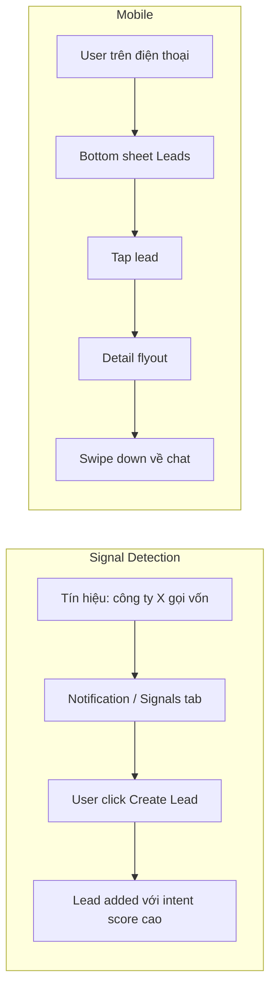

# User Flow — Gen Leads (multi-source lead intelligence)

> Tổng hợp từ: `epic21-lead-intelligence-ux.md`, `lead_gen_orchestrator.py`, prompt `multi_source_lead_gen`, `DynamicRightPanelCanvas.tsx`, `NowingLeadMatrix.tsx`, `LeadKanbanBoard.tsx`, và `Contextual Right Dock — EXPERIENCE.md`.

## 1. Tóm tắt flow

Flow được thiết kế theo nguyên tắc **chat-first, data-second**: người dùng bắt đầu bằng một câu hỏi tự nhiên, agent trả kết quả vừa trong chat (bảng markdown) vừa mở **Contextual Right Dock** để xem danh sách lead có cấu trúc. Từ đó người dùng có thể lọc, enrich, gửi Zalo, hoặc bắt đầu chuỗi outreach — tất cả không rời khỏi thread.

## 2. Backend Flow — từ prompt đến persistence

```mermaid
flowchart LR
    subgraph "Khởi động"
        U1["User gõ prompt tiếng Việt"]
        A1{"Agent chọn tool"}
        T1["multi_source_lead_gen"]
        U1 --> A1 -->|"lead / công ty / ứng viên / gói thầu"| T1
    end

    subgraph "Phân rã & điều phối"
        O1["LeadGenOrchestrator.decompose_query"]
        O2["Chọn adapter"]
        O3["Dispatch Celery queue 'nowing.lead_scrapers'"]
        T1 --> O1 --> O2 --> O3
    end

    subgraph "Thu thập song song"
        S1{"Adapter.search_leads"}
        S2["Raw records"]
        S3["adapter.normalize_lead"]
        S4["ConfidenceGate.score"]
        H1["High confidence"]
        M1["needs_enrichment = true"]
        M2["MicroExtractionWorker fallback"]
        M3["Mark needs_enrichment"]
        D1["EntityDeduplicationService"]

        O3 --> S1 --> S2 --> S3 --> S4
        S4 -->|">= 0.85"| H1
        S4 -->|"0.70 - 0.85"| M1
        S4 -->|"< 0.70"| M2
        M2 -->|"fail-soft"| M3
        H1 --> D1
        M1 --> D1
        M3 --> D1
    end

    subgraph "Lưu trữ & tuân thủ"
        P1["LeadBatchService.ingest_batch"]
        P2["DNC filter"]
        P3["PII encrypt"]
        P4["Upsert leads table"]
        P5["Auto round-robin assign"]
        P6["Zero sync"]

        D1 --> P1
        P1 --> P2
        P1 --> P3
        P1 --> P4
        P4 --> P5
        P4 --> P6
    end

    P6 --> R1["Trả kết quả UI"]

    style U1 fill:#e0f2fe
    style P6 fill:#dcfce7
```




## 3. UI Flow — từ kết quả chat đến outreach


```mermaid
flowchart LR
    subgraph "Kết quả trong chat"
        R1["Markdown table trong chat"]
        R2["Right Dock: tab Leads pulse"]
        R1 --> R2
    end

    subgraph "Data Panel"
        C1["DynamicRightPanelCanvas"]
        M1["NowingLeadMatrix"]
        T1["Cột: Fit / Công ty / Website / Ngành / SĐT / Hành động"]
        F1["Filter chips"]
        F2["Bulk chọn / Select all"]

        R2 --> C1 --> M1 --> T1
        T1 --> F1
        T1 --> F2
    end

    subgraph "Hành động trên lead"
        A1["Click 1 lead"]
        D1["LeadDetailFlyoutDrawer"]
        P1["PhoneCopyPill"]
        Z1["ZaloOutreachButton"]

        S1["Suggested actions"]
        E1["Enrich — unlock phone/email"]
        S2["Find similar"]
        S3["Start sequence"]
        X1["Export CSV"]

        T1 --> A1 --> D1
        D1 --> P1 (if phone exists)
        D1 --> U1["Mở khóa SĐT"]
        U1 --> P2["Debit 1.5 credits"]
        P2 --> P1 (if success)
        P2 --> E2["Không lấy được SĐT — hoàn credit"]
        D1 --> Z1

        F2 --> S1
        S1 --> E1
        S1 --> S2
        S1 --> S3
        S1 --> X1
    end

    subgraph "Chuỗi outreach"
        Q1["Sequence template selector"]
        Q2["Activate sequence"]
        Q3["Theo dõi Sequences tab"]

        S3 --> Q1 --> Q2 --> Q3
    end

    style R2 fill:#dcfce7
    style E1 fill:#fef3c7
    style S3 fill:#fef3c7
    style Q2 fill:#dbeafe
```

## 4. Mobile & Signal Flow




## 5. Các quyết định thiết kế chính

### 5.1 Chat-first, data panel thứ cấp
- Người dùng không cần rời chat. Kết quả lead xuất hiện dưới dạng bảng markdown ngắn gọn trong chat, đồng thời tab **Leads** trong Right Dock pulse để mở rộng nếu cần.
- Right Dock có thể đóng/mở, resize, hoặc chuyển sang verbose mode hiển thị inline.

### 5.2 Transparency về nguồn và chi phí
- Mỗi dòng trong `NowingLeadMatrix` hiển thị nguồn (batdongsan, chotot, topcv...) và Fit Score.
- Credits badge hiển thị số dư khả dụng; hành động **Enrich** và **Unlock phone** trừ credits rõ ràng.

### 5.3 Fail-soft & degradation
- `LeadGenOrchestrator` chạy adapter song song với timeout cô lập. Một nguồn fail/time-out không phá hỏng kết quả tổng thể.
- Lead dưới ngưỡng confidence được đánh dấu `needs_enrichment` thay vì bị loại bỏ, cho phép người dùng quyết định enrich thêm.

### 5.4 Multi-table tabs
- `DynamicRightPanelCanvas` hỗ trợ 4 mode: **Leads**, **Research**, **Automations**, **Scrapers**. Người dùng có thể chuyển đổi ngay trong thread mà không mất ngữ cảnh.

### 5.5 Mobile
- Trên mobile dock trở thành bottom sheet; lead detail mở dạng flyout phía trên. Tất cả thao tác vẫn giữ ngữ cảnh chat.

## 6. Mapping với component / code

| Giai đoạn | File / Component chính | Vai trò |
|---|---|---|
| Khởi động | `app/dashboard/[workspace_id]/new-chat/[[...chat_id]]/page.tsx` | `mode=leads` |
| Tool call | `app/agents/chat/multi_agent_chat/main_agent/tools/lead_generation.py` | Factory cho `multi_source_lead_gen` |
| Prompt / example | `app/agents/chat/multi_agent_chat/main_agent/system_prompt/prompts/tools/multi_source_lead_gen/` | Hướng dẫn agent khi nào gọi tool |
| Điều phối | `app/lead_intelligence/services/lead_gen_orchestrator.py` | Decompose, dispatch, score, dedup, persist |
| Data panel | `components/leads/DynamicRightPanelCanvas.tsx` | Canvas chính 4 mode |
| Bảng lead | `components/leads/NowingLeadMatrix.tsx` | Hiển thị, filter, bulk actions |
| Kanban / pipeline | `components/leads/pipeline/LeadKanbanBoard.tsx` | Chuyển trạng thái pipeline (kéo thả) |
| Phone unlock | `components/leads/PhoneCopyPill.tsx` | Unlock / copy SĐT |
| Zalo outreach | `components/leads/zalo-outreach-button.tsx` | Gửi Zalo từ lead |
| Dock behavior | `_bmad-output/planning-artifacts/ux-designs/ux-Nowing-2026-08-25/EXPERIENCE.md` | Quy tắc Contextual Right Dock |
| UX spec tổng | `_bmad-output/planning-artifacts/ux-design/epic21-lead-intelligence-ux.md` | Layout 2-panel, Suggested Actions, Fit Score |

## 7. Edge cases cần chú ý

1. **Timeout / source fail**: `LeadGenOrchestrator` ghi nhận `degraded_sources`, UI cần hiển thị badge "một số nguồn không khả dụng".
2. **Không có lead**: bảng markdown rỗng + Right Dock empty state "No leads yet".
3. **DNC hit**: lead bị suppress, hiển thị số lượng suppressed trong summary.
4. **Insufficient credits**: Enrich / unlock phone bị disable hoặc hiển thị "cần nạp thêm credits".
5. **Mobile sheet vs desktop dock**: cùng một `NowingLeadMatrix` nhưng container khác nhau (bottom sheet vs right panel).
6. **No phone, no unlock source**: lead row shows "Không có SĐT" instead of disabled buttons; detail drawer offers "Mở khóa SĐT" as primary action.
7. **Seller intent**: UI and chat suggest next actions "Tìm người mua" / "Phân tích giá" when the user is selling inventory.

---

*Lưu ý: `client_id` của lead hiện được lưu trong DB nhưng đã loại khỏi Zero publication và Zero client schema để tránh `SchemaVersionNotSupported`. UX flow không bị ảnh hưởng; `client_id` vẫn có sẵn qua REST/API nếu cần.*
