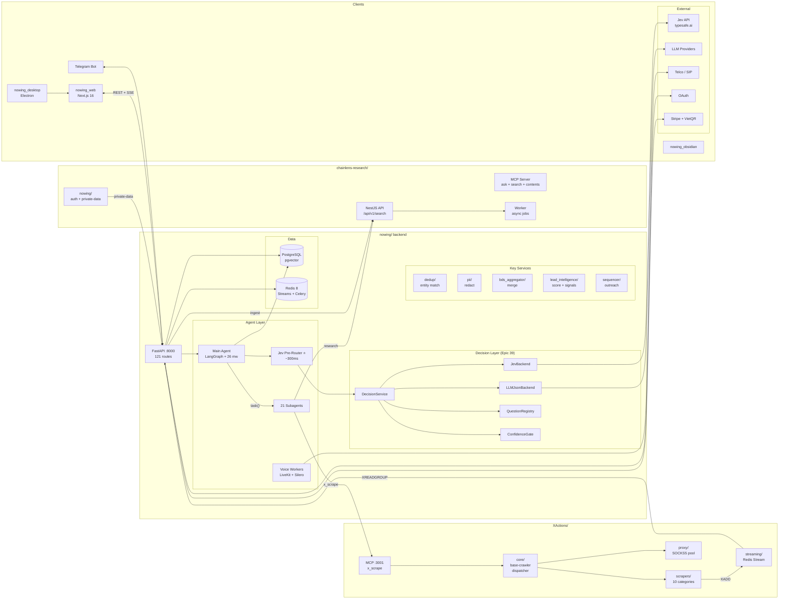
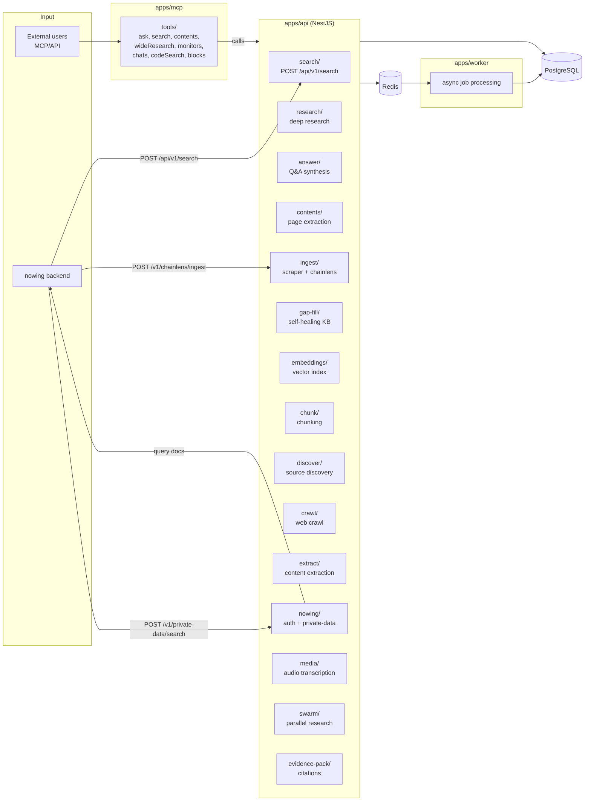
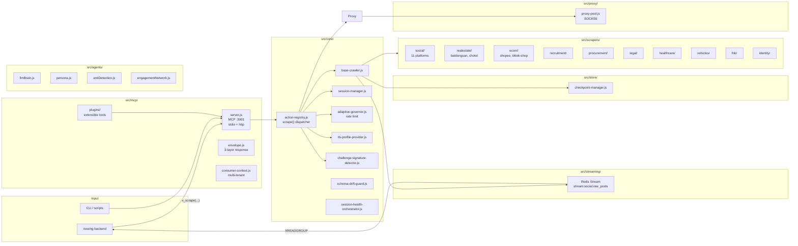
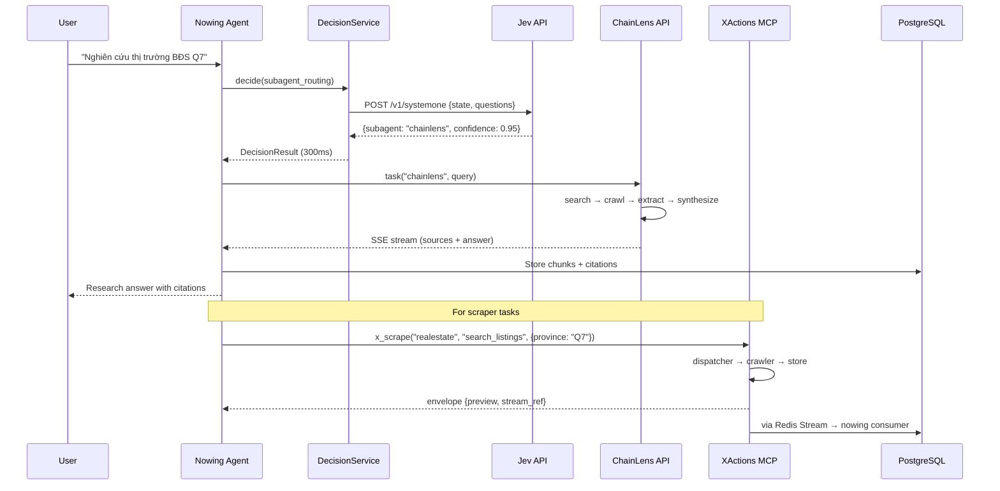
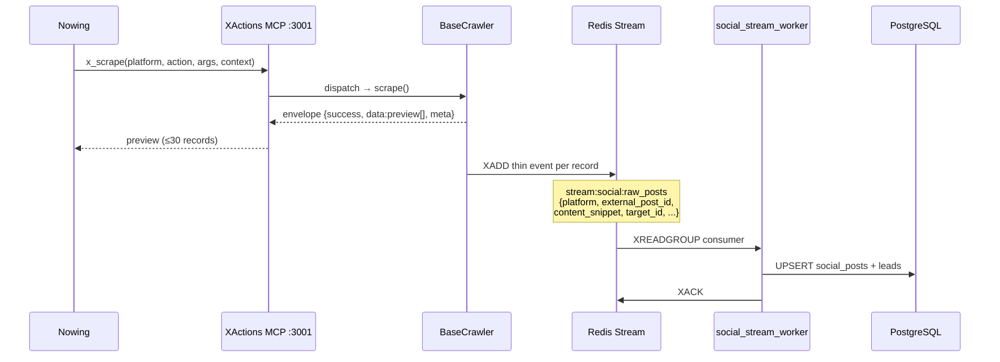
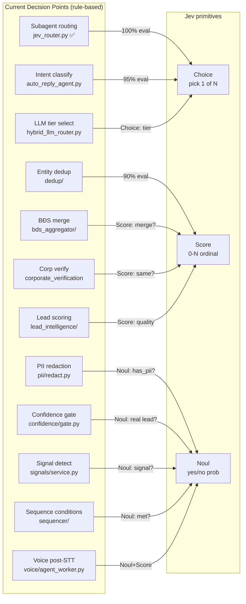
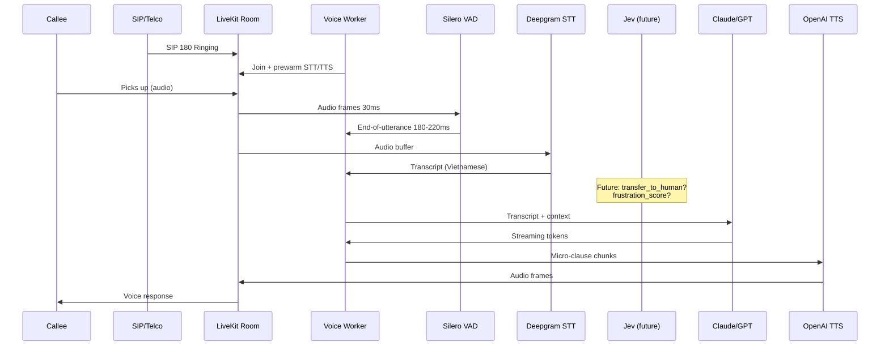
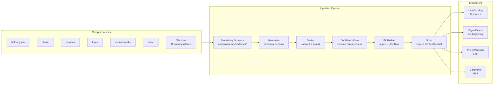

# Nowing Ecosystem System Architecture — September 2026

**Updated:** 2026-09-21 | **Verified against:** `nowing/nowing_backend/app/`, `chainlens-research/apps/`, `XActions/src/`

> Tất cả diagram dùng hướng trái-phải (LR) để đọc ngang, không bị nén dọc như dạng TB.

## 1. Ecosystem Overview — 3 repos, 1 platform

## 2. Middleware Stack — Main Agent (26 layers)

```mermaid
flowchart LR
    MSG["User Message<br/>VN/EN"] --> M1["busy_mutex"] --> M2["otel_span"] --> M3["todos"] --> M4["memory<br/>inject"] --> M5["anonymous_doc"] --> M6["knowledge_tree"] --> M7["kb_persistence"] --> M8["skills"] --> M9["checkpointed_subagent<br/>task() tool"] --> M10["jev_router ⭐<br/>~300ms hint"] --> M11["mode_budget"] --> M12["model_call_limit"] --> M13["tool_call_limit"] --> M14["context_editing"] --> M15["compaction"] --> M16["noop_injection"] --> M17["retry"] --> M18["fallback"] --> M19["tool_call_repair"] --> M20["permission"] --> M21["doom_loop"] --> M22["action_log"] --> M23["patch_tool_calls"] --> M24["dedup_hitl"] --> M25["plugins"] --> M26["anthropic_cache"] --> LLM["LLM Call<br/>Claude/GPT/Auto"]
```

## 3. ChainLens Internal Architecture

## 4. XActions Internal Architecture

## 5. Nowing ↔ ChainLens Data Flow

## 6. Nowing ↔ XActions Contract (target state)

## 7. Decision Points Map

## 8. Voice Pipeline

## 9. Data Flow — Scraper → Lead Pipeline

## Files Verified

| Repo | Path | What |
|------|------|------|
| nowing | `app/agents/.../middleware/stack.py` | 26-middleware stack, jev_router at position 10 |
| nowing | `app/agents/.../middleware/jev_router.py` | JevRouterMiddleware — calls typesafe_sdk directly |
| nowing | `app/agents/.../shared/feature_flags.py` | `enable_jev_router` flag, default OFF |
| nowing | `app/agents/.../subagents/builtins/` | 21 subagent directories |
| nowing | `app/services/` | 120+ service files |
| nowing | `app/proprietary/platforms/` | 22 platform scraper adapters |
| chainlens | `apps/api/src/` | 40+ NestJS modules |
| chainlens | `apps/mcp/src/tools/` | 7+ MCP tools |
| chainlens | `apps/worker/src/` | Async job worker |
| XActions | `src/mcp/server.js` | MCP server :3001 |
| XActions | `src/scrapers/` | 10 categories |
| XActions | `src/core/` | base-crawler, dispatcher, governor |
| XActions | `src/streaming/` | Redis Stream output |
